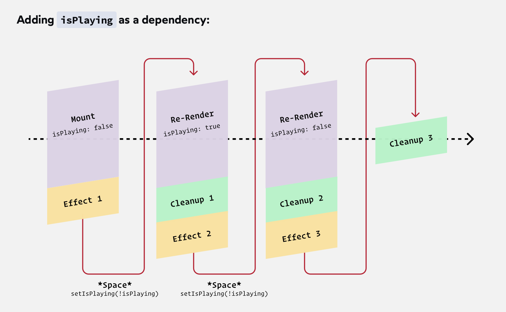

# The Joy of React - Module 3 - Course Notes

- [Course Outline Notes](course-notes.md)

## React Hooks

### Another tool in the Toolbox

- A way to share business logic throughout our app, without having to stack a bunch of components.
- The tool to solve this, is Hooks.
- Allow you to reuse logic throughout the application.
- Use it to manage a event listener, or data request, can now be packed up and re-used.
- Using Hooks and components together, makes building in React much better.

### The useId Hook

- Reuse, is the main benefit of using react.
- Try to write, any component re-usable. But is difficult for some parts of the web.
- React has a new tool, to give a unique identifier to an instance of a component.

```JAVASCRIPT
const id = React.useId();
```

- Gives a unique ID, to each instance of a given component. For example; if you have a form, and you want to give a unique id for each text input, label.

- If you console log the `id`, you get a unique id that corresponds with each instance of the component.
- React knows, how many instances of a given component exist, and it stores that info on the instance.
- The useId Hook, let's us hook into that internal data and access that id.

- Now you can use that unique id, on a form, and create a unique string.

```JAVASCRIPT
import React from 'react';

function LoginForm() {
  const [username, setUsername] = React.useState('');
  const [password, setPassword] = React.useState('');

  // Pluck this instance's unique ID from React
  const id = React.useId();

  // Create element IDs using this unique ID
  const usernameId = `${id}-username`;
  const passwordId = `${id}-password`;
  
  return (
    <form className="login-form">
      <div>
        {/* Apply these IDs to the label and input */}
        <label htmlFor={usernameId}>
          Username:
        </label>
        <input
          type="text"
          id={usernameId}
          value={username}
          onChange={event => {
            setUsername(event.target.value);
          }}
        />
      </div>
      <div>
        <label htmlFor={passwordId}>
          Password:
        </label>
        <input
          type="password"
          id={passwordId}
          value={password}
          onChange={event => {
            setPassword(event.target.value);
          }}
        />
      </div>
      <button>
        Submit
      </button>
    </form>
  );
}

export default LoginForm;
```

- How about using an alternative to create a unique id, like `Math.random()`
- But when you enter information into the field, you trigger a state change, and a new number will be created with the `Math.random()`. Notice the `React.useId()` is stable across renders.
- Because we are hooking into an instance, and the instance doesn't change between renders. But the `Math.random()` does change with each re-render of the component.
- Whenever we re-render the component, we call the function again, so `Math.random()` will generate a new number.
- Special thing with Hooks, we are able to pass things along between renders.

### Practice - Toggle Component

- A `Toggle` component, finish it up by adding a unique ID to the button, and connecting it ot the label. You should be able to trigger the toggle by clicking the 'Dark Mode' text.

- Add the `useId()` method hook. `const id = React.useId();`
- On the switch element label, add the `htmlFor` attribute, `htmlFor={id}`
- Then add the associated `id={id}` to the `button`

```JAVASCRIPT
function Toggle({
  label,
  checked,
  handleToggle,
  backdropColor = 'white',
  size = 16,
}) {
  const id = React.useId();

  const padding = size * 0.1;
  const width = size * 2 + padding * 2;

  const wrapperStyle = {
    width,
    padding,
    '--radius': size * 0.25 + 'px',
    '--backdrop-color': backdropColor,
  };

  const ballStyle = {
    width: size,
    height: size,
    transform: checked ? `translateX(100%)` : `translateX(0%)`,
  };

  return (
    <div className={styles.wrapper}>
      <label htmlFor={id}>
        {label}
      </label>
      <button
        id={id}
        className={styles.toggle}
        type="button"
        aria-pressed={checked}
        style={wrapperStyle}
        onClick={() => {
          handleToggle(!checked)
        }}
      >
        <span className={styles.ball} style={ballStyle} />
      </button>
    </div>
  );
};
```

### Rules of Hooks

- Hooks are special functions that allow us to "hook" into Rect internals.
- `useState` allows us to hook into a component instance's state, for example, while `useId` allows us to create and store a unique identifier on the component instance.
- What happens if we try to call these functions outside of a react context?
  - You get a warning, stating Hooks can only be called inside a body of a function component. This could happen for one of the following reasons.
  - 1. You might have mismatching versions of React and teh renderer, such as React DOM
  - 2. You might be breaking the Rules of Hooks
  - You might have more than one copy of React in the same app.

- First understand that hooks are plain old JS functions.
- When we call these functions, they hook into React internals.
- React expects hook functions to be used in very specific ways, and if we violate those expectations. Base things can happen.

- 📣 There are two Rules of Hooks that we should learn.
- 1. Hooks have to be called within the scope of a React app. We can't call them outside of our React components.
- 2. We have to call our hooks at the top level of the component. **This rule trips most people up.**

- Cannot call a hook, if it's in a condition statement, or anything that makes it not at the top level of the component. Order matters.
- A nice way to look at it, if the hook is indented, will not work.

```JAVASCRIPT
// will error
function TextInput({ id, label, type }) {
  let appliedId = id;
  if (typeof appliedId === 'undefined') {
    appliedId = ReactuseId();
  }

  return (
    // component markup
  )
}
```

- What if you wanted to use a condition? How would you write that?

```JAVASCRIPT
import React from 'react';

function TextInput({ id, label, type }) {
  // Here's the original code, violating the rule:
  //
  //   let appliedId = id;
  //   if (typeof appliedId === 'undefined') {
  //     appliedId = React.useId();
  //   }
  //
  // ...and here's the fixed code:
  const generatedId = React.useId();
  const appliedId = id || generatedId;

  return (
    <div className="text-input">
      <label htmlFor={appliedId}>
        {label}
      </label>
      <input
        id={appliedId}
        type={type}
      />
    </div>
  );
}

export default TextInput;
```

#### Hooks, exercises

- Fix the violation
- We have a search UI with a conditionally rendered text input. Clicking the icon slides a text input into place.
- The code is a violation of Rules of Hooks! Your mission is to update the code to comply with the rules.

- ACs
  - No lint warnings should be shown.
  - Clicking the search button should reveal a search input.

- Two possible solutions, first is to make sure the hook is at the correct level on the component.

```JAVASCRIPT
// Change this code:
let searchId;
if (showSearchField) {
  searchId = React.useId();
}

// ...to this code:
const searchId = React.useId();
```

- Or you can create a new create a new component and conditionally display the search input.

```JAVASCRIPT
import React from 'react';
import { X, Search } from 'react-feather';

import VisuallyHidden from './VisuallyHidden';

function App() {
  const [
    showSearchField,
    setShowSearchField,
  ] = React.useState(false);

  function handleToggleSearch(event) {
    event.preventDefault();
    setShowSearchField(!showSearchField);
  }

  return (
    <>
      <form>
        {showSearchField && <SearchField />}
        <button
          className="search-toggle-button"
          onClick={handleToggleSearch}
        >
          {showSearchField ? <X /> : <Search />}
          <VisuallyHidden>
            Toggle search field
          </VisuallyHidden>
        </button>
      </form>
    </>
  );
}

// create a new component, and use logical && to show it above
function SearchField() {
  const searchId = React.useId();

  return (
    <div className="search-field-wrapper">
      <label htmlFor={searchId}>
        <VisuallyHidden>Search</VisuallyHidden>
      </label>
      <input
        id={searchId}
        className="search-field"
      />
    </div>
  );
}

export default App;
```

#### Exercise, Fix another violation

Fix another violation with a different scenario

- In this exercise, our LoginForm component can either render:
- A form including email/password fields, if the user isn't logged in.
- A paragraph, if the user is logged in

You can toggle between these states by submitting the form.

- ACs
- Update the code below so that it doesn't violate the Rules of Hooks.

- Solution 1. Moving the early return, grouping the hooks together before you return any conditions.

```JAVASCRIPT
function LoginForm({ isLoggedIn, handleLogin }) {
  const id = React.useId();
  const [email, setEmail] = React.useState('');
  const [password, setPassword] = React.useState('');

  if (isLoggedIn) {
    return (
      <p>You're already logged in!</p>
    );
  }

  return (
    /* Same stuff, omitted for brevity */
  );
}
```

- Solution 2. Removing the early return entirely. Move the `isLoggedIn` to the parent component, `App`
- Use a ternary condition to display the logged in status.

```JAVASCRIPT
function App() {
  const [isLoggedIn, setIsLoggedIn] = React.useState(false);

  function handleLogin(event) {
    // NOTE: In a real application, we'd perform a
    // network request here, to validate the login.
    // We'll see how to do this later in this module.
    event.preventDefault();
    setIsLoggedIn(true);
  }

  return (
    <>
      {isLoggedIn ? (
        <>
          <p>You're already logged in!</p>
          <button
            onClick={(event) => {
              setIsLoggedIn(false);
            }}
          >
            Log Out
          </button>
        </>
      ) : (
        <LoginForm handleLogin={handleLogin} />
      )}
    </>
  );
}
```

### Immutability Revisited

One of the mis-understood things to grasp with React, is immutability, and what it means for state to be immutable.

- Remember, in React, you never want to mutate a piece of state.
- If you want to change a piece of state, you have to call the `setUser()` function. And provide it with a new object with the properties you want.
- When you do that, you are actually creating a new object, that lives in a different part of the computers memory.
- The confusing part, you are not editing the original object, you are creating a new one. And when you create a new one, you are not swapping out the instance, you are just creating a new one.

```JAVASCRIPT
// setUser, set state
user: {
  name: "Ivy"
}
```

- And another one

```JAVASCRIPT
// setUser, set state
user: {
  name: "Ava"
}
```

- The CORE idea, is when you setUser State, you have two different user variables in memory.
- 💡 So when we say, we are changing the state, it's more like we are painting a new picture with the new value. Even if the new value is the exact same.

- The moment you create this new object, it will be stored in memory. Imagine a ram stick, and it stores it in a little square on that ram stick.
- All that matters to React, is I am changing the object, and for it to use the new object in the next snapshot.

- Now, how does this work when you have multiple state variables.
- A state variable and an array, these will take up two differ slots in memory.

```JAVASCRIPT
user : {
  name: "Ivy"
}

items: [
  1
]
```

- Imagine you go through the process of calling setUser, with a handful of new objects.
- Every time I create a new object by calling `setUser`, I get a new object, that is put into a new memory slot in the computers memory.

- But not for the items array, each snapshot of the items array, points to the same spot in the computers memory.

```JAVASCRIPT
user : {
  name: "Ivy"
}

items: [
  1
]
```

- We are still generating a brand new items array in each snapshot, with `const [items, setItems] = React.useState();`.
- Each of the items is a different locally scoped variable, BUT the all point to the same underlying reference in memory.
- I only have one array of numbers and it's being threaded through every single snapshot.

- Have to understand the difference between two items that are referentially different, vs. the same item being threaded through. 🤔
- 🤔 The core idea, is how React handles mutability and how data is passed through snapshots.

- **What is a snapshot?**

- A snapshot is the result of performing a render. It's a combination of two things:

1. The specific values of any props/state at the time the render occurred
2. The React elements return form the component, describing the UI calculated in the render

- What is the difference between snapshots and instances?
- A component instance, is a JS object that is the source of truth for everything related to a particular instance of a component. It's created when teh component is mounted and it persists until the component is unmounted.

- A snapshot, is not a specific JS object, it refers to the data available at a moment in time.
- Could say, an instance holds the true value of a piece of sate, **but every time that state change**, we create a snapshot that captures the current value of that state variable.

### Refs

- How might we work with the `<canvas>` element in React?
- In this case, if you wanted to work with the `<canvas>`, you would have to get a context, a reference to that element.
- In JS, we do this by, using the `document.querySelector('canvas')` api, to get a reference to that element.
- But to do this in React, considered a bad practice, to reach around React, and get a reference to an element.
- This will also lead to bugs, when you have multiple instances of that component.

- To get the context, or reference of an instance, the conventional way is to use the `ref` attribute, hook.
- Its a little like the `key`, it signals to React we want to do something special.
- One way, is we can pass it a function, and React will provide us, with the underlying DOM node.

```JAVASCRIPT
function ArtGallery() {
  return (
    <main>
     <canvas
       ref={function(canvas) {
        console.log(canvas)
       }}
       width={200}
       height={200}
    />
    </main>
  )
}
```

- In the console,  you get the actual `<canvas>` element, the same thing you would get, if you called `document.querySelector('canvas')`
- This is one way to get to the underlying DOM node.

- The way `ref` works, it will be called whenever the component renders.

- A hook to use, in these situations, called `React.useRef()`
- The idea with `useRef()` is that it creates a box, and we can put whatever we want in the box, and React will thread this through every single render, so that I always have access to it.

- By default, `React.useRef()` creates an object, set to `{current: undefined}`
- Similar to the `React.useState()` hook, you can pass an initial value if you want.

```JAVASCRIPT
function ArtGallery() {
  const canvasRef = React.useRef();

  return (
    <main>
     <canvas
       ref={canvasRef}
       width={200}
       height={200}
    />
    </main>
  )
}
```

- You don't want to re-assign the variable, you want to mutate the `useRef` object.
- Hold up, aren't you not supposed to mutate object?
- That the difference, `React.useState()` is supposed to be immutable, BUT `React.useRef()` is intended to be mutated.

- Breakdown what doing:
- Creating a variable, `canvasRef` that starts as `{current: undefined}`
- Then you are capturing a reference, to a particular DOM node, by setting the `ref={canvasRef}` within the element, in this case, it's the `<canvas />` DOM node.
- This sets the `React.useRef()` hook to be set to the element, in this case `{ current: <canvas> }`

- Full Code Sample:

```JAVASCRIPT
import React from 'react';

function ArtGallery() {
  // 1. Create a “ref”, a box that holds a value.
  const canvasRef = React.useRef(); // { current: undefined }

  return (
    <main>
      <div className="canvas-wrapper">
        <canvas
          // 2. Capture a reference to the <canvas> tag,
          // and put it in the “canvasRef” box.
          //
          // { current: <canvas> }
          ref={canvasRef}
          width={200}
          height={200}
        />
      </div>

      <button
        onClick={() => {
          // 3. Pluck the <canvas> tag from the box,
          // and pass it onto our `draw` function.
          draw(canvasRef.current);
        }}
      >
        Draw!
      </button>
    </main>
  );
}

function draw(canvas) {
  const ctx = canvas.getContext('2d');

  ctx.clearRect(0, 0, 200, 200);

  ctx.beginPath();
  ctx.rect(30, 90, 140, 20);
  ctx.fillStyle = 'black';
  ctx.fill();
  ctx.closePath();

  ctx.beginPath();
  ctx.arc(100, 97, 75, 1 * Math.PI, 2 * Math.PI);
  ctx.fillStyle = 'tomato';
  ctx.fill();
  ctx.closePath();

  ctx.beginPath();
  ctx.arc(100, 103, 75, 0, 1 * Math.PI);
  ctx.fillStyle = 'white';
  ctx.fill();
  ctx.closePath();
  
  ctx.beginPath();
  ctx.arc(100, 100, 25, 0, 2 * Math.PI);
  ctx.fillStyle = 'black';
  ctx.fill();
  ctx.closePath();
  ctx.beginPath();
  ctx.arc(100, 100, 19, 0, 2 * Math.PI);
  ctx.fillStyle = 'white';
  ctx.fill();
  ctx.closePath();
}

export default ArtGallery;
```

### Exercises, Refs

- Video playback speed - we have a `<VideoPlayer> component that includes a playback speed control. But it doesn't work.
- For context, in vanilla JS, you can affect the playback speed of a `<video>` element with the following:

```JAVASCRIPT
const videoElement = document.querySelector('#some-video');
videoElement.playbackRate = 2; // Play at 2x speed
```

- AC's
- When the use changes the "Playback speed" control adn then plays the corresponding video, that video should play at the selected speed.
- You should use the `useRef` hook to capture a ref tot he `<video>` element.

- My attempt:

```JAVASCRIPT
import React from 'react';

function VideoPlayer({ src, caption }) {
  const playbackRateSelectId = React.useId();

  const videoRef = React.useRef(); // {current: undefined}
  console.log(videoRef);
  
  return (
    <div className="video-player">
      <figure>
        <video
          controls
          src={src}
          ref={videoRef}
        />
        <figcaption>
          {caption}
        </figcaption>
      </figure>
      
      <div className="actions">
        <label htmlFor={playbackRateSelectId}>
          Select playback speed:
        </label>
        <select
          id={playbackRateSelectId}
          defaultValue="1"
          onChange={(element) => {
            // grad the reference element
            const videoElement = videoRef.current;
            // grab the value of the select
            const videoRate = element.target.value;
            console.log(videoRate);
            // set the playback on the element and set it equal to the value of the select
            videoElement.playbackRate = videoRate;
          }}
        >
          <option value="0.5">0.5</option>
          <option value="1">1</option>
          <option value="1.25">1.25</option>
          <option value="1.5">1.5</option>
          <option value="2">2</option>
          <option value="3">3</option>
        </select>
      </div>
    </div>
  );
}

export default VideoPlayer;
```

- Solution video:
- Same solution, but you could simplify the `onChange` within the select.

```JAVASCRIPT
onChange={(event) => {
  videoRef.current.playbackRate = event.target.value;
}}
```

- NOTE: Don't forget the `.current` after.

### Exercise, Media Player

- Let's build a media player!

- The UI is ready and we have loaded an audio file, using `<audio>` tag. Our job now is to capture a reference to that element, and to trigger it when the user clicks teh play/pause button.

- For context, here how we solve this problem in vanilla JS:

```JAVASCRIPT
const audioElement = document.querySelector('#some-audio-element');

// Start playing the song
audioElement.play();

// Stop paying the song
audioElement.pause();
```

- AC's
- Clicking the "Play" button should start playing the song.
- Clicking the button again should pause the song.
- By default, we should render a `<Play>` icon inside the button, but it should flip to a `<Pause>` icon while the song is playing.

- Hint: to keep track whether the song is currently playing or not, you should use React state variable.
- In general, if you want some part of the UI to update, you need to use `useState()` hook.

- My attempt:

```JAVASCRIPT
import React from 'react';
import { Play, Pause } from 'react-feather';

import VisuallyHidden from './VisuallyHidden';

function MediaPlayer({ src }) {

  // use state to manage flipping the pause / play button
  const [isPlaying, setIsPlaying] = React.useState(false);
  
  const audioRef = React.useRef(); // {current: undefined}
  
  return (
    <div className="wrapper">
      <div className="media-player">
        
        <div className="summary">
          <h2>Take It Easy</h2>
          <p>Bvrnout ft. Mia Vaile</p>
        </div>
        <button
          onClick={() => {
            // use the state variable, set to false by default
            if (isPlaying) {
              audioRef.current.pause();
            } else {
              audioRef.current.play();
            }

            // flip the setState variable from true false or false true with the Logical NOT expression !
            setIsPlaying(!isPlaying);
                
          }}
        >
        
          { // use the isPlaying variable, to show which icon is shown
          isPlaying ? <Pause /> : <Play/>
          }
 
          <VisuallyHidden>
            Toggle playing
          </VisuallyHidden>
        </button>
        
        <audio 
          src={src}
          ref={audioRef}
        />
      </div>
    </div>
  );
}

export default MediaPlayer;
```

- Additional solution: When the song finishes, we need to slip the icon back to the initial state with `onEnded` added to the `<audio>` element.

```JAVASCRIPT
<audio
  ref={audioRef}
  src={src}
  onEnded={() => {
    setIsPlaying(false);
  }}
/>
```

## Side Effects

- As we build apps, we often need to synchronize with external systems. Things like.
  - Making network request
  - Managing timeouts / intervals
  - Reading / writing from localStorage
  - Listening for global events

- React calls all of these things 'side effects'.

### About "Best Practices"

- So, these side effects are hard, one of the hardest things about a modern React app.
- Should never feel shame for writing code that is not perfect and follow the best practices.
- Where ever you go, everyone is learning it as you go, and it's more about the journey and growth of learning.
- You will never be in a place in your career where you are writing/designing perfect code or designs. You are always learning. And if you look back at your code or designs from a couple years ago, and feel embarrassed, that is a good sign. That you are growing and not feeling stagnated.

### The useEffect hook

- So far, we have discussed the **CORE React Loop**
  - Provide React the JSX, a description of the UI you want.
  - Then React takes those descriptions and produces the real world DOM the user can see and use.
  - When the use does something, state change for example, React re-runs all the code and give React a new description of the DOM.

- But in web apps, we need to do things outside of this. For example, updating the title of the tab.
- This falls outside of Reacts normal space. Now we want to change something that exist outside of that container.
- React has a name for this, Side Effects, this is when you want to do something that is typically outside of Reacts typical job responsibilities. But still needs to be synchronized with the state we are holding in React.

- We want to synchronize this external element, with React state.
- To do this, we use `React.useEffect()`
- How it works, we pass it a function. And React will call this function for us at appropriate times.

- Example, update the title tag, to use a count state variable.

```JAVASCRIPT
// Counter.js

function Counter({ name, initialVal = 0 }) {

  // state management
  const [count, setCount] = React.useState(initialVal);

  React.useEffect(() => {
    document.title = `(${count}) - Counter 2.0`;
  })
  return (
    // DOM markup
  )
}
```

- What's going on here, with this function? We are telling React, to immediately run, after every render of this component.
- Whenever something updates, it will render the JSX, and then call the function inside the `useEffect()`.

- Why do you need `useEffect()`, couldn't you just put the function right in the body and have it render?

```JAVASCRIPT
// Counter.js

function Counter({ name, initialVal = 0 }) {

  // state management
  const [count, setCount] = React.useState(initialVal);

  //React.useEffect(() => {
  //  document.title = `(${count}) - Counter 2.0`;
  //})

  // Can't you just do this? Not considered good practice. 
  document.title = `(${count}) - Counter 2.0`;

  return (
    // DOM markup
  )
}
```

- Has to do with updates, and the re-render of the component. You shouldn't have to run the function everytime the component updates. In this example, only when `${count}` changes.

- The way it works, you specify a second argument as an array of dependencies.
- The first argument is the function and the second argument is the array of dependencies.

```JAVASCRIPT
// Counter.js

function Counter({ name, initialVal = 0 }) {

  // state management
  const [count, setCount] = React.useState(initialVal);

  React.useEffect(
    // first argument, function
    () => {
      document.title = `(${count}) - Counter 2.0`;
    },
    // second argument, list of dependencies
    [count]
  );
  return (
    // DOM markup
  )
}
```

- 🚀 Tells React, to only call the function, when the `count` variable changes.

- So instead of calling it on every single render, it only fires when something is updated in the second argument array, list of dependencies.
- But, the effect will always execute in the very first render. And the dependency array, will always tell React, how to re-render, when to fire the function.

### Exercises, useEffect

Get some practice with `useEffect` hook.

#### Logging a particular value

- Sign up form with several React state variables.
- Goal is to add a `console.log` that fires only when the value of "email" changes. We should see teh user's email logged in the console whenever they edit that field.

ACs:

- Whenever the user changes the value of the "email"state variable, the new value should be logged to the console.
- Nothing should be logged when the user changes their name, city or postal code.

Stretch Goal:

- Update the code so that `name` is also logged whenever it changes.

- Solution Code;
- TIP: ℹ️ You can have as many `useEffect()` hooks as you need so each only deals with a single concern.

```JAVASCRIPT
import React from 'react';

function SignupForm() {
  const [name, setName] = React.useState('');
  const [email, setEmail] = React.useState('');
  const [city, setCity] = React.useState('');
  const [postalCode, setPostalCode] = React.useState(
    ''
  );

  React.useEffect(
    // function
    () => {
      console.log({name});
    },
    // dependencies
    [name]
  );

    React.useEffect(
    // function
    () => {
      console.log({email});
    },
    // dependencies
    [email]
  );

  return (
    <form>
      <Field
        id="name"
        label="Preferred Name"
        value={name}
        onChange={(event) => {
          setName(event.target.value);
        }}
      />
      <Field
        id="email"
        type="email"
        label="Email Address"
        value={email}
        onChange={(event) => {
          setEmail(event.target.value);
        }}
      />
      <div className="row">
        <Field
          id="city"
          label="City"
          grow={2}
          value={city}
          onChange={(event) => {
            setCity(event.target.value);
          }}
        />
        <Field
          id="postal-code"
          label="Postal Code"
          grow={1}
          value={postalCode}
          onChange={(event) => {
            setPostalCode(event.target.value);
          }}
        />
      </div>
      <button>Sign up</button>
    </form>
  );
}

function Field({
  id,
  label,
  type = 'text',
  grow,
  value,
  onChange,
}) {
  return (
    <div
      className="field"
      style={{ '--grow': grow }}
    >
      <label htmlFor={id}>{label}</label>
      <input
        type={type}
        id={id}
        value={value}
        onChange={onChange}
      />
    </div>
  );
}

export default SignupForm;
```

### Exercise, Locally Persisted State

Imagine you are building an app with a "Dark Mode" toggle. It would be annoying if users had to keep toggling their preferred mode every time they load the application.

- Update the code ts that the user's preference is saved in localStorage, and restored when the page reloads.
- The current value of `isDarkMode` should be "remembered", and usd whn the page is refreshed.

- In plain JS, we can do this with the following code:

```JAVASCRIPT
// Save the value;
window.localStorage.setItem('is-dark-mode', true);

// Retrieve the value;
window.localStorage.getItem('is-dark-mode');
```

- AC's
  - The value of `isDarkMode` should be saved in localStorage whenever it changes, using the `useEffect` hook.
  - The initial value of the `isDarkMode` state variable should be retrieved from localStorage (or set to `false` if no value has been saved).
  - You can use the string `"is-dark-mode"` for the key.
  - Note: Items saved to localStorage are always saved as a string. You will need to convert the stored value back to boolean.  You can do this with the `JSON.parse()`.

- ℹ️ Check out the [Local Storage troubleshooting guide](https://courses.joshwcomeau.com/support/local-storage-troubleshooting) from Josh.

- Set into storage:

```JAVASCRIPT
function App() {
  const [isDarkMode, setIsDarkMode] = React.useState(false);

  React.useEffect(
    () => {
      // save to local storage
      window.localStorage.setItem('is-dark-mode', isDarkMode);
    },
    [isDarkMode]
  );

  return (
    // JSX here
  )
```

- Get it from storage:
- Note: `localStorage` is only capable of storing string, you have to convert it to the type you want.

```JAVASCRIPT
function App() {
  
  // get from localStorage
  const storedValue = window.localStorage.getItem('is-dark-mode');
  // convert the localStorage string to a boolean
  const parsedValue = JSON.parse(storedValue);

  // then use the parsedValue as your initial state
  const [isDarkMode, setIsDarkMode] = React.useState(parsedValue);

  React.useEffect(
    () => {
      // save to local storage
      window.localStorage.setItem('is-dark-mode', isDarkMode);
    },
    [isDarkMode]
  );

  return (
    // JSX here
  )
```

- But, need to address `null` value when nothing is specified on initial load.
- Update the `parsedValue` with an OR conditional `||` so it will default to `false`

```JAVASCRIPT
  const parsedValue = JSON.parse(storedValue) || false;
```

- One last thing, we don't want to run `window.localStorage` on every single render, it is expensive to interact with local storage.
- You can use the 'alternative form factor', whatever that means, in the `useState`. Use a callback function inside of state.
- On initial load, it will use the callback function to figure out what the value should be, but on every render after that, it won't run.

```JAVASCRIPT
function App() {

  // then use the parsedValue as your initial state
  const [isDarkMode, setIsDarkMode] = React.useState(
    // Callback function to determine the initial value on the initial render only.
    () => {
      // get from localStorage
      const storedValue = window.localStorage.getItem('is-dark-mode');
      // return the value
      return JSON.parse(storedValue) || false;
    }
  );

  React.useEffect(
    () => {
      console.log(isDarkMode);
      // save to local storage
      window.localStorage.setItem('is-dark-mode', isDarkMode);
    },
    [isDarkMode]
  );

  return (
    // JSX here
  )
```

### Effect Lint Rules

- A common linting error, when using `useEffect`, is `React Hook React.useEffect has a missing dependency: 'count'. Either include it or remove the dependency array.`
- Not a good practice to silence the warning, with `// eslint-disable-next-line`, you are not solving the problem, you are just silencing the problem.

- The problem is the state variables are getting out of sync, every time you re-render the component. The snapshots are using different versions of the `count` variable stored in memory.
- To solve this, make sure to always include the state variable dependency in the `useEffect` dependency array.

- Simple Counter example:

```JAVASCRIPT
import React from 'react';

function App() {
  const [count, setCount] = React.useState(0);
 
  // Lint Warning: React Hook React.useEffect has a missing dependency: 'count'. Either include it or remove the dependency array.
  React.useEffect(() => {
    console.log(count);
  }, []);

  return (
    <>
      <p>The count is: {count}</p>
      <button onClick={() => setCount(count + 1)}>
        Increment
      </button>
    </>
  );
}

export default App;
```

- To solve the warning, include the `count` state variable as dependency.

```JAVASCRIPT
import React from 'react';

function App() {
  const [count, setCount] = React.useState(0);
 
  // Include the count state variable.
  React.useEffect(() => {
    console.log(count);
  }, [count]);

  return (
    <>
      <p>The count is: {count}</p>
      <button onClick={() => setCount(count + 1)}>
        Increment
      </button>
    </>
  );
}

export default App;
```

### Running on Mount

- Imagine you have a form, and when the page loads, you want focus on the input.
- How, or when do you call the `focus()` method on the input?
- The issue is timing, when the component mounts, and when things render.

```JAVASCRIPT
import React from 'react';

function App() {
  const [
    searchTerm,
    setSearchTerm,
  ] = React.useState('');
  
  // create a reference, { current: undefined}
  const inputRef = React.useRef();
  
  // 🛑 wrong, is undefined because it runs before the JSX below.
  inputRef.current.focus();

  return (
    <>
      <header>
        
      </header>
      <main>
        <form>
          <input
            ref={inputRef}
            value={searchTerm}
            onChange={(event) => {
              setSearchTerm(event.target.value);
            }}
          />
          <button>Search</button>
        </form>
      </main>
    </>
  );
}

export default App;
```

- The issue is timing, React needs to render the JSX, to create the input and all the DOM nodes.
- What you want to do, is wait until React has run the JSX, and then run the `focus()` method.
- Common in React, if you want to make a network request, or establish a DOM node.

- The established way, is the `useEffect()` Hook.

- But, with this code, effect run after every single render. Which is not exaclty what you want.

```JAVASCRIPT
React.useEffect(() => {
  inputRef.current.focus();
});
```

- To solve this, add a dependency array to the effect. And leave it empty.
- 🤔 Telling React, you only want to run when one of these dependencies change, but you haven't specified any dependencies. So nothing changes after the mount.
- It will always run after that first mount, but will never run again, no matter what state changes happen.

```JAVASCRIPT
React.useEffect(() => {
  inputRef.current.focus();
}, []);
```

- Full example, search input focus() with useEffect Hook:

```JAVASCRIPT
import React from 'react';

function App() {
  const [
    searchTerm,
    setSearchTerm,
  ] = React.useState('');

  const inputRef = React.useRef();

  React.useEffect(() => {
    // Uncomment me!
    // inputRef.current.focus()
  }, []);

  return (
    <>
      <header>
        
      </header>
      <main>
        <form>
          <input
            ref={inputRef}
            value={searchTerm}
            onChange={(event) => {
              setSearchTerm(event.target.value);
            }}
          />
          <button>Search</button>
        </form>
      </main>
    </>
  );
}

export default App;
```

### Subscriptions

- Let's suppose you want to track the user's cursor position. Whenever they move their mouse, we will update some state. We can add `onMouseMove` event handlers to specific DOM nodes like this:

```JAVASCRIPT
<div
  onMouseMove={event => {
    setMousePosition({
      x: event.clientX,
      y: event.clientY,
    });
  }}
>
```

- This will only work while the user is hovering over this particular `<div>` though. What if we want to track their cursor position no matter where the mouse is within the viewport?

- Try the solution, to work on the solution.
- HINT: To listen to global events, you can use `window.addEventLister`. You want to listen for `mousemove` events. You can get the cursor position using `event.clientX` and `event.clientY`.

- Solution:
- Create a `useEffect()` hook to manage the global mouse position.
- And use the set state function and pass it an object, in the same format as the `useState` object.

```JAVASCRIPT
import React from 'react';

function MouseCoords() {
  const [
    mousePosition,
    setMousePosition
  ] = React.useState({ x: 0, y: 0 });

  React.useEffect(() => {
    function handleMouseMove(event) {
      // state setter, object in same format
      setMousePosition({
        x: event.clientX,
        y: event.clientY,
      });
    }
  })
  
  return (
    <div className="wrapper">
      <p>
        {mousePosition.x} / {mousePosition.y}
      </p>
    </div>
  );
}

export default MouseCoords;
```

- Set a global event listener, pass in the `mousemove` event, and pass in the `handleMouseMove` callback.

```JAVASCRIPT
import React from 'react';

function MouseCoords() {
  const [
    mousePosition,
    setMousePosition
  ] = React.useState({ x: 0, y: 0 });

  React.useEffect(() => {
    function handleMouseMove(event) {
      // state setter, object in same format
      setMousePosition({
        x: event.clientX,
        y: event.clientY,
      });
    }
      // set the global event listener
      window.addEventListener('mousemove', handleMouseMove);
  })

  return (
    <div className="wrapper">
      <p>
        {mousePosition.x} / {mousePosition.y}
      </p>
    </div>
  );
}

export default MouseCoords;
```

- Now, when you move the mouse, you see the numbers update on the DOM.
- But, a problem with this.
- We are adding an event listener, but we are never removing the event listener.
- The problem is, we are adding an event listener, every time we move the mouse. This piles up over time.

- When you call `window.addEventListener()` it is purely a JS thing, happens outside of React.
- Every time, you move your cursor, it re-runs the component, draws the JSX and runs the `useEffect()` hook again, which includes the `window.addEventListener`.
- This creates a new event listener every single time.

- Think of this method, `window.addEventListener()` as a subscription, by starting it, you are starting a long running process.
- 📣 You only want to do that once, when the component mounts 📣
- And the long running process will handle all the `mousemove` events

- To fix this, add an empty dependency array `[]` to the `useEffect()` hook. Which means, the event listener will only run the first time it renders.

```JAVASCRIPT
  React.useEffect(() => {
    function handleMouseMove(event) {
      // state setter, object in same format
      setMousePosition({
        x: event.clientX,
        y: event.clientY,
      });
    }
      // set the global event listener
      window.addEventListener('mousemove', handleMouseMove);
  }, []);
```

- 📣 This is the way it works with other types of subscription, starting an interval, or starting a web socket connection.
- You want to start the process once, and then the process takes care of itself. Updating the state as the events happen.

- Diagram, with an empty dependency array.
- Initial render, that starts the long running process. And for every re-render, it only runs the event.


- Diagram, With no dependency array
- Every time we trigger an event, it creates a re-render, but you also start another `Effect`, which they start to pile on top of one another.


- 🤔 This is very common, where you have some sort of subscription or registration that needs to happen immediately after mount. But them we need to make sure it doesn't happen over and over again. **Because the subscription is long running.**

### Exercises, Side Effects

Exercises for side effects

#### Window dimensions

Let's use teh effect hook to track teh window's dimensions over time.

- ACs
  - As the window is resized, teh number shown in the "Result" tab should update, accurately showing the width and height of the iframe.
  - Only a single event listener should be registered.

NOTE:  You can test this by dragging the division between teh two tabs. If you are not using a pointer device, you can focus the divider and use the left/right arrow keys.

- My Solution:

```JAVASCRIPT
import React from 'react';

function WindowSize() {
  const [
    windowDimensions,
    setWindowDimensions,
  ] = React.useState({
    width: window.innerWidth,
    height: window.innerHeight,
  });

  // Add use effect hook
  React.useEffect(() => {
    // Create the callback function and call our set state handler
    function handleResize() {
      setWindowDimensions({
        width: window.innerWidth,
        height: window.innerHeight,
      })
    }
    // Set the global event listener on resize and call our function
    window.addEventListener('resize', handleResize);
    // Add the empty dependency array below, so the listener will only run once
  }, []);
  
  return (
    <div className="wrapper">
      <p>
        {windowDimensions.width} / {windowDimensions.height}
      </p>
    </div>
  );
}

export default WindowSize;
```

#### Exercises, Toasty

- Create a toasty effect, tied to a scroll position. When the user scrolls to a specific point in the page, a message will slide out from the edge of the screen.
- Lots going on, video for context.

- ACs
  - As the use scrolls near the bottom of the page, a ghost character should slide in.
  - This can be accomplished by observing the `styles.wrapper` element, and setting the `isShown` state variable to true/false based on whether it's within the viewport or not.
  - You shouldn't use `document.querySelector` You can capture a reference to the wrapper element with the `React.useRef` hook.

- ℹ️ Note: This uses the `IntersectionObserver()` API. How it works, you create an intersection observer instance, and then tell it to observe a particular DOM node.
- Similar to an event listener, that is starts a long running process. `observer.observe(wrapperElement)`
- Pure JS version:

```JAVASCRIPT
// Here's how we'd solve this problem using vanilla JS:
function pureJsVersion() {
  const wrapperElement = document.querySelector('.toasty-wrapper');
  
  const observer = new IntersectionObserver((entries) => {
    const [entry] = entries;

    if (entry.isIntersecting) {
      // Show character
    } else {
      // Hide character
    }
  });

  observer.observe(wrapperElement);
}
```

- TODO:
  - Get the DOM element to reference, `useRef`
  - Create a `useEffect` hook, with callback function for observer

- Solution:

```JAVASCRIPT
// Toasty.js
import React from 'react';

import styles from './Toasty.module.css';

// Here's how we'd solve this problem using vanilla JS:
// function pureJsVersion() {
//   const wrapperElement = document.querySelector('.toasty-wrapper');
  
//   const observer = new IntersectionObserver((entries) => {
//     const [entry] = entries;

//     if (entry.isIntersecting) {
//       // Show character
//     } else {
//       // Hide character
//     }
//   });

//   observer.observe(wrapperElement);
// }

function Toasty() {
  // Your goal is to update the `isShown` state variable,
  // based on the user's scroll position, using
  // IntersectionObserver.
  const [isShown, setIsShown] = React.useState(false);

  // Get the reference
  const wrapperRef = React.useRef();
  console.log(wrapperRef); // {current: undefined

  // Create a useEffect hook to call the Intersection Observer
  React.useEffect(() => {

    const observer = new IntersectionObserver((entries) => {
      const [entry] = entries;
      console.log({entry});
      console.log(entry.isIntersecting)
      
      // if (entry.isIntersecting) {
      //   // Show character
      //   setIsShown(true)
      // } else {
      //   // Hide character
      //   setIsShown(false)
      // }

      // set the state variable directly
      setIsShown(entry.isIntersecting);
    }); 

    // Listen for the scroll position using the useRef hook
    observer.observe(wrapperRef.current);
  }, []);
   
  // This CSS value will control whether the ghost is
  // visible or not.
  const translateX = isShown
    ? '0%'
    : '100%';
  
  return (
    <div ref={wrapperRef} className={styles.wrapper}>
      <div
        className={styles.character}
        style={{
          transform: `translateX(${translateX})`,
        }}
      >
        👻
      </div>
    </div>
  );
}

export default Toasty;
```

- Why are we not getting any dependency warnings, for using `wrapperRef`, or `setIsShown`? These things are declared outside of the effect.
- A state variable can grow stale over time, but the set state function `setIsShown`, is the same function every single time. We get this from React every single time.
- Same thing with `const wrapperRef = React.useRef()`, is it always the same object over time, the object is the same each time, but the values inside the object update over time. There are not multiple copies of the object for every single snapshot. Share the same object across renders.

- So that means, the values cannot become stale, and no issues with using them in an effect.

- Bonus: [See video](https://courses.joshwcomeau.com/joy-of-react/03-hooks/05.05-on-mount-exercises) for how the CSS works on this effect.
- ☝️ Good example of conditionally trigger some CSS from an event.

#### Cleanup

- All the solutions so far, with the subscriptions, are incomplete.
- When React mounts a component, all the subscriptions / logic or long running processes with that component are started.
- When you unmount a component, shouldn't the opposite happen? It would stop or remove any long running process?
- No, it doesn't, even when you unmount a component instance, the event lister is still running in the background.
- And ever time you mount and unmount a component with a subscription (listener) you are stacking them on top of one another.
- 📣 They are never being cleaned up. 📣

- We say that when we un-mount the component, we delete the instance. We don't actually delete the instance, we just remove references to it. It's just out there floating in memory.

- The JS garbage collector 🤔 cannot clean it up, if there are still references to it. If a event listener or subscription is still running.

- If the subscription is still running, that means the component instance can not be cleaned up, deleted, destroyed.
- So you end up with new ones, being stacked up in memory over time.

- The reason it doesn't get cleaned up, in the `useEffect()` hook, the subscription, or event listener is not part of React. It is part of vanilla JS.

```JAVASCRIPT
  React.useEffect(() => {
    // Effect logic:
    function handleMouseMove(event) {
      console.log('move');
      setMousePosition({
        x: event.clientX,
        y: event.clientY,
      });
    }

    // Part of vanilla JS, will not get cleaned up in React:
    window.addEventListener('mousemove', handleMouseMove);

    // Add a Cleanup function to remove:
    return () => {
      window.removeEventListener('mousemove', handleMouseMove);
    };
  }, []);
```

- And actually, when we call a `useEffect()`, React doesn't have any idea what is inside that effect. It just calls it.
- It just says, hey React, here is a function that I would like you to run, when this component mounts. And here are the dependencies, for when this effect should re-run.
- 🤔 We are giving React a chunk of code, and when it should run.
- React has no idea, you are starting an event listener, when you mount the component, or when it runs the `useEffect`

- You have two independent systems, React and Vanilla JS, that are going about, doing their own thing.
- 🚀 It is up to us, to make sure these things are synchronized. When the component unmounts, **we remove the ongoing events**. 🚀

- In vanilla JS, you can use the `removeEventListener()`, you want to run this, right before the component unmounts.
- The `useEffect()` hooks comes with a tool for this. The way it works, is you give it a `return()` function and put anything in it you want to clean up.

- React now has two different things it can do at different times.
- When the component mounts, it will run the effect logic

```JAVASCRIPT
    // Effect logic:
    function handleMouseMove(event) {
      console.log('move');
      setMousePosition({
        x: event.clientX,
        y: event.clientY,
      });
    }
```

- Then it will return a function, and React is going to hand on to this function.
- 🤔 React will evoke this function at the right time, right before the component un-mounts.
- Which will remove the ongoing event listener.

```JAVASCRIPT
    // Add a Cleanup function to remove:
    return () => {
      window.removeEventListener('mousemove', handleMouseMove);
    };
```

- 🚀 When you are dealing with any ongoing subscription, this is the format. You set it up, and then return a function to manage the clean up. 🚀

- Full example of Mouse tracker

```JAVASCRIPT
import React from 'react';

function MouseTracker() {
  const [mousePosition, setMousePosition] = React.useState({
    x: 0,
    y: 0,
  });

  React.useEffect(() => {
    // Effect logic:
    function handleMouseMove(event) {
      console.log('move');
      setMousePosition({
        x: event.clientX,
        y: event.clientY,
      });
    }

    window.addEventListener('mousemove', handleMouseMove);

    // Cleanup function:
    return () => {
      window.removeEventListener('mousemove', handleMouseMove);
    };
  }, []);

  return (
    <p>
      {mousePosition.x} / {mousePosition.y}
    </p>
  );
}

export default MouseTracker;
```

- 😬 Functions that return functions 😬
- This is a confusing idea. A function that all it does, it return another function.

```JAVASCRIPT
function doSomething() {
  const hi = 5;

  return function() {
    return hi * 2;
  };
}
```

- A similar thing is happening with the `useEffect()` cleanup API. Our main effect function is returning a function:
- The good news, this is just an implementation detail.
- The most important thing to remember, We give React two functions, an effect function and a cleanup function. And React calls these functions for us at the appropriate time.

#### Cleanup with dependencies

- So far, in the examples, we have learned how to start a long running process the moment the component mounts, and we have learned how to clean it up.
- We don't include a dependency in the dependency array and that tells React, to not re-run this code.

```JAVASCRIPT
  React.useEffect(() => {
    function handleMouseMove(event) {
      setMousePosition({
        x: event.clientX,
        y: event.clientY,
      });
    }

    window.addEventListener('mousemove', handleMouseMove);

    return () => {
      window.removeEventListener('mousemove', handleMouseMove);
    };
  }, []);
```

- What happens when we do have dependencies, and we want the code to re-run sometimes?
- Want to use a state variable `isEnabled` to start and stop the event listener.

```JAVASCRIPT
const [isEnabled, setIsEnabled] = React.useState(true);
```

- Cannot wrap in a conditional, even though this may seem like the intuitive way.
- ✋ React will not allow you to call `useEffect()` hook conditionally.

```JAVASCRIPT
  const [isEnabled, setIsEnabled] = React.useState(true);

  // 🛑 Will not work, wrapping conditionally
  if (isEnabled) {
    React.useEffect(() => {
      function handleMouseMove(event) {
        setMousePosition({
          x: event.clientX,
          y: event.clientY,
        });
      }

      window.addEventListener('mousemove', handleMouseMove);

      return () => {
        window.removeEventListener('mousemove', handleMouseMove);
      };
    }, []);
  }

```

- But the idea, is a good one. 🤔 You can move the condition to be just inside the `useEffect()`.
- So the entire body of the effect, including the clean up function, are wrapped in a condition.

```JAVASCRIPT
  const [isEnabled, setIsEnabled] = React.useState(true);

  // 👍 Will work, condition inside the effect, but you need to include the dependency
  React.useEffect(() => {
    if (isEnabled) {
      React.useEffect(() => {
        function handleMouseMove(event) {
          setMousePosition({
            x: event.clientX,
            y: event.clientY,
          });
        }

        window.addEventListener('mousemove', handleMouseMove);

        return () => {
          window.removeEventListener('mousemove', handleMouseMove);
        };
      }, [isEnabled]);    
    }
```

- Now, our mouse tracker works, and I can start and stop the tracking process.
- But how is this working?

1. Refresh the page, the component mounts for the first time. And we run the `useEffect`
2. The state variable is set to true, `isEnabled`. so we run the `handleMouseMove` event to start the listener. And also hand React the cleanup function `return` for later.
3. All the tracking happens as the user move mouse around. No dependencies updated.
4. Then the user clicks the button, and it updates the dependency, `isEnabled` to be `false` which triggers a re-run of the effect.
5. But before it can do that, it has to invoke the clean up function. React always wants to clean up, what was done previously, before it starts a new effect. So it removes that event listener, `window.removeEventListener()`, in the return function.
6. Then React re-runs the effect, except now, `isEnabled` is false, and it skips over all the code inside the body of the effect. Like commenting out everything inside the `if(isEnabled) {}` condition.
7. Now, we have no mouse tracking, until the user clicks the button again, and runs the effect and everything starts over again.

- Full code example, mouse tracker, with cleanup dependency.

```JAVASCRIPT
import React from 'react';

function MouseTracker() {
  const [mousePosition, setMousePosition] = React.useState({
    x: 0,
    y: 0,
  });
  const [isEnabled, setIsEnabled] = React.useState(true);

  React.useEffect(() => {
    if (isEnabled) {
      function handleMouseMove(event) {
        setMousePosition({
          x: event.clientX,
          y: event.clientY,
        });
      }

      window.addEventListener('mousemove', handleMouseMove);

      return () => {
        window.removeEventListener('mousemove', handleMouseMove);
      };
    }
  }, [isEnabled]);

  function toggleMouseTracking() {
    setIsEnabled(!isEnabled);
  }

  return (
    <>
      <button onClick={toggleMouseTracking}>
        Mouse Tracking: {isEnabled ? 'On' : 'Off'}
      </button>
      <p>
        {mousePosition.x} / {mousePosition.y}
      </p>
    </>
  );
}

export default MouseTracker;
```

- Graph examples:

- The order of operations: Shows what effects are scheduled based on what render it is.
- Effects always run after the first render.
- No cleanup, haven't done anything yet. **If a cleanup function is provided, it will hang on to it.**


- A view of individual snapshots and cleanup:
- You want to stop running the effect from the first render, before you start something else.
- On each subsequent re-render, the cleanup function is invoked before running the effect again, and when the component is un-mounted.


- Cleanup functions aren't always provided:
- You don't always have to provide a cleanup, if there is nothing to clean up, no subscription or event listener running.
- Like the conditional example above, if `isEnabled` is false, none of the code inside the effect runs. So, there is nothing to clean up.


- The big idea 🤔, you want to provide a cleanup function, if the effect starts any sort of ongoing process. For events, intersection observer, timeout, or an interval. 📣 You want to make sure you provide a way to stop the subscription, so they don't stake up.

#### Exercises, Cleanup Subscriptions

- Practice some cleanup subscriptions with useEffect Hook.

##### Fixing Previous exercises

**Window dimensions:**

- Update the solution to the "Window dimensions" exercise so that the event listener is cleaned up.

AC's

- The "resize" event listener should be removed inside a cleanup function.

Solution:

```JAVASCRIPT
import React from 'react';

function WindowSize() {
  const [
    windowDimensions,
    setWindowDimensions,
  ] = React.useState({
    width: window.innerWidth,
    height: window.innerHeight,
  });

  React.useEffect(() => {
    function handleResize() {
      console.log('resize');
      
      setWindowDimensions({
        width: window.innerWidth,
        height: window.innerHeight,
      });
    }

    window.addEventListener('resize', handleResize);

    // Add the cleanup function to remove the event listener
    return() => {
      window.removeEventListener('resize', handleResize);
    }
  }, []);

  return (
    <div className="wrapper">
      <p>
        {windowDimensions.width} / {windowDimensions.height}
      </p>
    </div>
  );
}

export default WindowSize;
```

**Toasty!**

- In the Toasty exercise, we implemented a animation using the IntersectionObserver, but we never cancel the process.
- Here is the code to stop the IntersectionObserver. `observer.disconnect()`

AC's

- The IntersectionObserver should be disconnected within the effect's cleanup function.

Solution:

```JAVASCRIPT
/*

To stop an IntersectionObserver, you can run:
  observer.disconnect();

*/
import React from 'react';

import styles from './Toasty.module.css';

function Toasty() {
  const [isShown, setIsShown] = React.useState(false);

  const wrapperRef = React.useRef();

  React.useEffect(() => {
    const observer = new IntersectionObserver((entries) => {
      const [entry] = entries;

      setIsShown(entry.isIntersecting);
    });

    observer.observe(wrapperRef.current);

    // Cleanup function to remove the observer, no good way to test this though
    return() => {
      observer.disconnect();
    }
  }, []);

  const translateX = isShown ? '0%' : '100%';

  return (
    <div ref={wrapperRef} className={styles.wrapper}>
      <div
        className={styles.character}
        style={{
          transform: `translateX(${translateX})`,
        }}
      >
        👻
      </div>
    </div>
  );
}

export default Toasty;
```

##### Digital Clock

Build a digital clock in React! We have a clock starter code but the value doesn't update. Update the code so that the clock shows the correct time:

AC's

- The clock should update once per second, to show the current time.
- There should be no memory leaks, no ongoing processes that outlive the `Clock` instance.

Hint: Brush up on your JS, "[Intervals and Timeouts](https://courses.joshwcomeau.com/joy-of-react/10-javascript-primer/13-intervals-and-timeouts)"

```JAVASCRIPT
// Clock.js, Starter Code
import React from 'react';
import format from 'date-fns/format';

function Clock() {
  const [time, setTime] = React.useState(new Date());

  return (
    <p className="clock">
      {format(time, 'hh:mm:ss a')}
    </p>
  );
}

export default Clock;
```

```JAVASCRIPT
// App.js, to toggle the clock on and off, mount and unmount the Clock.js component
import React from 'react';
import format from 'date-fns/format';

function Clock() {
  const [time, setTime] = React.useState(new Date());

  React.useEffect(() => {
    // effect function
    const clockInterval = window.setInterval(() => {
      console.log('tick');
      setTime(new Date());
    }, 1000);

    // cleanup
    return() => {
      window.clearInterval(clockInterval);
      console.log('cleanup');
    }
  }, [time]);
  return (
    <p className="clock">
      {format(time, 'hh:mm:ss a')}
    </p>
  );
}

export default Clock;
```

- Solution:
- Use the `setInterval` method to call the `setTime` state setter.

```JAVASCRIPT
import React from 'react';
import format from 'date-fns/format';

function Clock() {
  const [time, setTime] = React.useState(new Date());

  React.useEffect(() => {
    // effect function
    const clockInterval = window.setInterval(() => {
      console.log('tick');
      setTime(new Date());
    }, 1000);

    // cleanup
    return() => {
      window.clearInterval(clockInterval);
      console.log('cleanup');
    }
  }, []);
  return (
    <p className="clock">
      {format(time, 'hh:mm:ss a')}
    </p>
  );
}

export default Clock;
```

- 🤔 Think of the interval inside of an effect, like an event listener, it is just a long running process. Where we are starting a process in the `setInterval` and then ending it with the `clearInterval`. And there is some sort of even that happens in between. Where that's mouse move events or intersections, here it's the interval firing once per second.

#### Useless Machine

Useless machines, small boxes are built with a single switch on them, when you flip the switch, the box flips back. Let's build something similar.

We will create a checkbox that automatically ticks itself, whenever it's unticked.

AC's

- When the user unticks the checkbox, it should become re-ticked automatically after half a second. This can be done with a `setTimeout`.
- If the user toggles it off and on really quickly, the timeout should be canceled, since the machine has been left in an "on" state.
- If the user clicks it a bunch of times in rapid succession, the machine should wait a full 500ms from the final click before ticking itself back on.

Notes:

- When you have a situation where you want to change state or something after a specific amount of time, but you don't want it to keep doing it over and over again. You don't want to use `setInterval`, use `setTimeout` instead.
- Start with adding your `useEffect` dependency, only want to start this `timeout` when the `isOn` state variable changes.

```JAVASCRIPT
// state hook
const [isOn, setIsOn] = React.useState(true);

React.useEffect(() => {
  window.setTimeout(() => {
    // run this code every second, call the state setter and set to true
    setIsOn(true);
  }, 1000)
}, [isOn])
}
```

- How do you handle, if user clicks the checkbox on and off really quickly? You can add a condition at the beginning of the `useEffect`, to check the value of the state variable `isOn === true`. If the value is true, the `return` statement, will "bail early" and not run any of the code under it.
- This mean, we will only schedule a timeout, if the user toggles it off.
- ℹ️ See more info on [Early Returns](https://courses.joshwcomeau.com/joy-of-react/03-hooks/05.07-cleanup-exercises).

```JAVASCRIPT
  React.useEffect(() => {
    // condition to check value of isOn, to bail out of the effect early and not run the timeout code. 
    if (isOn === true) {
      return; // early return, this will bail out and prevent any code after the return to not run.
    }
    // function will only run, if isOn is false
    const timeoutId = window.setTimeout(
      () => {
        console.log('clicked')
        setIsOn(true);
      },
      500 // half second
    )

    // cleanup
    return() => {
      window.clearTimeout(timeoutId); 
      console.log('cleanup');
    }
  }, [isOn]);
```

- Full Code Example;

```JAVASCRIPT
import React from 'react';

import VisuallyHidden from './VisuallyHidden';

function UselessMachine() {
  const id = React.useId();
  const [isOn, setIsOn] = React.useState(true);

  React.useEffect(() => {
    // Ignore renders that happen because the
    // checkbox is flipped on. We only want to
    // respond when it's flipped *off*.
    if (isOn) {
      return;
    }

    // Flip the checkbox back on in 500ms...
    const timeoutId = window.setTimeout(() => {
      setIsOn(true);
    }, 500);

    return () => {
      // ...Unless the 'isOn' property changes
      // before that time has elapsed, OR the
      // component happens to unmount:
      window.clearTimeout(timeoutId);
    };
  }, [isOn]);

  return (
    <>
      <input
        id={id}
        type="checkbox"
        checked={isOn}
        onChange={(event) => {
          setIsOn(event.target.checked);
        }}
      />
      <VisuallyHidden>
        <label htmlFor={id}>Toggle checkbox</label>
      </VisuallyHidden>
    </>
  );
}

export default UselessMachine;
```

### Stale Values

- The media player example, from a previous exercise. One thing all media players have in common, the space bar key will play or pause the currently selected song.
- Update the media player  to include the space bar shortcut.

- ℹ️ Hint: You will want to register the `keydown` event listener. If they pressed the space bar, `event.code` will be equal to the string "Space".

- 🤔 To solve this problem, use multiple `useEffect` hooks, to keep the internal audio sync, `play()`, `pause()`, in sync with the `isPlaying` state variable.
- The alternative would be to just create a function to handle the playing logic.
- Better approach to handle in a effect, so you have a single source of truth for the state variable `isPlaying`

- **Solving with `isPlaying` as a dependency**



```JAVASCRIPT
// MediaPlayer.js Component
import React from 'react';
import { Play, Pause } from 'react-feather';

import VisuallyHidden from './VisuallyHidden';

function MediaPlayer({ src }) {
  const [isPlaying, setIsPlaying] = React.useState(false);

  const audioRef = React.useRef();

  React.useEffect(() => {
    // function
    function handleKeyDown(event) {
      if (event.code === 'Space') {
        // Todo: play or pause
        // use the state setter function to update the state variable
        setIsPlaying(!isPlaying);
      }
    }

    // Set the event listener
    window.addEventListener('keydown', handleKeyDown);

    // Cleanup
    return () => {
      window.removeEventListener('keydown', handleKeyDown);
    }
  }, [isPlaying]);

  // Add a second useEffect hook to sync the audio and the state variable isPlaying
  // The one place, to manage the connection between the audio and the state variable
  React.useEffect(() => {
    if (isPlaying) {
      audioRef.current.play();
    } else {
      audioRef.current.pause();
    } 
  }, [isPlaying])

  return (
    <div className="wrapper">
      <div className="media-player">
        
        <div className="summary">
          <h2>Take It Easy</h2>
          <p>Bvrnout ft. Mia Vaile</p>
        </div>
        <button
          onClick={() => {
            if (isPlaying) {
              audioRef.current.pause();
            } else {
              audioRef.current.play();
            }

            setIsPlaying(!isPlaying);
          }}
        >
          {isPlaying ? <Pause /> : <Play />}
          <VisuallyHidden>Toggle playing</VisuallyHidden>
        </button>

        <audio
          ref={audioRef}
          src={src}
          onEnded={() => {
            setIsPlaying(false);
          }}
        />
      </div>
    </div>
  );
}

export default MediaPlayer;
```

- **Solving with callback function:**

- Alternative approach to the dependency and adding and removing the event listener every time.
- In the effect, `handleKeyDown` function we call the state setter function `setIsPlaying` to switch the value of the state so the audio will play.

```JAVASCRIPT
  React.useEffect(() => {
    function handleKeyDown(event) {
      if (event.code === 'Space') {
        // Todo: play or pause
        // use the state setter function to update the state variable
        setIsPlaying(!isPlaying);
      }
    }

    // rest of useEffect code
  }
```

- But you can also pass a function, and return a value, it's equivalent to calling the setter function with that value.

```JAVASCRIPT
// pass a function with the value, this will return and set it to 5
setIsPlaying(() => {
  return 5
})

// equivalent to this
setIsPlaying(5)
```

- React will call this function for us and whatever you return, becomes the new state variable.
- Why is this useful, because we can set a parameter, and the parameter is the value of whatever the state value is.

```JAVASCRIPT
SetIsPlaying((currentIsPlaying) => {
  return
})
```

- Instead of trying to read the state variable from the snapshot, **which could be stale**, you can instead pass React a function
- 🚀 And ask React, you tell me what the current value is, and then I will do something with that value.
- 📣 I will do something with that value, I will manipulate it in some way, to calculate the next state.

- In this case, to flip the value of the state variable to start and stop the audio player

```JAVASCRIPT
SetIsPlaying((currentIsPlaying) => {
  return !currentIsPlaying;
})
```

- **Solving using a callback function:**


```JAVASCRIPT
import React from 'react';
import { Play, Pause } from 'react-feather';

import VisuallyHidden from './VisuallyHidden';

function MediaPlayer({ src }) {
  const [isPlaying, setIsPlaying] = React.useState(false);

  const audioRef = React.useRef();

  React.useEffect(() => {
    // function
    function handleKeyDown(event) {
      if (event.code === 'Space') {
        // Todo: play or pause
        // use the state setter function to update the state variable
        // pass a function in the state setter to get the current value of the state variable, then do something with it
        // flip the value
        setIsPlaying((currentIsPlaying) =>{
          return !currentIsPlaying;
        });
      }
    }

    // Set the event listener
    window.addEventListener('keydown', handleKeyDown);

    // Cleanup
    return () => {
      window.removeEventListener('keydown', handleKeyDown);
    }
  }, [isPlaying]);

  // Add a second useEffect hook to sync the audio and the state variable isPlaying
  // The one place, to manage the connection between the audio and the state variable
  React.useEffect(() => {
    if (isPlaying) {
      audioRef.current.play();
    } else {
      audioRef.current.pause();
    } 
  }, [isPlaying])

  return (
    <div className="wrapper">
      <div className="media-player">
        
        <div className="summary">
          <h2>Take It Easy</h2>
          <p>Bvrnout ft. Mia Vaile</p>
        </div>
        <button
          onClick={() => {
            if (isPlaying) {
              audioRef.current.pause();
            } else {
              audioRef.current.play();
            }

            setIsPlaying(!isPlaying);
          }}
        >
          {isPlaying ? <Pause /> : <Play />}
          <VisuallyHidden>Toggle playing</VisuallyHidden>
        </button>

        <audio
          ref={audioRef}
          src={src}
          onEnded={() => {
            setIsPlaying(false);
          }}
        />
      </div>
    </div>
  );
}

export default MediaPlayer;
```

#### The state setter callback

- An important concept, a new way to set React state is the state-setter callback.
- So far in the course, we have been calling the state-setter functions with teh new value:

```JAVASCRIPT
const [count, setCount] = React.useState(0);

// sets 'count' to '100'
setCount(100);
```

- There is an alternative syntax for state updates. We can pass a callback, and React wil invoke that function for us:

```JAVASCRIPT
const [count, setCount] = React.useState(0);

// sets 'count' to '100'
setCount(() => {
  return 100;
});
```

- Whatever we return form this function becomes the new value for teh state, as if we had passed that value directly.
- This is useful because React provides the current value:

```JAVASCRIPT
setCount((currentCount) => {
  return currentCount + 1;
});
```

- 🤔 In most cases, this isn't necessary, since we already have access to the `count` variable. But, when working with effects, it becomes possible for us to lose access to the **freshest version** of a state variable.

- In the exercise above, video player with keyboard, we saw an example of how this alternative syntax can be useful:

```JAVASCRIPT
// Audio Keyboard example
const [isPlaying, setIsPlaying] = React.useState(false);

React.useEffect(() => {
  function handleKeyDown(event) {
    if (event.code === 'Space') {
      setIsPlaying((currentIsPlaying) => {
        return !currentIsPlaying;
      });
    }
  }

  window.addEventListener('keydown', handleKeyDown);

  return () => {
    window.removeEventListener('keydown', handleKeyDown);
  };

  // No dependency on `isPlaying`!
}, []);
```

- If we try to access `isPlaying` inside the `handleKeyDown` callback, that value will be stale, since this effect only runs after the very first mount.
- 📣 By passing a callback function, we pluck the freshest value for this state variable, directly from the component instance.

##### When to use the callback syntax

- Most of the time, we don't' need to use the callback syntax.
- Only necessary when it's possible for state variables to grow stale.

- Stale state variables aren't stricly a `useEfftct` thing. Can happen with other hooks tha thave dependency arrays, like `useMemo` and `useCallback`. Learn about later in module.

- In practice, most of the time a callback syntax is used is because of this situation: need to access a state variable inside an effect, but I don't want to add it to the dependency array.

ℹ️ Why not always use the callback syntax?

For example; a simple counter app:

```JAVASCRIPT
function Counter() {
  const [count, setCount] = React.useState(0);

  return (
    <button
      onClick={() => {
        setCount((currentCount) => currentCount + 1);
      }}
    >
      {count}
    </button>
  )
}
```

- A callback function works fine, why not use it all the time?
- This is sort of a crutch, by doing this callback function, you don't have to worry about thsi tricky "stale values" stuff. Not recommended to do it this way.
- Recommend, use the default non-callback by default. If you run into bugs, you can try the callback syntax to see if that helps. If it does, try to figure out why. Practice is the only way to get comfortable.
-

#### Exercises, Side Effects

- **Interval counter**

- In this component we want to count how many seonds have elapsed since the component mounted: But the solution has a bug, stops counting at 1 🤔
- Fix the bug so that the number keeps inprementing past 1.

- ACs
- The UI should accurately show the # of seconds since mount.
- There should be no lint warnings, and no `esling-disable` comments.

```JAVASCRIPT
// starter code
import React from 'react';

function Timer() {
  const [count, setCount] = React.useState(0);

  React.useEffect(() => {
    const intervalId = window.setInterval(() => {
      setCount(count + 1);
    }, 1000);

    return () => {
      window.clearInterval(intervalId);
    };
    // eslint-disable-next-line
  }, []);

  return (
    <div className="timer">
      <h1>Seconds since load:</h1>
      <p>{count}</p>
    </div>
  );
}

export default Timer;
```

- **Solution 1:**
- Remove the eslint disable line
- Add the state to the useEffect dependency array
- Semantically, more appropriate to use `setTimeout` since it is mounting and unmounting

```JAVASCRIPT
import React from 'react';

function Timer() {
  const [count, setCount] = React.useState(0);

  React.useEffect(() => {
    const intervalId = window.setTimeout(() => {
      setCount(count + 1);
    }, 1000);

    return () => {
      window.clearTimeout(intervalId);
    };
    
  }, [count]);

  return (
    <div className="timer">
      <h1>Seconds since load:</h1>
      <p>{count}</p>
    </div>
  );
}

export default Timer;
```

- **Solution 2:**
- Use the function callback approach, to get the freshest state variable.
- Also remove the eslint comment

```JAVASCRIPT
import React from 'react';

function Timer() {
  const [count, setCount] = React.useState(0);

  React.useEffect(() => {
    const intervalId = window.setInterval(() => {
      // use a callback function to get the freshest state value
      setCount((currentCount) => {
        return currentCount + 1
        });
    }, 1000);

    return () => {
      window.clearInterval(intervalId);
    };
    
  }, []);

  return (
    <div className="timer">
      <h1>Seconds since load:</h1>
      <p>{count}</p>
    </div>
  );
}

export default Timer;
```

#### Strict Mode

- When you create a new react app using the [boilerplate / meta-framework](https://courses.joshwcomeau.com/joy-of-react/11-tools-of-the-trade/08-boilerplates-and-meta-frameworks) like create-react-app, you will notice something different.

- When we render our app, we wrap it in a `React.StrictMode` element.

```JAVASCRIPT
root.render(
  <React.StrictMode>
    <App />
  </React.StrictMode>
);
```

- This element flips a switch inside React, adding in a bunch of restrictions and safeguards designed to improve teh robustness of our app.

- The most confusing part of Strict Mode, is how it impact the `useEffect()` hook.
- It will change how our effects are run. Normally, Component Mounts > Runs the Effect > Add your Event Listener.
- But in Strict Mode, Component Mounts > Run the Effect > Call Cleanup Function > Re-Run the Effect.
- One after the other, almost instantanously, calling it twice.  

- Runs the Effect and calls the function inside the effect. Adds any event listeners then will return any cleanup. Then, it re-runs the Effect function.
- Mount > Run Effect > Run Cleanup > Re-run Effect

- This seems very wasteful, will this make the app twice as slow? Yes, but, it only does this for us developers.
- React has differ modes, development mode, and production mode.
- But when you bundle and build your app for production, Strict mode and any lint warnings are removed.

- Will use Strict Mode from this point on in the course.
- It can be frustrating to use Strict Mode, because it runs the effect twice, can break things.
- 📣 But that's the point, it is highlighting that something is broken. **It can take a subtle bug and highlight to be obvious.**

- If you search on Stack Overflow, Why is my effect running twice, the accepted answer is to remove `<React.StrictMode>` from your index.js

```JAVASCRIPT
root.render(
  <React.StrictMode>
    <App />
  </React.StrictMode>
)
```

- But this isn't solving the problem, like removing/disabling eslint warnings. You are just pushing the problem down the line.

- Summary:
- In Normal mode, the sequence of operations:
  - ➡️ Mount
  - ➡️ Run effect

- In Strict Mode, the sequence is:
  - ➡️ Mount
  - ➡️ Run effect
  - ➡️ Run cleanup
  - ➡️ Re-run effect

- Sandbox code example for strict mode:

```JAVASCRIPT
// index.js
import React from "react";
import { createRoot } from 'react-dom/client';
import "./reset.css";
import "./styles.css";
import App from "./App";

const container = document.getElementById('root');
const root = createRoot(container);

root.render(
  <React.StrictMode>
    <App />
  </React.StrictMode>
);
```

```JAVASCRIPT
// mediaPlayer.js
import React from 'react';
import { Play, Pause } from 'react-feather';

import VisuallyHidden from './VisuallyHidden';

function MediaPlayer({ src }) {
  const [isPlaying, setIsPlaying] = React.useState(false);

  const audioRef = React.useRef();

  React.useEffect(() => {
    function handleKeyDown(event) {
      if (event.code === 'Space') {
        setIsPlaying((currentIsPlaying) => !currentIsPlaying);
      }
    }

    window.addEventListener('keydown', handleKeyDown);

    return () => {
      // The cleanup work is disabled.
      // Because Strict Mode is enabled (in /index.js),
      // our keyboard shortcut shouldn't work.
      // window.removeEventListener('keydown', handleKeyDown);
    };
  }, []);

  React.useEffect(() => {
    if (isPlaying) {
      audioRef.current.play();
    } else {
      audioRef.current.pause();
    }
  }, [isPlaying]);

  return (
    <div className="wrapper">
      <div className="media-player">
        
        <div className="summary">
          <h2>Take It Easy</h2>
          <p>Bvrnout ft. Mia Vaile</p>
        </div>
        <button
          onClick={() => {
            setIsPlaying(!isPlaying);
          }}
        >
          {isPlaying ? <Pause /> : <Play />}
          <VisuallyHidden>Toggle playing</VisuallyHidden>
        </button>

        <audio
          ref={audioRef}
          src={src}
          onEnded={() => {
            setIsPlaying(false);
          }}
        />
      </div>
    </div>
  );
}

export default MediaPlayer;
```

#### More information about Strict Mode

- In addition to re-running effects, Strict Mode changes other things. Breaks down to two categories:

1. Safegaurds designed to amplify potential issues
2. Warnings about deprecated APIs

- If you are running a legacy codebase, you may run into deprecatoin warnings.
- All the safeguards follow the same pattern: **running things twice**.

- You can see a full list of Strict Mode changes in the [official documentation](https://react.dev/reference/react/StrictMode).

#### The new default

- Becoming the standard way to use React. Most boiler plate frameworks use Strict Mode by default.

### Custom Hooks

- React supports custom hooks. You can use the hooks that come along with React, `useState`, `useEffect`
- And we can create our own hooks, like `useInterval` and `useOnScroll`.

- Custom hooks re the best thing about React hooks. That's why everyone like hooks!

#### Not as scary as it sounds

- First thing to understand, not really inveneting our own hooks.

- Sounds scary and only for advaced power users / developers. But think of them as custom hook combos.
- Video Summary:
- The idea, is you can bundle hooks into a custom hook and you can return whatever you want from a custom hook.
- What do you actually need from JSX, what does the component use? That's what you return from the custom hook to make it work.
- In the example below, we need to know the `time` because that's that gets rendered.
- Then insidde the component, you specify `time` to use the custom hook `useTime`

```JAVASCRIPT
import React from 'react';
import format from 'date-fns/format';

function Clock() {
  // Specify to use the custom useTime hook
  const time = useTime();
  
  return (
    <p className="clock">
      {format(time, 'hh:mm:ss a')}
    </p>
  );
}

// Define the custom hook
function useTime() {
  const [time, setTime] = React.useState(
    new Date()
  );
  
  React.useEffect(() => {
    // Effect logic
    const intervalId = window.setInterval(() => {
      setTime(new Date());
    }, 1000);
    
    return () => {
      // Cleanup logic
      window.clearInterval(intervalId);
    };
  }, []);
  // Return the state variable used in the JSX
  return time;
}

export default Clock;
```

- Two advantages to Custom Hooks:
  - Code organization, you can structure stuff however you want.
  - You can share this behaviour between components. You can use the same code `const time = useTime();` The ability to package up React logic and re-use it between components.

📣 A rule we need to follow: Custom Hooks have to start with the word, `use`, so `useTime` or `useInterval` etc.

- React will expect you to start your custom hooks with `use`, and give you eslint warnings.

### Exercises, Custom Hooks

#### useMousePosition

- In an earlier exercise, we tracked the user's mouse position to display it in a `MouseCoords` component.
- Pull this logic into a generic, reusable hook called `useMousePosition`

- Set up a new file, `use-mouse-poistion.js` and put the custom hook into
- Make sure you `return` the state variable
- And don't forget to `export` and `import` your file, via ES6 modules.

```JAVASCRIPT
// App.js
import React from 'react';

// Import the custom hook
import useMousePosition from './hooks/use-mouse-position.js';

// TODO: Pull the mouse-position logic into
// the use-mouse-position.js file!

function App() {
 // Assign the state variable to the hook
 const mousePosition = useMousePosition();

  return (
    <div className="wrapper">
      <p>
        {mousePosition.x} / {mousePosition.y}
      </p>
    </div>
  );
}

export default App;
```

- The seperate file

```JAVASCRIPT
import React from 'react';

function useMousePosition() {
  // TODO
  const [mousePosition, setMousePosition] = React.useState({
    x: 0,
    y: 0,
  });
  
  React.useEffect(() => {
    function handleMouseMove(event) {
      setMousePosition({
        x: event.clientX,
        y: event.clientY,
      });
    }

    window.addEventListener('mousemove', handleMouseMove);

    return () => {
      window.removeEventListener('mousemove', handleMouseMove);
    };
  }, []);

  return mousePosition
}

export default useMousePosition;
```

#### useToggle

- In the Digital Clock exercise, we could click a button to toggle the clock off and on:
- Create a `useToggle` hook to update the `showClock` state, but instead of taking a new value, it automatically "flips" to the opposite boolean value.

- **Acceptance Criteria:**

- The `useToggle` hook should use `useState`  internally, to create and manage a state variable.
- We should be able to specify an initial value for the state variable.
- It should return an array containing two items:
  - The state variable
  - A funtion that flips the state variable between `true` and `false`
- Clicking the button should toggle the clock off and on.

- Setup the `use-toggle.js` custom hook

```JAVASCRIPT
import React from 'react';

function useToggle() {
  // Create a generic state hook
  const [value, setValue] = React.useState();

  // define toggle function
  function toggleValue() {
    // call setValue and pass NOT value as argument
    // set from true to false or false to true
    setValue(!value);
  }

  // Return an array
  return [
    // return value
    value,
    // toggle function
    toggleValue
  ]
}

export default useToggle;
```

- Start to use this in `App.js`, update the hook to `useToggle`

```JAVASCRIPT
function App() {
  // TODO: Replace this with “useToggle”!
  const [
    showClock,
    setShowClock
  ] = React.useState(true);

  // rest of component...
}
```

- Add custom hook, `useToggle`, don't forget to remove the `React.` since it's a custom hook.

```JAVASCRIPT
function App() {
  // TODO: Replace this with “useToggle”!
  const [
    showClock,
    toggleClock,
  ] = useToggle(true);

  // rest of component...
}
```

- Update the `onClick` to use the `toggleClock` function.

```JAVASCRIPT
  return (
    <>
      <button
        className="clock-toggle"
        onClick={() => toggleClock()}
      >
        {showClock ? 'Clock ON' : 'Clock OFF'}
      </button>
      
      {showClock && <Clock />}
    </>
  );
```

- Alternative syntax, you can pass the function directly to the `onClick`, passing just the function.

```JAVASCRIPT
  onClick={toggleClock}
```

- Couple more things, set an intial value for the `useToggle` function, and check the typeof value.

```JAVASCRIPT
  // Check the type of for initial value
  if (typeof initialValue !== 'boolean') {
    console.warn('Invalid type for useToggle');
  }
```

- Last thing, update the function to use a callback function to get the most recent value.

```JAVASCRIPT
  function toggleValue() {
    // update to use callback function to always get the fresh value of the state variable and then flip it with logical NOT operator !
    setValue((currentValue) => !currentValue);
  }
```

- Full code example, `useToggle`, custom hook

```JAVASCRIPT
// use-toggle.js
import React from 'react';

function useToggle(initialValue = false) {
  if (
    typeof initialValue !== 'boolean' &&
    typeof initialValue !== 'function'
  ) {
    console.warn('Invalid type for useToggle');
  }

  const [value, setValue] = React.useState(
    initialValue
  );

  function toggleValue() {
    setValue((currentValue) => !currentValue);
  }

  return [value, toggleValue];
}

export default useToggle;
```

```JAVASCRIPT
// App.js
import React from 'react';

import useToggle from './hooks/use-toggle'
import Clock from './Clock'

function App() {
  const [
    showClock,
    toggleClock,
  ] = useToggle(true);

  return (
    <>
      {showClock && <Clock />}
      <button
        className="clock-toggle"
        onClick={toggleClock}
      >
        Toggle clock
      </button>
    </>
  );
}

export default App;
```

#### Exercise, useIsOnscreen

- Similar to the toasty exercise, using the `IntersectionObserver` to trigger a state change when an element enters/exits the viewport. Let's generalize that solution.

- In the solution below, see a large red square that can be scrolled into view. Your job is to fil in the `useIsOnscreen` hook so that we track this element.

- ACs
  - When the red sqaure is in the viewport, we should see the word "YES" in the top right corner.
  - Whent he red square is not in the viewport, we should se the word "NO" instead.
  - We shouldn't use `document.querySelector`.
  - No lint warnings.

- ℹ️ Pure JS version for the intersection observer:

```JAVASCRIPT

Here's the “pure JS” version once again:

  function pureJsVersion() {
    const wrapperElement =
      document.querySelector('.some-class');
  
    const observer = new IntersectionObserver((entries) => {
      const [entry] = entries;
  
      // `entry.isIntersecting` will be true if the
      // element is in the viewport, false if not.
    });
  
    observer.observe(wrapperElement);
  }

To unsubscribe, you can call:

  observer.disconnect();

```

- First Solution:

```JAVASCRIPT
// App.js
import React from 'react';

import useIsOnscreen from './hooks/use-is-onscreen.js';

function App() {

  // Reference to the red box
  const wrapperRef = React.useRef();
  // Pass it as a param to the hook
  const isOnscreen = useIsOnscreen(wrapperRef);

  return (
    <>
      <header>
        Red box visible: {isOnscreen ? 'YES' : 'NO'}
      </header>
      <div className="wrapper">
        <div ref={wrapperRef} className="red box" />
      </div>
    </>
  );
}

export default App;
```

```JAVASCRIPT
// hook, use-is-onscreen.js
import React from 'react';

// Pass in the ref DOM node as a param from App.js
function useIsOnscreen(wrapperRef) {

  // Create a state hook
  const [isOnScreen, setIsOnscreen] = React.useState(false);

  // Setup an effect
  React.useEffect(() => {
    
    // Function, set up the intersection observer
    const observer = new IntersectionObserver((entries) => {
      const [entry] = entries;

      // update the state when called
      // `entry.isIntersecting` will be true if the
      // element is in the viewport, false if not.
      setIsOnscreen(entry.isIntersecting);
  
    });

    // specify the ref, DOM node to watch
    observer.observe(wrapperRef.current);
    
    // Cleanup function, remove the observer
    return () => {
      observer.disconnect();
    }
    
  }, [wrapperRef])
  
  // return the state variable
  return isOnScreen;
}

export default useIsOnscreen;
```

- An alternate version, is who owns the `ref`, should it be in the `app.js` or the `use-is-onscreen.js` hook?
- If you define it in the hook, you will have to define it in the hook, and then return it, so `App.js` can use it.
- In the return, package them up in a array and return.

```JAVASCRIPT
// use-is-onscreen.js
function useIsOnscreen() {
  // Define the ref
  const elementRef = React.useRef();
  
  // Rest of function code
  
  // Package up in array and return both
  return [isOnscreen, elementRef]
}
```

- Then in the `App.js` file, desctructure the array, and call the custom hook.
- Both solution are similar, the only difference, is who owns the ref, in this version, it's owned by the hook, and we pass it along to the `App.js`

- Full Solution:

```JAVASCRIPT
import React from 'react';

import useIsOnscreen from './hooks/use-is-onscreen.js';

function App() {

  // Desctructure the array and call the custom hook
  const [isOnscreen, elementRef] = useIsOnscreen();

  return (
    <>
      <header>
        Red box visible: {isOnscreen ? 'YES' : 'NO'}
      </header>
      <div className="wrapper">
        <div ref={elementRef} className="red box" />
      </div>
    </>
  );
}

export default App;
```

- Custom Hook:

```JAVASCRIPT
// use-is-onscreen.js
import React from 'react';

// Pass in the ref DOM node as a param from App.js
function useIsOnscreen() {

  // Create a state hook
  const [isOnScreen, setIsOnscreen] = React.useState(false);

  const elementRef = React.useRef();

  // Setup an effect
  React.useEffect(() => {
    
    // Function, set up the intersection observer
    const observer = new IntersectionObserver((entries) => {
      const [entry] = entries;

      // update the state when called
      // `entry.isIntersecting` will be true if the
      // element is in the viewport, false if not.
      setIsOnscreen(entry.isIntersecting);
  
    });

    // specify the ref, DOM node to watch
    observer.observe(elementRef.current);
    
    // Cleanup function, remove the observer
    return () => {
      observer.disconnect();
    }
    
  }, [elementRef])
  
  // return the state variable
  return [isOnScreen, elementRef];
}

export default useIsOnscreen;
```

- What if you want to track multiple things in the DOM? That's why we use an array to desctructure, much easier to rename.

```JAVASCRIPT
// App.js
import React from 'react';

import useIsOnscreen from './hooks/use-is-onscreen.js';

function App() {

  // Desctructure the array and call the custom hook
  // Using an array to destructure, allows to rename them to whatever you want
  // Now you can track multiple things using the same hook
  const [isRedOnscreen, redElementRef] = useIsOnscreen();
  const [isPurpleOnscreen, purpleElementRef] = useIsOnscreen();

  return (
    <>
      <header>
        Red box visible: {isRedOnscreen ? 'YES' : 'NO'}
        <br />
        Purple box visible: {isPurpleOnscreen ? 'YES' : 'NO'}
      </header>
      <div className="wrapper">
        <div ref={redElementRef} className="red box" />
        <div ref={purpleElementRef} className="purple box" />
      </div>
    </>
  );
}

export default App;
```

### Data Fetching

- These lessons focus on how to use Fetch in a React context. A fair amount of "assumed" knowledge here.

- Some Primers:
- [Synchronous vs. Asynchronous code](https://developer.mozilla.org/en-US/docs/Learn/JavaScript/Asynchronous/Introducing)
- [Promises](https://web.dev/promises/)
- [Async / Await](https://courses.joshwcomeau.com/joy-of-react/10-javascript-primer/15-async-await)
- [HTTP Methods](https://courses.joshwcomeau.com/joy-of-react/10-javascript-primer/16-http-methods)
- [Fetch Basics](https://courses.joshwcomeau.com/joy-of-react/10-javascript-primer/17-fetch)

#### Test API

- A sample back-end API for learning about network requests.
- A cheatsheet about this sample API:
  - All request are artificially slowed by 1-2 seconds, to give su the time to check loading states.
  - We can simulate errors by passing a query parameter, `simmulatedError=true`
  - For endpionts that return data, that data will often be randomized / faked.

#### Fetching an Event

- A contact form, let's see how to implement one:

- The starter form, the page does a full page refresh, not exaclty what we want to do.
- We want to direct the submit, to a specific endpiont, the sample one above.

- On the form, the first thing we need to do is create a `onSubmit={handleSubmit}` function on the form

```JAVASCRIPT
function handleSubmit(event) {
  // prevent the default refresh
  event.preventDefault();
}
```

- Now, using the `fetch` method, we can make a request. The endpoint is provided `ENDPOINT`

```JAVASCRIPT
function handleSubmit(event) {
  // prevent the default refresh
  event.preventDefault();

  // fetch request the endpoint
  fetch(ENDPOINT, {
    // supply the http method for the endpoint
    method: 'POST'
  })
}
```

- Supply the data to the endpoint, and use `JSON.stringify()` to send the data accross network.

```JAVASCRIPT
    fetch(ENDPOINT, {
      // supply the http method, defined in the endpoint
      method: 'POST',
      // supply the data, email and message
      // gatcha, you cannot send objects accross the network
      // you have to use JSON.stringify and pass the object
      body: JSON.stringify({
        email,
        message,
      })
    })
```

- When you run the code above, it makes the request, `fetch` is Promise based.
- You want to use the `async`, `await` keywords to the `fetch` request.
- And create a `response` variable.

```JAVASCRIPT
  // make a async function
  async function handleSubmit(event) {
    event.preventDefault();

    // await the fetch, and capture in a response variable
    const response = await fetch(ENDPOINT, {
      // supply the http method, defined in the endpoint
      method: 'POST',
      // supply the data, email and message
      // gatcha, you cannot send objects accross the network
      // you have to use JSON.stringify and pass the object
      body: JSON.stringify({
        email,
        message,
      })
    })
  }
```

- Then to get the body of the response, use `response.json()`, which you also have to `await`.
- Why do you have to await the response? The raw json could come in parts, or streaming, make sure you have that covered.

```JSON
    // get the response of the json, and also await
    // why await? we don't know if we have the raw content, it could be streaming, comes over multiple parts.
    const json = await response.json();
    console.log(json);
```

- Console.log the response when you submit the form.
- The full `handleSubmit` function to submit the data from the form to an API endpiont.

```JAVASCRIPT
  // make a async function
  async function handleSubmit(event) {
    event.preventDefault();

    // await the fetch, and capture in a response variable
    const response = await fetch(ENDPOINT, {
      // supply the http method, defined in the endpoint
      method: 'POST',
      // supply the data, email and message
      // gatcha, you cannot send objects accross the network
      // you have to use JSON.stringify and pass the object
      body: JSON.stringify({
        email,
        message,
      })
    })
    // get the response of the json, and also await
    // why await? we don't know if we have the raw content, it could be streaming, comes over multiple parts.
    const json = await response.json();
    console.log(json);
  }
```

- Full form component:
- Sent data to our backend API using `fetch`. We saw how to send a POST request, how to stringify the body, and how to validate we received teh correct response from the server.

```JAVASCRIPT
import React from 'react';

const ENDPOINT =
  'https://jor-test-api.vercel.app/api/contact';

function ContactForm() {
  const [email, setEmail] = React.useState('');
  const [message, setMessage] = React.useState('');

  const id = React.useId();
  const emailId = `${id}-email`;
  const messageId = `${id}-message`;

  // make a async function
  async function handleSubmit(event) {
    event.preventDefault();

    // await the fetch, and capture in a response variable
    const response = await fetch(ENDPOINT, {
      // supply the http method, defined in the endpoint
      method: 'POST',
      // supply the data, email and message
      // gatcha, you cannot send objects accross the network
      // you have to use JSON.stringify and pass the object
      body: JSON.stringify({
        email,
        message,
      })
    })
    // get the response of the json, and also await
    // why await? we don't know if we have the raw content, it could be streaming, comes over multiple parts.
    const json = await response.json();
    console.log(json);
  }

  return (
    <form onSubmit={handleSubmit}>
      <div className="row">
        <label htmlFor={emailId}>Email</label>
        <input
          required={true}
          id={emailId}
          type="email"
          value={email}
          onChange={(event) => {
            setEmail(event.target.value);
          }}
        />
      </div>
      <div className="row">
        <label htmlFor={messageId}>Message</label>
        <textarea
          required={true}
          id={messageId}
          value={message}
          onChange={(event) => {
            setMessage(event.target.value);
          }}
        />
      </div>
      <div className="button-row">
        <span className="button-spacer" />
        <button>Submit</button>
      </div>
    </form>
  );
}

export default ContactForm;
```

- The next part, is to improve the UX, and make the form more user friendly.

##### Loading, success, and error statuses

When submitting network request, we want to update the UI to indicate 3 different status:

➡️ Loading
➡️ Success
➡️ Error

- and Four differnt status, at any given time
idle | loading | success | error

- Here is how to update the form, to work with these statuses.

- 1. Create a new status variable, to tell us how things are going for every snapshot that we render for the form component.

And Four differnt status, at any given time, they cover most network request.
idle | loading | success | error

```JAVASCRIPT
  // Create a status hook
  // idle | loading | success | error
  const [status, setStatus] = React.useState('idle');
```

- 2. In the handle submit function, set the status to loading

```JAVASCRIPT
  async function handleSubmit(event) {
    event.preventDefault();

    // onSubmit, set status to loading
    setStatus('loading');

  }
```

- 3. How do you check the status, the response you get back from the server?

- You can use `response.status`:
  - `200` if went well
  - `400` if client error
  - `500` if a server error
  - `300` series error

- Good idea in theory, but in practice, should check the response itself. The data that we receive from the server.
- When you submit the form, you can get a preview of the data, in the console.log

```JAVASCRIPT
{
  ok: true, 
  dataReceived: {
    email: "hello@hello.com", 
    message: "this is a hello world"
    }
}
```

- We are going to use the `ok` property, to determine if the response is valid or not.
- In the `useEffect` hook, write a conditional to check the status of `json.ok`

```JAVASCRIPT
  // check the status response
  if (json.ok) {
    setStatus('success');
  } else {
    setStatus('error');
  }
```

- 📣 Now we can start using this `status` variable in our UI.

- First thing, add `disabled={status === 'loading'}` to the form fields, input and the button.
- This will disable the form, on submit, and once the response is complete, everythign becomes back to idle state.
- ℹ️ Preferred to disable the form, because it stops the user form accidentely double clicking the button and doing multiple submissions. It also means they cannot edit the fields while in process of submitting it. Any edits they make will not be received by the backend.

- But this isn't enough on it's own, to just disable. We can also changs the text in the button.
- The button will change to 'Submitting...' onSubmit.


```JAVASCRIPT
  <button 
    disabled={status === 'loading'}>
    {status === 'loading' ? 'Submitting...' : 'Submit'}
  </button>
```

- What about the loading state? If the request resolves successfully? You can render something else, like, 'Message sent!' or something more informational.
- Add the logic to the component, just before the `return` the JSX for the form component.


```JAVASCRIPT
  // if success, you can return a message
  if (status === 'success') {
    return <p>Message sent!</p>
  }
```

- But what is user wants to send multiple messages, you can add the message to the component.


```JAVASCRIPT
return (
  <form onSubmit={handleSubmit}>
    /* contact form JSX here */

    {status === 'success' && <p>Message sent!</p>}
  </form>
)
```

- And you should clear out the message field, you can do this when you check the status, `setMessage('')`.


```JAVASCRIPT
    // check the status response
    if (json.ok) {
      setStatus('success');
      // clear the form
      setMessage('');
    } else {
      setStatus('error');
    }
```

- What about error states? The test API, supports passign a qeury parameter, you can set to true, you get an error state

```JAVASCRIPT
const ENDPOINT =
  'https://jor-test-api.vercel.app/api/contact?simulatedError=true';
```

- Open up dev tools, and network tab. Submit it again, and you will see the request throw an 500 error


- Check the error status, and display a message.


```JAVASCRIPT
return (
  <form onSubmit={handleSubmit}>
    /* contact form JSX here */

    {status === 'success' && <p>Message sent!</p>}
    {status === 'error' && <p>Something went wrong!</p>}
  </form>
)
```

- For form validation, you can rely on the native validation for form elements.
- Full Code Sample:

```JAVASCRIPT
// contact form
import React from 'react';

const ENDPOINT =
  'https://jor-test-api.vercel.app/api/contact?simulatedError=true';

function ContactForm() {
  const [email, setEmail] = React.useState('');
  const [message, setMessage] = React.useState('');

  // Create a status hook
  // idle | loading | success | error
  const [status, setStatus] = React.useState('idle');

  const id = React.useId();
  const emailId = `${id}-email`;
  const messageId = `${id}-message`;

  // make a async function
  async function handleSubmit(event) {
    event.preventDefault();

    // onSubmit, set status to loading
    setStatus('loading');

    // await the fetch, and capture in a response variable
    const response = await fetch(ENDPOINT, {
      // supply the http method, defined in the endpoint
      method: 'POST',
      // supply the data, email and message
      // gatcha, you cannot send objects accross the network
      // you have to use JSON.stringify and pass the object
      body: JSON.stringify({
        email,
        message,
      })
    })
    // get the response of the json, and also await
    // why await? we don't know if we have the raw content, it could be streaming, comes over multiple parts.
    const json = await response.json();
    console.log(json);

    // check the status response
    if (json.ok) {
      setStatus('success');
      // clear the form
      setMessage('');
    } else {
      setStatus('error');
    }

  }

  return (
    <form onSubmit={handleSubmit}>
      <div className="row">
        <label htmlFor={emailId}>Email</label>
        <input
          required={true}
          disabled={status === 'loading'}
          id={emailId}
          type="email"
          value={email}
          onChange={(event) => {
            setEmail(event.target.value);
          }}
        />
      </div>
      <div className="row">
        <label htmlFor={messageId}>Message</label>
        <textarea
          required={true}
          disabled={status === 'loading'}
          id={messageId}
          value={message}
          onChange={(event) => {
            setMessage(event.target.value);
          }}
        />
      </div>
      <div className="button-row">
        <span className="button-spacer" />
        <button 
          disabled={status === 'loading'}>
          {status === 'loading' ? 'Submitting...' : 'Submit'}
        </button>
      </div>
      {status === 'success' && <p>Message sent!</p>}
      {status === 'error' && <p>Something went wrong!</p>}
    </form>
  );
}

export default ContactForm;
```

#### Fetching on Mount

In the previous lesson, we made a network request in response to an event, like submitting a form. But what about the initial view?

In this example, let's suppose we are buidling a weather app. We want to show the user what hte current temperature in their area:


- We want to show the temperature immediately, righ when the component mounts.
- This is a thorny problem, might seem like a slight difference, fetchign on mount instead of fetching on event, but it opens up a whole can of worms.

- It's tricky, in order to fetch on mount, we generlly use the `useEffect` hook, and there are some gotchase around using async/await in an effect, as well as dealing with Strict Mode.

- But also, i fwe want to solve this problem in a robust, production ready way, there are all sorts of concerns we nee dto worry about:
  - Caching the response so that it can be reused by mulitple compoennts across the app.
  - revalidating the data so that it never becomes to stale.

- 🕳️ This is a rabit hole 😬

- As a result it has become standard in the community to use a tool to help wtih all this.
- The React docs, suggest using a package like [React Query](https://tanstack.com/query/v4/?from=reactQueryV3&original=https://react-query-v3.tanstack.com/) or [SWR](https://swr.vercel.app).

##### Intro to SWR

- Below is an MVP implementation of the weather app using SWR.

```JAVASCRIPT
import React from 'react';
import useSWR from 'swr';

const ENDPOINT =
  'https://jor-test-api.vercel.app/api/get-temperature';

async function fetcher(endpoint) {
  const response = await fetch(endpoint);
  const json = await response.json();
  
  return json;
}

function App() {
  const { data, error } = useSWR(ENDPOINT, fetcher);
  
  console.log(data, error);
  
  return (
    <p>
      Current temperature:
      {typeof data?.temperature === 'number' && (
        <span className="temperature">
          {data.temperature}°C
        </span>
      )}
    </p>
  );
}

export default App;
```

- Explanation of the code above.
- So how does this work?
- You can import 3rd party hooks, and use in your application.
- First thing to do, is to import, the `swr` hook into the app.

```JAVASCRIPT
  import useSWR from 'swr';
```

- The way it works, is we call the `useSWR()` hook and we give it two things:

- First, they key, unique identifier for the API route going to use, the endpoint itself, the location you want to make the network request to.

```JAVASCRIPT
  const ENDPOINT = 'https://jor-test-api.vercel.app/api/get-temperature';

  function App() {
    // swr hook
    const { data, error } = useSWR(ENDPOINT, fetcher);
  }
```

- Second, a fetcher function, tools like `swr` are meant to be agnostic when it comes to fetching data over a network. Here we are packaging it up in a function and we are passing this function to the library. The hook, `useSWR` is going to decide when to call this function, and what to do with the returned value.

```JAVASCRIPT
  const ENDPOINT = 'https://jor-test-api.vercel.app/api/get-temperature';

  // fetcher function
  async function fetcher(endpoint) {
  // making a request to endpoint
  const response = await fetch(endpoint);
  // getting it as json
  const json = await response.json();
  // and returning it
  return json;
}

  function App() {
    // swr hook
    const { data, error } = useSWR(ENDPOINT, fetcher);
  }
```

- Whatever you return from the `fetcher` function, will be stored in the `data` variable, when we call the `useSWR` hook.
- Once we get that data, we are gettign it from the `data`variable, from inside `useSWR` hook.
- And we are using it to control the rendered output, JSX.

```JAVASCRIPT
  return (
    <p>
      Current temperature:
      {typeof data?.temperature === 'number' && (
        <span className="temperature">
          {data.temperature}°C
        </span>
      )}
    </p>
  );
```

##### The entire flow

- Component mounts, we call the `useSWR()` hook, with a unique key `ENDPOINT`, and a function `fetcher`.

```JAVASCRIPT
  const { data, error } = useSWR(ENDPOINT, fetcher);
```

- SWR, is going to call the function, and provide the key as the first paramerter. `ENDPOINT`, and the paramater `endpoint` are the same, the reason we call it `endpoint`, is to keep the function generic, so you can reuse.

```JAVASCRIPT
  const ENDPOINT =
  'https://jor-test-api.vercel.app/api/get-temperature';

  async function fetcher(endpoint) {
  // making a request to endpoint
  const response = await fetch(endpoint);
  // getting it as json
  const json = await response.json();
  // and returning it
  return json;
}

  function App() {
    const { data, error } = useSWR(ENDPOINT, fetcher);
  }
```

- The data returned from the `return json`, is populated in the `data` variable.
- Then you can use it, inside your JSX, to control the render.

---

- 🤔 Seems like a lot, what are the benefits here?
- SWR, **Stale While Revalidate**, it's a http caching strategy
- The idea, is the information on the page, may grow stale if you spend any length of time on the page.
- If you change tabs, and come back, it's a good idea to fetch new data.
- The act of swithing tabs, and coming back, that triggered the revalidation.
- 🤔 Notice we don't see a loading spinner or anything, *because it chooses to show, the stale data.*
  - *We are revalidating the data, but while we are diong that, we are keeping the stale data. The UI always shows something*

- Trying to do this on your own is very hard. Why use a library. But the library makes all this configurable, can choose when you want this to happen.

- Full weather compoennt:

```JAVASCRIPT
import React from 'react';
// Import swr hook
import useSWR from 'swr';

const ENDPOINT =
  'https://jor-test-api.vercel.app/api/get-temperature';

async function fetcher(endpoint) {
  // making a request to endpoint
  const response = await fetch(endpoint);
  // getting it as json
  const json = await response.json();
  // and returning it
  return json;
}

function App() {
  const { data, error } = useSWR(ENDPOINT, fetcher);
  
  console.log(data, error);
  
  return (
    <p>
      Current temperature:
      {typeof data?.temperature === 'number' && (
        <span className="temperature">
          {data.temperature}°C
        </span>
      )}
    </p>
  );
}

export default App;
```

#### Loading and error states

Our MVP above doesn't include any loading or error states. How can we implement them with SWR.

##### Loading

- In addtition to providing a `data` value, the `useSWR` hook also tells su where or not the request is curretly loading. We can pull out the `isLoading` key:

```JAVASCRIPT
  const { data, isLoading } = useSWR(ENDPIONT, fetcher);
```

- `isLoading` is a boolean value. The initial value is `true`, and it flips to `false` once the fetch reqeust has completed.
- We can use tha tvalue to confidtionally render a loading UI like this:

```JAVASCRIPT
  // return a loading conditionally
  function App() {
    const { data, is Loading } = useSWR(ENDPOINT, fetcher);
 
    // conditionally return if loading
    if (isLoading) {
      return (
        <p>Loading</p>
      );
    }

    return (
    <p>
      Current temperature:
      {typeof data.temperature === 'number' && (
        <span className="temperature">
          {data.temperature}°C
        </span>
      )}
    </p>
  );
  }
```

##### Error

- To simulate the error, we can add a query parameter to the `ENDPOINT`:

```JAVASCRIPT
  const ENDPOINT =
  'https://jor-test-api.vercel.app/api/get-temperature?simulatedError=true';
```

- This will cause the server to return a 500 status code, instead of a 200. It will also return the following JSON:

```JAVASCRIPT
{
  "error": "This request returns an error, because the “simulatedError” query parameter was specified."
}
```

- 👀 [See JS Primer on HTTP Status codes](https://courses.joshwcomeau.com/joy-of-react/10-javascript-primer/18-http-status-codes)

``` JSON
200 — Everything went smoothly!
401 - You're not allowed to access this resource
404 - The server can't find the resource you requested
500 - Something unexpected gone wrong with the server (eg. it's on fire)
```

- With SWR, hoever, neighe rof these thigns is sufficient to mark this as an error.
- Remember: we manage the network request! Our `fetcher` function is responsible for retrieving the data, and passign it along to SWR.
- If we want this to count as an error, we need to throw it:

```JAVASCRIPT
  async function fetcher(endpiont) {
    const responce = await fetch(endpoint);
    const json = await response.json();

    if(!json.ok) {
      throw json
    }

    return json;
  }
```

- With this change done, `data` will be undefined, and `error` will be the object we got back from the server.

---

##### ℹ️ Throwing an object?

It's conventional in JS to throw an Error like this:

```JAVASCRIPT
  if (!json.ok) {
    throw new Error('Some sort of error message');
  }
```

- When working with SWR, however, I prefer to throw the JSON object.

```JAVASCRIPT
  if (!json.ok) {
    throw json;
  }
```

- It's equally valid, and it means that `error` will be an object rathe rthan being an `Error` instance. This is easier to work with, can access the data associated with the error.

- Final implementation with loading and error states:

```JAVASCRIPT
// weather app, SWR, with loading and error states
import React from 'react';
import useSWR from 'swr';

// Remove "?simulatedError=true" to see the success state:
const ENDPOINT =
  'https://jor-test-api.vercel.app/api/get-temperature?simulatedError=true';

async function fetcher(endpoint) {
  const response = await fetch(endpoint);
  const json = await response.json();

  if (!json.ok) {
    throw json;
  }

  return json;
}

function App() {
  const { data, isLoading, error } = useSWR(ENDPOINT, fetcher);

  if (isLoading) {
    return <p>Loading…</p>;
  }

  if (error) {
    return <p>Something's gone wrong</p>;
  }

  return (
    <p>
      Current temperature:
      {typeof data?.temperature === 'number' && (
        <span className="temperature">
          {data.temperature}°C
        </span>
      )}
    </p>
  );
}

export default App;
```

---

#### Exercises, Data Fetching

##### Book Search

Suppose we are building a Good reds-type site, a place for users to discover new books. Our job is to implement a search feature:

In the sandbox, you will find you have a `<SearchResult>` component ready to b used to display the results. Your mission 'if you choose it' is to wire up the search form so that the results are fetched from our backend API. An endpoint has been provided.

Example request/response:

```JAVASCRIPT
// REQUEST:
GET '/api/book-search?searchTerm=winter'

// RESPONSE:
{
  "ok": true,
  "results": [
    {
      "isbn": "1234567890123",
      "name": "Winter's Orbit",
      "author": "Everina Maxwell",
      "coverSrc": "/image-path/cover.png",
      "abstract": "While the Iskat Empire has long dominated the system…"
    }
  ]
}
```

**Acceptance Criteria:**

- Subitting the form should make a GET request to the supplied API endpoint, passing along `searchTerm` as a query parameter.
- If there are search results, we should map over them, rendering a `<SearchResults>` element for each one.
- We should show the text "Searching..." while the search is in progress.
- Before the user has searched, we should show a paragraph containing teh text "Welcome to Book Search!"
- If there are no matching results, we should show a paragraph containing the text "No results".
- If teh API returns an error, we should show a paragraphy containing the text "Something went wrong!"
  - You can simulate an error by passing `simulatedError=true` as a query parameter.
- There should be no key warning in the console.

ℹ️ You don't have to usr SWR for this. SWR is primarily useful when fetching data on mount.

ℹ️ How to test:

- The backend API has a very small sample librry of about 20 books. Most commons search queries will return 0 results.
- Use these terms:
  - fifth - 1 result
  - a - 18 results
  - becky - 4 results
  - hello - 0 results

- Setup the handle function

```JAVASCRIPT
  //set up a handle function
  async function handleSearch(event) {
    // turn off defualt browser bahavior
    event.preventDefault();

    // create a new url variable
    const url = `${ENDPOINT}?searchTerm=${searchTerm}`

    const response = await fetch(url);
    // use the results
    const json = await response.json();

    // pass the results to state
    setSearchResults(json.results);
    
  }
```

- Map over the results

```JAVASCRIPT
    {
      // map over the results
      // add the ?, optional chaining operator, if searchResults is null or undefined
      // iT doesn't go any further
      searchResults?.map(result => (
        <SearchResult result={result} />
      ))
    }
```

- Set up new state for `idle` | `success` | `loading` | `error`

```JAVASCRIPT
  // state for the differ states
  // idle | success | loading | error
  const [status, setStatus] = React.useState('idle');
```

- In the `handleSearch`, add the logic for the `loading`, `success` and `error` cases.

```JAVASCRIPT
  //set up a handle function
  async function handleSearch(event) {
    event.preventDefault();

    // Set the status to loading when we submit the search
    setStatus('loading');

    // create a new url variable
    const url = `${ENDPOINT}?searchTerm=${searchTerm}`

    const response = await fetch(url);
    // use the results
    const json = await response.json();

    // check if the json has been successfuly parsed
    // json.ok, if truthy then it's a succcess
    if (json.ok) {
      // pass results to state
      setSearchResults(json.results);
      // also set status to success
      setStatus('success');
    } else {
      // otherwise, set to error
      setStatus('error');
    }
  }
```

- Look at the JSX, what we are rendering, should only be shown in the success case.

```JAVASCRIPT
      <main>
        {
          // only be shown in the success case
          status === 'success' && (
            <div className="search-results">
              <h2>Search Results:</h2>
              {
                // map over the results
                searchResults?.map(result => (
                  <SearchResult result={result} />
                ))
              }
            </div>           
          )
        }
      </main>
```

- This allows us to add other branches for the other status's, `idle`, `error`, `loading`.

```JAVASCRIPT
      <main>
        {
          // idle state
          status === 'idle' && (
            <p>Welcome to Book Search</p>
          )
        }
        {
          // loading state
          status === 'loading' && (
            <p>Searching...</p>
          )
        }
        {
          // error state
          status === 'error' && (
            <p>Something went wrong!</p>
          )
        }
        {
          // only be shown in the success case
          status === 'success' && (
            <div className="search-results">
              <h2>Search Results:</h2>
              {
                // map over the results
                searchResults?.map(result => (
                  <SearchResult result={result} />
                ))
              }
            </div>           
          )
        }
      </main>
```

- Don't forget to add the key to the `<SearchResult/>` component. You can use the `isbn` value from the result object. ISBN is just a unique identifier for books, which works for this case.

```JAVASCRIPT
<SearchResult 
  result={result}
  key={result.isbn}
/>
```

- And we need to test the error state. You can do this, by adding the query parameter to the `ENDPOINT`, `&simulatedError=true`


```JAVASCRIPT
  const url = `${ENDPOINT}?searchTerm=${searchTerm}&simulatedError=true`;
```

##### No results found

- What about the case, when no results are found?

- When you have nested logic, it's really difficult to figure out, what is going on.
- Instead, you can create a new component for the search result list.
- A different way to structure the code, you have the standard, global 4 status's always use, `idle`, `loading`, `error`, `success`.
- And in the `success` variant, you have a component, that handles the 'no results' case.

- **Success branch logic:**

```JAVASCRIPT
    {
      // only be shown in the success case
      status === 'success' && (
        // now just render the SearchResultList
        <SearchResultList
          searchResults={searchResults}
        />
      )
    }
```

- The `SearchResultList` component:

```JAVASCRIPT
// Component for the Search Result List, pass in the searchResult as a prop
function SearchResultList({ searchResults }) {
  // check if not results and do an early return
  if (searchResults.length === 0) {
    return <p>No results</p>;
  }
  
  // if do have resutls, return our search results
  return (  
      // markup for the search results
      <div className="search-results">
          <h2>Search Results:</h2>
              {
                // map over the results
                searchResults?.map(result => (
                  <SearchResult 
                    result={result}
                    key={result.isbn}
                  />
                ))
              }
      </div>    
  )
}
```

- If this were a real app, would break apart and manage components in differ files.

---

- **Full App() component:**

```JAVASCRIPT
// App.js Book search app
import React from 'react';

import TextInput from './TextInput.js';
import SearchResult from './SearchResult.js';

/*
  API INSTRUCTIONS
  
  This endpoint expects a GET request,
  with a query parameter of `searchTerm`.
  Eg. `/api/book-search?searchTerm=winter`
  
  To simulate an error, attach the following
  query parameter: `simulatedError=true`
  
  To test the results, here are some suggested
  search terms:
  
    • `fifth` — 1 result
    • `a` — 18 results
    • `becky` — 4 results
    • `hello` — 0 results
*/

const ENDPOINT =
  'https://jor-test-api.vercel.app/api/book-search';

function App() {
  
  const [
    searchTerm,
    setSearchTerm,
  ] = React.useState('');
  
  const [
    searchResults,
    setSearchResults,
  ] = React.useState(null);
  
  // state for the differ states
  // idle | success | loading | error
  const [status, setStatus] = React.useState('idle');

  //set up a handle function
  async function handleSearch(event) {
    event.preventDefault();

    // Set the status to loading when we submit the search
    setStatus('loading');

    // create a new url variable
    const url = `${ENDPOINT}?searchTerm=${searchTerm}`

    const response = await fetch(url);
    // use the results
    const json = await response.json();

    // check if the json has been successfuly parsed
    // json.ok, if truthy then it's a succcess
    if (json.ok) {
      // pass results to state
      setSearchResults(json.results);
      // also set status to success
      setStatus('success');
    } else {
      // otherwise, set to error
      setStatus('error');
    }
    
  }

  return (
    <>
      <header>
        <form onSubmit={handleSearch}>
          <TextInput
            required={true}
            label="Search"
            placeholder="The Fifth Season"
            value={searchTerm}
            onChange={(event) => {
              setSearchTerm(event.target.value);
            }}
          />
          <button>Go!</button>
        </form>
      </header>

      <main>
        {
          // idle state
          status === 'idle' && (
            <p>Welcome to Book Search</p>
          )
        }
        {
          // loading state
          status === 'loading' && (
            <p>Searching...</p>
          )
        }
        {
          // error state
          status === 'error' && (
            <p>Something went wrong!</p>
          )
        }
        {
          // only be shown in the success case
          status === 'success' && (
            // now just render the SearchResultList
            <SearchResultList
              searchResults={searchResults}
            />
          )
        }
      </main>
    </>
  );
}

// Component for the Search Result List
function SearchResultList({ searchResults }) {
  // check if not results and do an early return
  if (searchResults.length === 0) {
    return <p>No results</p>;
  }
  
  // if do have resutls, return our search results
  return (  
      // markup for the search results
      <div className="search-results">
          <h2>Search Results:</h2>
              {
                // map over the results
                searchResults?.map(result => (
                  <SearchResult 
                    result={result}
                    key={result.isbn}
                  />
                ))
              }
      </div>    
  )
}

const EXAMPLE = {
  isbn: '9781473621442',
  name: 'A Closed and Common Orbit',
  author: 'Becky Chambers',
  coverSrc: 'https://sandpack-bundler.vercel.app/img/book-covers/common-orbit.jpg',
  abstract:
    "Lovelace was once merely a ship's artificial intelligence. When she wakes up in an new body, following a total system shut-down and reboot, she has no memory of what came before. As Lovelace learns to negotiate the universe and discover who she is, she makes friends with Pepper, an excitable engineer, who's determined to help her learn and grow.",
};

export default App;
```

#### Fetching the current user

In the sandbox, you are given starter code to an API endpoint that returns data about a user, like this:

```JAVASCRIPT
{
  "user": {
    "name": "Ahmed",
    "email": "me@ahmed1234.com",
  }
}
```

Your mission, if you choose it, is to fetch the data from the endpoint provided, and to manage both laoding and error states.

AC's:

- 1. You should use the provided `useSWR` hook to perform the request.
- 2. While the request is running, a spinner should be shown. A `Spinner` component has been provided for this purpose.
- 3. If the request succeeds, the `<UserCard>` component should be shown, populated with the data from the request.
- 4. If the request fails, you can show an error message ( a standard paragraph with "Something went wrong" will do).
  - You can simulate the error by passing `simulatedError=true` as a query parameter.

- ℹ️ Youc an refer to the final sandbox from the previous lesson as a template for making reqeust with the `useSWR` hook

##### AC 1, Make the request via SWR

- Set up the SWR hook in the component.

```JAVASCRIPT
function App() {
  // SWR Hook, Stale While Rendering
  const { data, error } = useSWR(ENDPOINT, fetcher);

  // rest of code here..
}
```

- Create the `fetcher` fuction to call the endpoint.

```JAVASCRIPT
const ENDPOINT =
  'https://jor-test-api.vercel.app/api/get-current-user';

// fetcher async function
async function fetcher(endpoint) {
  // make request, store it
  const response = await fetch(endpoint);
  // getting it as json
  const json = await response.json();
  // return it
  return json;
}
```

- `console.log` the `data` to see what you get back.

##### AC 2, Set up the spinner

- Add `isLoading` to the `useSWR` hook.

```JAVASCRIPT
  const { data, isLoading, error } = useSWR(ENDPOINT, fetcher);
```

- Create the condition, to check if loading.

```JAVASCRIPT
function App() {

  // SWR Hook, Stale While Rendering
  const { data, isLoading, error } = useSWR(ENDPOINT, fetcher);
  console.log(data);

  // check if loading, display Spinner component
  if (isLoading) {
    return <Spinner />;
  }

  // if an error, show error text
  if (error) {
    return <p>Something went wrong</p>
  }
  
  return (
    <UserCard name="Name here" email='Email' />
  );
}
```

##### AC 3, Show the data in the Card

- Update the `<UseCard />` component with the data, if successful.

```JAVASCRIPT
  return (
    <UserCard name={data.user.name} email={data.user.email} />
  );
```

##### AC 4, If the reqeust fails, show error message

- You can simulate the error by passing `?simulatedError=true` as a query parameter.
- In the `fetcher` funciton, add a condition to check if the json is NOT ok. Then use `throw` statement, to terminate the function.

```JAVASCRIPT
const ENDPOINT =
  'https://jor-test-api.vercel.app/api/get-current-user?simulatedError=true';

// fetcher async function
async function fetcher(endpoint) {
  // make request, store it
  const response = await fetch(endpoint);
  // getting it as json
  const json = await response.json();
  // check the response ok
  if (!json.ok) {
    throw json;
  }
  // return it
  return json;
}
```

- Add the condition to the JSX, to check `error` and display a message.

```JAVASCRIPT
  // if an error, show error text
  if (error) {
    return <p>Something went wrong!</p>;
  }
```

- Full App solution for fetching user data.

```JAVASCRIPT
// App.js
import React from 'react';
import useSWR from 'swr';

import UserCard from './UserCard.js';
import Spinner from './Spinner.js';

/*
  API INSTRUCTIONS
  
  This endpoint expects a GET request.
  
  To simulate an error, attach the following
  query parameter: `simulatedError=true`
*/

const ENDPOINT =
  'https://jor-test-api.vercel.app/api/get-current-user';

// fetcher async function
async function fetcher(endpoint) {
  // make request, store it
  const response = await fetch(endpoint);
  // getting it as json
  const json = await response.json();
  // check the response ok
  if (!json.ok) {
    throw json;
  }
  // return it
  return json;
}

function App() {

  // SWR Hook, Stale While Rendering
  const { data, isLoading, error } = useSWR(ENDPOINT, fetcher);
  console.log(data);

  // check if loading, display Spinner component
  if (isLoading) {
    return <Spinner />;
  }

  // if an error, show error text
  if (error) {
    return <p>Something went wrong!</p>;
  }
  
  // check if you have data
  if (data?.user) {
    return (
      <UserCard name={data.user.name} email={data.user.email} />
    );    
  }
}

export default App;
```

#### Async Effect Gotcha

- Imagine we want to fetch some data, on mount, and we don't have SWR. We will makea `fetch` request inside a `useEffect` hook.
- Using async/await, could try something like this:

```JAVASCRIPT
React.useEffect(async () => {
  const response = await fetch(ENDPOINT);
  const json = await response.json();

  setTemperature(json.temperature);
}, []);
```

- In order to use the `await` keyword, we need to be within a `async` function.
- Seems logical we make our effect callback async, but doesn't work that way.
- You get this warning:

```CODE
  Warning: useEffect must not return anything besides a function, which is used for clean-up.

  It looks like you wrote useEffect(async () => ...) or returned a Promise. Instead, write the async function inside your effect and call it immediately.
```

- We're not allowed to make the effect callback async. Instead, we need to create another funciton wihtint he effect. Here how to solve this problem:

```JAVASCRIPT
  React.useEffect(() => {
    // Create an async function within our effect:
    function runEffect() {
      const response = await fetch(ENDPOINT);
      const jjson = await response.json();

      setTemperature(json.temperature);
    }

    // Immediately clal this function to run the effect:
    runEffect();
  }, []);
```

- We move al the effect logic into this async function.
- Using a generic name `useEffect` instead of a specific name like `fetchTemperature`, to make it clear that we are moving everything related to that effect into this function.

- If our effect has a cleanup function, that function should NOT be included in our `runEffect` function:

```JAVASCRIPT
  React.useEffect(() => {
    async funtion runEffect() {
      // ... Effect logic here
    }

    runEffect();

    return () => {
      // ... Cleanup logic here
    }
  }, [])
```

- Libraries like SWR solve this problem for us.
- But you cannot always use a data-fetchign library. And might be some cases wher eyou want to `await` some sort of async operation.

- ℹ️ Why async effect callbacks are not allowed?
  - `async` funcitons always return a promise.
  - So when React runs the effect, it doesn't recieve a cleanup function, it recieves a promise.
  - To avoid this, React team decided effect callbacks, can't be async functions.
  - Instead, wrap async logic up in an async function. That way React receives the cleanup function immediately.

## Memoization

- In large React apps, re-render can happen a lot.
- Can lead to some performance issues over time.
- Dig deeper into why React components re-render. And look at React tools to optimize this.

- The `React.memo` component wrapper
- The `useCallback` hook
- The `useMemo` hook

### Why React Re-Renders

- First, get comfortable with the React render cycle.
- We've seen how we can call a state setter function (`setCount`, `setUser`) to trigger a re-render.
- React captures a snapshot of what the UI should look like given this new value for a state variable.

- ℹ️ Rendering vs. Painting - Not the sme thing
  - Re-render, React process where it figures out what needs to change (reconciliation, spot the difference)
  - Painting, whenever a DOM node is edited, the browser will re-paint, redrawing the UI.

#### The Basic Rule - Re-Renders - Core React Loop

- The fundamental truth: **Every re-render in React starts with a state change.**
- It's the trigger in React for a comoponent to re-render.
- But, don't component re-render when their props change?

- Here's the thing, when a component re-renders, **it also re-render all of its decendants.**

- Let's look at an example; Counter app.

```JAVASCRIPT
// counter app example, React Re-Render
import React from 'react';

function App() {
  return (
    <>
      <Counter />
      <footer>
        <p>Copyright 2022 Big Count Inc.</p>
      </footer>
    </>
  );
}

function Counter() {
  const [count, setCount] = React.useState(0);
  
  return (
    <main>
      <BigCountNumber count={count} />
      <button onClick={() => setCount(count + 1)}>
        Increment
      </button>
    </main>
  );
}

function BigCountNumber({ count }) {
  return (
    <p>
      <span className="prefix">Count:</span>
      {count}
    </p>
  );
}

export default App;
```

- In this example, we have 3 components, `App` at the top, which renders `Counter`, which renders `BigCountNumber`.
- In React, every state variable is attached to a particular component instance.
- In this example, we have a single piece of state, `count`, which is associated with the `Counter` component.
- Whenever thsi state change, `Counter` re-renders. And because `BigCountNumber` is being rendered by `Counter`, it will re-render as well.

- Graph of what is happening:


- 📣 Big Misocnception #1 - **The entire app re-renders whenever a state variable changes.**

- Some believe, that every state cahnge in React forces an application wide render. **This isn't true.**
- Re-renders only affect the component that owns the state + it decendants (if any).
- In the above example, `App` component doesn't have to re-render when the count state variable changes.

- React "main job" it so keep the application UI in sync with teh react state. The point of a re-render is to **figure out what needs to change**.

- Consider the "Counter" example above. When the application first mounts, React renders all of our component and comes up with the following sketch for what the DOM should look like.

```JAVASCRIPT
    <main>
      <p>
        <span class="prefix">Count:</span>
        0
      </p>
      <button>
        Increment
      </button>
    </main>
    <footer>
      <p>Copyright 2022 Big Count Inc.</p>
    </footer>
```

- When the user clicks on the button, the `count` state variable flips from `0` to `1`. How does this affect the UI?
- That's what we hope to learn from doing another render!

- Rect re-runs code for the `Counter` and `BigCountNumber` compoennts, and we generate a new picture of the DOM we want:

```JAVASCRIPT
<main>
  <p>
    <span class="prefix">Count:</span>
    1
  </p>
  <button>
    Increment
  </button>
</main>
<footer>
  <p>Copyright 2022 Big Count Inc.</p>
</footer>
```

- 📣 **As we've learned, each render is like a snapshot,** a photo that tells us what the UI should look like, based on the current application state.

- React then plays a "find the differences" game to figure out what's changed between snapshots.
- I this case, it seems our paragraph has a text node that changed from `0` to `1`, and so it edits the text node to match the snapshot.
- Satisfied that its work is done, React settles back and waits for the next state change.
- 📣 **This is what we have called the core React loop.**

- Render Graph:


- Our `count` state is associated with the `Counter` component. Because data can't flow "up" in a React application, we know that this state change can't possibly affect `<App />`. And so we dont' need to re-render hat component.

- But we do need to re-render `Counter`'s child, BigCountNumber.
- This is the compoennt that actaully displays the `count` state.
- If we don't render it, we won't knwo that our paragraph's text node should change from `0` to `1`.
- We ened to include this component in our sketch.  

- 📣 The point of a re-render is to figure out how a state change should affect the user UI. And we need to re-render all potentailly-affected components, to get an accurate snapshot. 📣

#### It's not about the props

- Now, big misconception #2: **A component will re-render because its props change.**

- An updated example:
- In the code below, our "Counter" app has been given a brand new component, `Decoration`

```JAVASCRIPT
import React from 'react';

import Decoration from './Decoration';
import BigCountNumber from './BigCountNumber';

function Counter() {
  const [count, setCount] = React.useState(0);
  
  return (
    <main>
      <BigCountNumber count={count} />
      <button onClick={() => setCount(count + 1)}>
        Increment
      </button>
      
      {/* 👇 This fella is new 👇 */}
      <Decoration />
    </main>
  );
}

export default Counter;
```

- Our counter now has a `Decoration` component. It doesn't depend on `count`, so it probably won't re-render when `count` changes, right? Not quite.


- When a compoennt re-renders, it tried to re-render al descendants, regardless of whether they being passed a particular state varuable through props or not.

- Counter-intuitive, if we are not passing `count` as a prop to `<Decoration>`, why would it need to re-render?
- The answer: it's hard for React to know, with 100% certainty, whether `<Decoration>` depends, directly or indirectly, on the `count` state variable.

- In an ideal world, React components would always be pure. Always produces the same UI when given the same props.

- In the real world, many of our components are impure. For example;

```JAVASCRIPT
function CurrentTime() {
  const now = new Date();

  return (
    <p>It is currently {now.toString()}</p>
  );
}
```

- This component will display a different value whenever it's rendered, since it relies on the current time `Date()`.
- **React's #1 goal** is to make sure that the UI the user sees is kept "in sync" with the application state.
- So, React will err on the side of to many renders. It doesn't want to risk showing the user a stale UI.

- Going back to the misconception: props have nothing to do with re-renders.
- `<BigCountNumber>` component is not re-rendering because the count prop changed.

- 📣 When a component re-renders, because one of tis state variables has been updated, *that re-render will casecade all the way down the tree*, in order for React to figure out what the new snapshot should look like.

- Saying that, we can optimize the process.

### Pure Components

- In the last lesson, we saw how a component will automatically re-render when its parent re-renders, regardless of whether or not its props have changed.

- In larger apps, this can lead to performance issues. A single state change might re-render dozens or even hundres of components, even if only a small fraction of them actaully need to re-render.

- React provides an escape hatch we can use: the `React.memo` utility.

```JAVASCRIPT
  function Decotation() {
    return (
      <div className="decoration">
        🍰
      </div>
    );
  }

  const PureDecoration = React.memo(Decoration);

  export default PureDecoration;
```

- React.memo is a utility that lets us tell React: "Hey, this component is pure! It doesn't need to re-render unless its props or state changes. It will always return the exact same UI when given the same props + state".

- It takes a component as an argument (`Decoration`) and augments it, giving it a new super power: **it can selectively ignore re-renders that don't affect it.**

- When the parent component re-renders, React will try to re-render the child `PureDecoration`, but `PureDecoration` steps in and says "None of my props ahve changed, and so I won't be re-rendering this time"

- 📣 This uses a technique known as **memoization**.

- It's missing the R, but think of it as "momorization". The idea React will remember the previosu snapshot.
- If none of the props have chnaged, rec will re-use that stale snapshot rather than going through the trouble of generating a brand new one.

- Let's suppose I wrap both `BigCountNumber` and `Decoration` with the `React.memo` helper.
- Here is how would affect the renders:


- When count changes, we re-render Counter, and React will try to render both descendant components.

- Because `BigCountNumber` takes `count` as a prop, and because that prop has changed, `BigCountNumber` is re-rendered.
- But because Decorations's props haven't changed (doesn't have any) the original snapshot is used.

- Pretend that React.memo is like a lazy photographer. If you ask it to take 5 photos of the exact same thing, will take 1 photo and give you 5 copies of it. The photographer will only snap a new picture when your instructions change.

- [Live code example; Use Memo](https://codesandbox.io/s/ynbfuv?file=/Counter.js&utm_medium=sandpack)

- To summerize:

- The only way to re-render anythign in react si to update a state variable by calling a state-setter function (eg. `setCount`).
- When a component re-renders, it automatically re-renders all of its descendants, even if none of their props have changed.
- We can wearp our component with React.memo to optimize it, so that it only re-renders if at least 1 of its props have changed since the last render.

- ℹ️ Why isn't this the default behaviour?
- Easy to overestimate how expensive re-renders are. In teh case of our `Decoration` component, re-renders are lighting quick.
- If a component has a bunch of props and not a lot of descendants, it can actaully be slower to check if any of the props have changed compared to re-rendering the component.
- The official recommendation is to use React.memo as-needed, when trying to fix a perfomance issue. No need to apply pre-emptively.

### The useMemo Hook

- In the last lesson we saw how `React.memo` helper let sus memoize a component, so that it only re-renders when its props/state changes.

- In this sesion, we are going to look at another tools that les us do a different sort of memoization: the `useMemo` hook.

- The fundamental idea with the `useMemo` is that is allow sus to "remember" a computed value between renders.

- Generally use this hook for performance optimaizations. It can be used in two seperate but related ways:

1. Can reduce the amount of work that need to be done in a given render.
2. Can reduce the number of times taht a component is re-rendered.

#### Use case 1: Heavy computations

- Building a tool to help users find all of the prime numbers between 0 and `selectedNum`, where `selectedNum` is a user-supplied value. A prime number is a number hat can only be divided by 1 and itself, like 17.

- [Solution, Code Playground](https://codesandbox.io/s/h7j2m9?file=/App.js&utm_medium=sandpack)

```JAVASCRIPT
import React from 'react';

function App() {
  // We hold the user's selected number in state.
  const [selectedNum, setSelectedNum] = React.useState(100);
  
  // We calculate all of the prime numbers between 0 and the
  // user's chosen number, `selectedNum`:
  const allPrimes = [];
  for (let counter = 2; counter < selectedNum; counter++) {
    if (isPrime(counter)) {
      allPrimes.push(counter);
    }
  }
  
  return (
    <>
      <form>
        <label htmlFor="num">Your number:</label>
        <input
          id="num"
          type="number"
          value={selectedNum}
          onChange={(event) => {
            // To prevent computers from exploding,
            // we'll max out at 100k
            const num = Math.min(
              100_000,
              Number(event.target.value)
            );
            
            setSelectedNum(num);
          }}
        />
      </form>
      <p>
        There are {allPrimes.length} prime(s) between 1 and {selectedNum}:
        {' '}
        <span className="prime-list">
          {allPrimes.join(', ')}
        </span>
      </p>
    </>
  );
}

// Helper function that calculates whether a given
// number is prime or not.
function isPrime(n){
  const max = Math.ceil(Math.sqrt(n));
  
  if (n === 2) {
    return true;
  }
  
  for (let counter = 2; counter <= max; counter++) {
    if (n % counter === 0) {
      return false;
    }
  }

  return true;
}

export default App;
```

- In this example, we have a single piece of state, `selectedNum`. Using a for loop, we manually calculate all the prime numbers between 0 and `selectedNum`. the user can cahnge `selectedNum` by editing a controlled number input.

- This code requires a significant amount of computation. If user picks a large `selectedNum`, have to go through tens of thousand of numbers, checking each one is prime.

- We need to do this work atleast once, and again whenever the user picks a new number.

- Another example, suppose we add a digital clock, using the `useTime` hook we created.

- [Code Example, Prime Number and Timer](https://codesandbox.io/s/k4jpss?file=/App.js&utm_medium=sandpack)

- Now, our application now has two pieces of state, `selectedNum` and `time`.
- Once per second, the `time` variable is updated to reflect the current time and that value is used to render a digital clock in the top right corner.

- Here is the issue: whenever either of these state varibales change, the component re-renders adn we re-run all these expsnsive computatoins.
- And because time changes once per second, it means we are constantly re-generating a list of primes, even when the user number has not changed.


- In JS, we only have one main thred, and we are keeping it super busy by running thsi code over and over, every single second.
- Application will feel sluggish as user tries to do other things, especially on lower end devices.

- **What if we could skip these calculations?** If we already have a list of primes for a given number, why not re-use that value instead of calculating it from scratch every time?

- This is precisely what useMemo allows us to do. Here's what it looks like:

```JAVASCRIPT
const allPrimes = React.useMemo(() => {
  const result = [];

  for (let counter = 2; counter < selectedNum; counter++) {
    if (isPrime(counter)) {
      result.push(counter);
    }
  }

  return result;
}, [selectedNum]);
```

- `useMemo` takes two argumants:

1. A chunk of work to be performed, wrapped in a callback function
2. A lsit of dependencies

During mount, when this component is rendered for the very first time, Rect will invoke this function to run all of this logic, calculating all of the primes. Whatever we return from this funcitno is assinged to the `allPrimes` variable.

For every subsequent render, react ha sa choice to make. Should it:

1. Invoke the function again, to re-calcualte the value, or
2. Re-use the data it already has, from the last ime it did this work.

To answer this, React looks to the supplied list of dependencies. Have any of them changed since the previous render?
If so, react will rerun the supplied funciton, to calcualte a new value. Otherwise, it will skip all that work and reuse the previously-calculated value.

🤔 Similar to other stuff
The structure of `useMemo` is a lot like the structure for `useEffect`. They both take a callback funciton and a dependency array.

- The main difference, is that `useMemo` is used to calculate a value **during render.**
- Effects, meanwhile, invoke the callback function after the render, **to synchronize React state wtih some sort of external system.**

- You might have also noticed: the `useMemo` hook as a similar name to the `React.memo` helper we saw in the previous lesson.

➡️ `React.memo`, memoizes the result of rendering a component, only re-running when the props change.
➡️ `React.useMemo`, memoizes the result of a computation, only re-running when the dependencies change.

- Solution using the `useMemo` hook: [Code Playground](https://codesandbox.io/s/knjmwx?file=/App.js&utm_medium=sandpack)

```JAVASCRIPT
import React from 'react';
import format from 'date-fns/format';

import useTime from './use-time';

function App() {
  const [selectedNum, setSelectedNum] = React.useState(100);
  const time = useTime();
  
  const allPrimes = React.useMemo(() => {
    const result = [];
    
    for (let counter = 2; counter < selectedNum; counter++) {
      if (isPrime(counter)) {
        result.push(counter);
      }
    }
    
    return result;
  }, [selectedNum]);
  
  return (
    <>
      <p className="clock">
        {format(time, 'hh:mm:ss a')}
      </p>
      <form>
        <label htmlFor="num">Your number:</label>
        <input
          id="num"
          type="number"
          value={selectedNum}
          onChange={(event) => {
            // To prevent computers from exploding,
            // we'll max out at 100k
            let num = Math.min(100_000, Number(event.target.value));
            
            setSelectedNum(num);
          }}
        />
      </form>
      <p>
        There are {allPrimes.length} prime(s) between 1 and {selectedNum}:
        {' '}
        <span className="prime-list">
          {allPrimes.join(', ')}
        </span>
      </p>
    </>
  );
}

function isPrime(n){
  const max = Math.ceil(Math.sqrt(n));
  
  if (n === 2) {
    return true;
  }
  
  for (let counter = 2; counter <= max; counter++) {
    if (n % counter === 0) {
      return false;
    }
  }

  return true;
}

export default App;
```

### Use case 2: Preserved references

- We have seen how `useMemo` can help improve performance by caching expensive calculations. This is one way this hook can be used. But not the only way. Another use case.

- In the example below, we have a Boxes component. It displays a set of colorful boxes, to be used for some sort of decorative purpose. It also has a bit of unrelated state, the user's name.

- [Code Playground:](https://codesandbox.io/s/r64v7p?file=/App.js&utm_medium=sandpack)

```JAVASCRIPT
import React from 'react';

import Boxes from './Boxes';

const PureBoxes = React.memo(Boxes);

function App() {
  const [name, setName] = React.useState('');
  const [boxWidth, setBoxWidth] = React.useState(1);
  
  const id = React.useId();
  
  // Try changing some of these values!
  const boxes = [
    { flex: boxWidth, background: 'hsl(345deg 100% 50%)' },
    { flex: 3, background: 'hsl(260deg 100% 80%)' },
    { flex: 1, background: 'hsl(50deg 100% 60%)' },
  ];
  
  return (
    <>
      <PureBoxes boxes={boxes} />
      
      <section>
        <label htmlFor={`${id}-name`}>
          Name:
        </label>
        <input
          id={`${id}-name`}
          type="text"
          value={name}
          onChange={(event) => {
            setName(event.target.value);
          }}
        />
        <label htmlFor={`${id}-box-width`}>
          First box width:
        </label>
        <input
          id={`${id}-box-width`}
          type="range"
          min={1}
          max={5}
          step={0.01}
          value={boxWidth}
          onChange={(event) => {
            setBoxWidth(Number(event.target.value));
          }}
        />
      </section>
    </>
  );
}

export default App;
```

- Our Boxes component has been made pure by `React.memo()`. This means that it should only re-render whenever its props change.
- And yet, wheneve rthe user changes their name, PureBoxes re-renders as well.


- What's going on? Why isn't our React.memo() force field protecting this?

- The PureBoxes compoennt only has 1 prop, boxes, and it appears as though we are giving it hte exact saem data on every render.
- It is always the same thing. We do have a `boxWidth` stae variable that affects the boxes array, but we are not changing it.

- Here's the problem, evertime React re-renders, we are producing a brand new array. **They are equivalent in terms of value, but not in terms of reference.**

- Forget about React for a moment and talk about vanilla JS.

```JAVASCRIPT
function getNumbers() {
    return [1,2,3];
}

const firstResult = getNumbers();
const secondResult = getNumbers();

console.log(firstResult === secondResult);
```

- What do you think the value of the console log is? `true` or `false`?
- In a way, they are both equal, the values are equal. But that isn't what `===` operator is checking.

- Instead, the `===` is checking whether the two experessoins are the same thing.

- Covered in the "Immutability Revisited" lesson. When it comes to objects and arrays, it is not enough for them to look the same.
- They have to be the same. Both variables need to point to the same entity held in the computer's memory.

- Every time we invoke the `getNumbers` function, we create a brand-new array.
- A distict thing held in the computer's meemory.
- If we invoke it multiple times, we will store multiple copies of this array in-memory.

- ℹ️ Note that simple data types - things like `strings`, `numbers`, and `boolean` values - can be compared by value.
- But when it comes to `arrays` and `objects`, they are only compared by reference.

- Check out the [visual guide to references in JS](https://daveceddia.com/javascript-references/).

- Takign this back to React: Our PureBoxes React copoennt is also a JS function. When we render it, we invoke that function.

```JAVASCRIPT
// Every time we render this component, we call this function...
function App() {
  // ...and wind up creating a brand new array...
  const boxes = [
    { flex: boxWidth, background: 'hsl(345deg 100% 50%)' },
    { flex: 3, background: 'hsl(260deg 100% 40%)' },
    { flex: 1, background: 'hsl(50deg 100% 60%)' },
  ];

  // ...which is then passed as a prop to this component!
  return (
    <PureBoxes boxes={boxes} />
  );
}
```

- When the `name` state changes, our `App` component re-renders, which re-runs all of the code. We construct a brand-new `boxes` array and pass it onto our `PureBoxes` component.

- **And PureBoxes re-renders, because we gave ti a brand new array!**

- The structure of the boxes array hasn't changed between renders, but that isn't relevant.
- All React knows, is that the `boxes` prop has received a freshly-created, never-before-seen array.

- To solve this problem, we can use the `useMemo` hook:

```JAVASCRIPT
const boxes = React.useMemo(() => {
    return [
    { flex: boxWidth, background: 'hsl(345deg 100% 50%)' },
    { flex: 3, background: 'hsl(260deg 100% 40%)' },
    { flex: 1, background: 'hsl(50deg 100% 60%)' },
    ];
}, [boxWidth]);
```

- Unlike the example we saw earlier, with the prime numbers, we are not worried about a compuationally expensive calculation here.
- Our only goal si to preserve a reference to a particulat array.

- We list `boxWidth` as a dependency, because we do want the `PureBoxes` component to re-render when the user tweaks the width of the red box.

-
