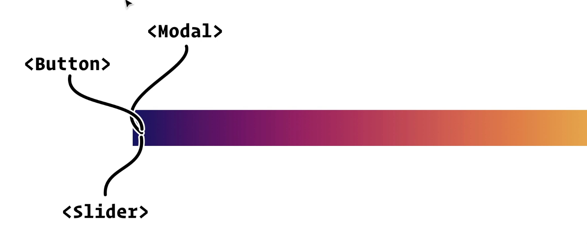
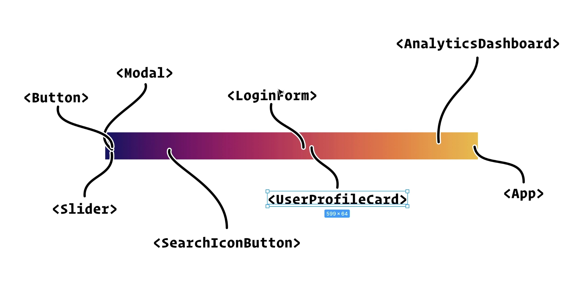
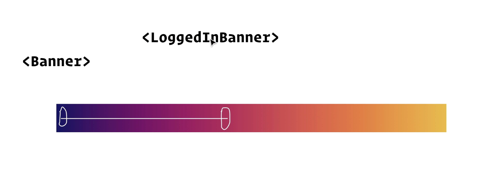
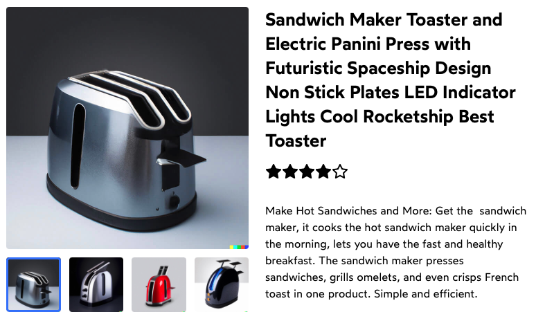
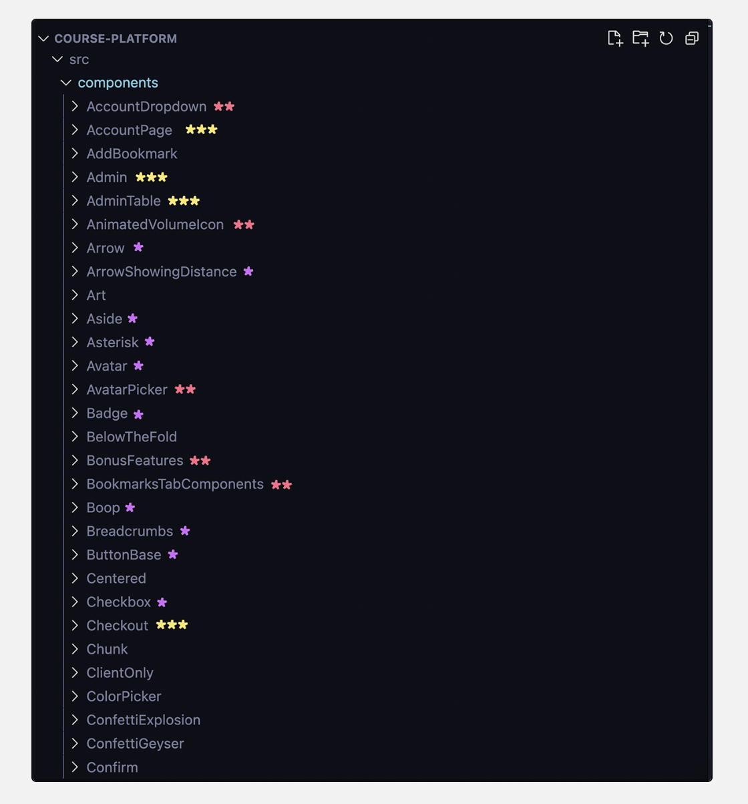
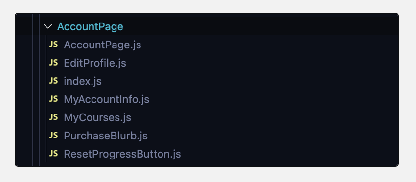
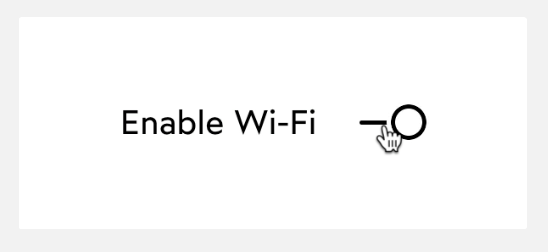
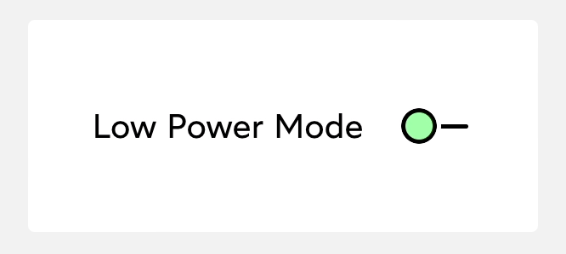
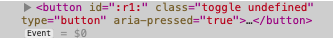
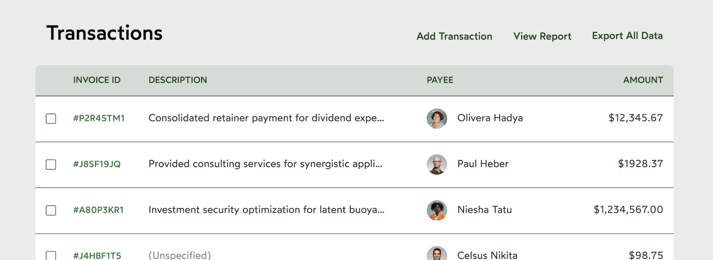

# The Joy of React - Module 4 - Course Notes

- [Course Outline Notes](course-notes.md)

## Component API Design

### Introduction

- Most common question, 'How do I create a React apps that scale?"

- Going to learn techniques that keep complexity manageable as apps grow larger and larger.
- Gain new mental models, ways of thinking that will help make architectural decisions in our apps.

- Producers and consumers
- Think of this, the restaurant analogy, the waiter is your 3rd party API, and the waiter is the interface that you use to access you meal. You don't see all that goes on in the kitchen.

- Twitter for example, teams of people just working on that API layer, they decide what the parameters should be, the routes, authentication, permissions.
- Producing and consuming, Twitter developers produce this API, and we consume it.
- Common pattern, every time we install an NPM package, we are consuming something another developer has produced.

- A React component is also like a closed system, like the Twitter example. A React component closes up the markup and styles, we don't have access to that directly, instead, we have access to the interface, which is props.

- As the person developing the components, we can control what props are included and excluded. And we don't think about it. In a React producer and consumer, we wear both hats.

- It may take some time to produce the component, but for years, you will be consuming it.
- If the props, are intuitive and easy to use, it will be easy to use.

- If a component is designed well, produced in a thoughtful manner, the prop interface, will be nice to work with in the future.

### The Spectrum of Components

- Here is a simple implementation of a `<Banner/>` component, meant to show teh user a message.

```JAVASCRIPT
import React from 'react';

import styles from './Banner.module.css';

function Banner({ type, user, children }) {
  const backgroundColor = type === 'success'
    ? 'var(--color-success)'
    : 'var(--color-error)';
  
  // Only logged in, verified users are
  // allowed to see the banner
  if (
    !user ||
    user.registrationStatus === 'unverified'
  ) {
    return null;
  }
  
  return (
    <div
      className={styles.banner}
      style={{ backgroundColor }}
    >
      {children}
    </div>
  );
}

export default Banner;
```

- What do you think about this structure?
- An opportunity to do things, in a more flexible and scalable way.

- The spectrum of components.
- On the left, primitive lego bricks we build our application with, reusable and generic.



- But we need things that are more application specific and tied into our business logic.
- As you move along the spectrum we start to be more and more tied into our specific application.



- At the end of the spectrum, the components that are the most tied into our application and business logic.

- Good mental model, every component should be clear where they sit on the spectrum.

- With this in mind, where should this go in our spectrum? How would you structure this?
- Whenever you render our <LoggedInBanner/> it does the business logic check, then it defers to our generic <Banner/>.

```JAVASCRIPT
// Create a new component
// this component can be responsible for the logic
// and then you can return a generic <Banner/>
function LoggedInBanner({ type, user, children }) {
  // Only logged in, verified users are
  // allowed to see the banner
  if (
    !user ||
    user.registrationStatus === 'unverified'
  ) {
    return null;
  }  

  return (
    <Banner type={type}>
      {children}
    </Banner>
  )
}
```

- And now, you have two separate components, that have two separate concerns.
- Purely cosmetic, based on it's type.

```JAVASCRIPT
// Generic Banner
function Banner({ type, children }) {
  const backgroundColor = type === 'success'
    ? 'var(--color-success)'
    : 'var(--color-error)';
   
  return (
    <div
      className={styles.banner}
      style={{ backgroundColor }}
    >
      {children}
    </div>
  );
}
```

- You can export `<LoggedInBanner>`, so you can use it in your `<App>`.
- Then you can use this in the `<App>` component, and if you wanted to just show, if you wanted to just show something all the time. Whether they are logged in or not.

```JAVASCRIPT
// BANNER
import React from 'react';

import Banner from './Banner';

const EXAMPLE_USER = {
  name: 'Sayen',
  registrationStatus: 'verified',
};

function App() {
  return (
    <Banner
      type="success"
    >
      Email to reset password sent!
    </Banner>
    
  );
}

export default App;
```

- But, if you wanted to conditionally show the `Banner` based on log in.
- Import your `LoggedInBanner` and use that in the place of `Banner`

```JAVASCRIPT
import React from 'react';

import { LoggedInBanner } from './Banner';

const EXAMPLE_USER = {
  name: 'Sayen',
  registrationStatus: 'verified',
};

function App() {
  return (
    <LoggedInBanner
      type="success"
      user={EXAMPLE_USER}
    >
      Successfully logged in! Welcome aboard, {EXAMPLE_USER.name}!
    </LoggedInBanner>
    
  );
}

export default App;
```

- Now you have two different components, that occupy different parts of the spectrum.
- `Banner`, is the primitive, and `LoggedInBanner` is the one with business logic.



- Benefits, you have these two differ components you can use depending on which banner is most appropriate.
- The real benefit, is the structure of your application.
- The problem is, when you cram all the logic in the low level component, it's impossible to maintain or follow. Early returns, conditions, etc.
- And every time the product changed, a new requirement, you end up cramming all that logic into one area of the app. Cannot tell what that part of the app is rendering.

- When you restructure it, it becomes very clear what each component does and renders.
- 📣 And as the product changes and scales, you can solve that by creating new components.
- The cool thing, is all the new components you are spinning off, all use the same underlying banner.

### Exercises

#### Product Details Page

Imagine you are building nan e-commerce site. You have received a mockup, and we implemented as one big component.

In terms of our spectrum of abstraction, we have created a very high  level component, but there are two lower level components hiding within. Begging to be extracted into their own components.

Your mission (is you choose it) is to identify a spectrum related problem and to extract at least 1 lower level component.

- AC's
  - Extract at least 1 lower-level, potentially-reusable component.
  - The extracted component can be defined inside `/ProductDetails.js`, below the main component.
  - If you are not sure where to start / which components should be extracted, I provide my suggestions below the sandbox.

👩‍💻 Code Sandbox - [Product Details Page](https://codesandbox.io/s/rp4htb?file=/ProductDetails.js&utm_medium=sandpack)

- Attempted to extract the `buttons`, within the photo carousel. And create a new component called `PhotoButtons`.
- Passing in as props, product, and the state, `selectedPhotoIndex` and `setSelectedPhotoIndex`

```JAVASCRIPT
// My attempt to abstract the photos button. 
function PhotoButtons({ product, selectedPhotoIndex, setSelectedPhotoIndex }) {
  return (
          <div className="buttons">
            {product.photos.map((photoSrc, index) => {
              const isSelected = selectedPhotoIndex === index;
  
              return (
                <button
                  key={index}
                  className="thumbnail-button"
                  onClick={() => setSelectedPhotoIndex(index)}
                >
                  <VisuallyHidden>
                    Toggle image #{index + 1}
                  </VisuallyHidden>
                  
                  <span
                    className="selected-ring"
                    style={{
                      opacity: isSelected ? 1 : 0,
                    }}
                  />
                </button>
              );
            })}
          </div>  
  )
}
```

- Solution: Try and do the star rating, because it's a low level component with a bunch of logic in it.
- Pass in the `product` as a prop.

```JAVASCRIPT
// Star rating
function StarRating({ product }) {
  return (
        <div className="star-rating">
          {range(5).map((num) => {
            const className =
              product.rating > num
                ? 'star filled'
                : 'star hollow';
            return <Star className={className} />;
          })}
        </div>
  )
}
```

- You can take this a step further, by updating the prop name, to `rating`, and just pass in the product.rating to make it clear you are only using a single object.

```JAVASCRIPT
function ProductDetails({ product }) {
    return (
        <StarRating 
          rating={product.rating}
        />
        // rest of component code
    )
}
// Star rating component
function StarRating({ rating }) {
  return (
        <div className="star-rating">
          {range(5).map((num) => {
            const className =
              rating > num
                ? 'star filled'
                : 'star hollow';
            return <Star className={className} />;
          })}
        </div>
  )
}
```

- Another thing you can pull out, is the photo toggle functionality.
- And move the state, inside that component, since it's not used anywhere else.

```JAVASCRIPT
function PhotoToggle({ photos }) {
  // move the state, inside the photos toggle
    const [
    selectedPhotoIndex,
    setSelectedPhotoIndex,
  ] = React.useState(0);
  
  return (
      <div>
                  
          <div className="buttons">
            {photos.map((photoSrc, index) => {
              const isSelected = selectedPhotoIndex === index;
  
              return (
                <button
                  key={index}
                  className="thumbnail-button"
                  onClick={() => setSelectedPhotoIndex(index)}
                >
                  <VisuallyHidden>
                    Toggle image #{index + 1}
                  </VisuallyHidden>
                  
                  <span
                    className="selected-ring"
                    style={{
                      opacity: isSelected ? 1 : 0,
                    }}
                  />
                </button>
              );
            })}
          </div>  
      </div>
  )
}
```

- Then take a look at the higher level component, much easier to see what is going on.
- In the props, you can see at a high level, what the data structure each component uses.

```JAVASCRIPT
// Uses the low level components, StarRating and PhotoToggle defined above. 
function ProductDetails({ product }) {

  return (
    <article className="product-details">
      <div className="photos-wrapper">
        <div>
          <PhotoToggle 
            photos={product.photos}
          />
        </div>
      </div>
      <div className="product-info">
        <h1>{product.title}</h1>
        <StarRating 
          rating={product.rating} 
        />
        <p className="product-description">
          {product.description}
        </p>
      </div>
    </article>
  );
}
```

- Full Solution of `ProductDetails.js`
- Code Sandbox - [Product Component Spectrum](https://codesandbox.io/s/magical-microservice-td2ghh?file=/ProductDetails.js)



```JAVASCRIPT
// ProductDetails.js
import React from 'react';
import { Star } from 'react-feather';

import { range } from './utils';
import VisuallyHidden from './VisuallyHidden';

function ProductDetails({ product }) {

  return (
    <article className="product-details">
      <div className="photos-wrapper">
        <div>
          <PhotoToggle 
            photos={product.photos}
          />
        </div>
      </div>
      <div className="product-info">
        <h1>{product.title}</h1>
        <StarRating 
          rating={product.rating} 
        />
        <p className="product-description">
          {product.description}
        </p>
      </div>
    </article>
  );
}

function StarRating({ rating }) {
  return (
        <div className="star-rating">
          {range(5).map((num) => {
            const className =
              rating > num
                ? 'star filled'
                : 'star hollow';
            return <Star className={className} />;
          })}
        </div>
  )
}

function PhotoToggle({ photos }) {
  // move the state, inside the photos toggle
    const [
    selectedPhotoIndex,
    setSelectedPhotoIndex,
  ] = React.useState(0);
  
  return (
      <div>
                  
          <div className="buttons">
            {photos.map((photoSrc, index) => {
              const isSelected = selectedPhotoIndex === index;
  
              return (
                <button
                  key={index}
                  className="thumbnail-button"
                  onClick={() => setSelectedPhotoIndex(index)}
                >
                  <VisuallyHidden>
                    Toggle image #{index + 1}
                  </VisuallyHidden>
                  
                  <span
                    className="selected-ring"
                    style={{
                      opacity: isSelected ? 1 : 0,
                    }}
                  />
                </button>
              );
            })}
          </div>  
      </div>
  )
}

export default ProductDetails;
```

#### Extracting a Card Component

In the sandbox below, we have two separate components that each implement a similar 'card' design. Let's extract into it's own `Card` component.

- 👩‍💻 Code sandbox - [Card Component](https://codesandbox.io/s/xrdbfl?file=/App.js&utm_medium=sandpack)

AC's

- Two files, `Card.js` and `Card.module.css`, have been created. Your mission is to populate them with the component + styles.
- You should use this component within `UserProfileCard` and `ProductInfoCard`.
- Note that the two cards have slightly differ styles: they have a different `box-shadow` value. Each card should be able to specify the elevation level for the shadow, to be applied dynamically inside `Card`.

- Create a `Card` component, with a `children` prop so you can use it in the other components `UserProfileCard` and `ProductInfoCard`

```JAVASCRIPT
import React from 'react';

import styles from './Card.module.css';

function Card({ children }) {
  /* TODO */
  return (
    <div className={styles.card}>
      {children}
    </div>
  )
}

export default Card;
```

- Make sure you bring over the base `.card` styles into your CSS module `Card.module.css`

```CSS
.card {
  background: white;
  padding: 16px;
  border-radius: 8px;
}
```

- Now you need to account for the different elevations within the CSS global variables, `var(--elevation-1)`, `var(--elevation-2)`, `var(--elevation-3)`.

- Add an `elevation` prop to your `Card` component
- Create a boxShadow variable, and interpolate the CSS variable using the value of the prop `elevation`
- And add it to the DOM element via the `style` attribute.

```JAVASCRIPT
import React from 'react';

import styles from './Card.module.css';

function Card({ 
  elevation = 2, // values 1 | 2 | 3
  children,
}) {
  /* TODO */
  // Create a style for the elevation prop, and interpolate into a string using the CSS variable
  const boxShadow = `var(--elevation-${elevation})`;
  return (
    <div className={styles.card} style={{ boxShadow }}>
      {children}
    </div>
  )
}

export default Card;
```

- Then, on your other components, import and then wrap with `Card` component. You can just pass in the elevation value you want, 1, 2, or 3.

```JAVASCRIPT
function UserProfileCard({ user }) {
  const profileUrl = `/users/${user.handle}`;
  const imageAlt = `${user.avatarDescription} (user profile photo)`;

  return (
    <>
    <Card elevation={1}>
      
      <a
        href={profileUrl}
        className={styles.userProfileLink}
      >
        {user.name}
      </a>
    </Card>
      
    </>
  );
}

export default UserProfileCard;
```

### Component Libraries

- A component library is a collection of low-level generic components. The LEGO bricks that every application needs. Things like buttons, date pickers and auto-pickers.

- This is mostly third-party component libraries. The most popular being Material UI.

- Josh doesn't recommend using these sorts of tools in most cases. Can be useful for prototyping, internal tools, but not well suited for production applications.

- Why not? Check out the blog post on the subject. [You don't need a UI framework.](https://www.smashingmagazine.com/2022/05/you-dont-need-ui-framework/)

- The most critical part, very few tech companies actually rely on these tools. If your goal is to become a better React developer, you will need to know how to build applications without relying on these tools.

- Most tech companies build their own first-party component libraries. At DigitalOcean, built [Walrus](https://www.digitalocean.com/blog/introducing-walrus-digitaloceans-reimagined-design), at Khan Academy, built [Wonder Blocks](https://khan.github.io/wonder-blocks/?path=/docs/overview--docs)

#### Usability and Accessibility

Tools that focus exclusively on usability and accessibility without prescribing a bunch fo styles.

- [Reach UI](https://reach.tech)
- [Headless UI](https://headlessui.com)
- [Radix Primitives](https://www.radix-ui.com)
- [React ARIA](https://react-spectrum.adobe.com/react-aria/)

Other mentions:

- [Chakra UI](https://chakra-ui.com)
- Tailwind

#### Design Systems

To understand why very few product-focused companies use third party component libraries. We need to talk about design systems.

- A design system is what gives a brand its unique identity. It is a collection of rules that govern how a product loos, feels and behaves. It includes tokens for colors, typography styles, and in-depth designs for specific UI elements.

- Design systems are built by designers using design software, like Figma or Sketch. They provide the documents to developers to implement components based on their designs.

- In terms of an analogy, the design system is like a recipe book. The component library is the set of prepared ingredients required, chopped onions, tomatoes and mushrooms. And the web application is the finished meal.

- **Here is the problem**, third party component libraries have their own design system baked in.

- Material UI for example, uses Google's 'Material Design' system. It's a very specific aesthetic, used by official Google applications across the web and Android.

- Now, third-party component libraries do allow us to customize/tweak the styles, but it would be incredibly difficult and annoying to try and swap out an  entire design system this way. Developers who have done this, have regretted it.

- 📣 the bottom line: very few tech companies rely on 'pre-styled' component libraries like Material UI, because they want complete control over the branding / aesthetic.

#### Application Structure

When building a first-party component library, it's common for the component library to be its own project. It has its own git repository, its own landing page, and its own documentation.

- This is useful when our components need to be shared across multiple projects, but honesty, it adds a ton of friction.
- Josh's practice, is to keep all the components, from the entire spectrum, in a single directory.
- For example; the components from this course platform.



- Components with a single purple asterisk *, lowest-level components.
- Moving up the spectrum, components marked with **, higher level components, like `AccountDropDown`
- Finally, high-level components marked with, ***, things like `AccountPage` which renders all the main content of the Account Page.

- Good way to work, it's a spectrum and all the components are at your finger tips.

- Also, some directories have multiple components, for example the `Account Page`.
- Allow you to keep all the related content together.
- Here, the `MyAccountInfo` component will never be used outside of `AccountPage` component, and so it doesn't make sense to clutter up my `/src/components` directory.



- Blog post on this topic, [Delightful React File Structure](https://www.joshwcomeau.com/react/file-structure/)

## Prop Delegation

In teh `Banner` example from the Spectrum lesson, we saw how our `LoggedIn` banner had to "forward" some props along:

```JAVASCRIPT
function LoggedInBanner({
  user,
  // These two props:
  type,
  children,
}) {
  if (
    !user ||
    user.registrationStatus === 'unverified'
  ) {
    return null;
  }

  // ...are forwarded along to Banner:
  return <Banner type={type}>{children}</Banner>;
}
```

- 🤔 What if the component had 10 forwarded props instead of 2? We would have to list them all out, one by one?
- React has a solution for that, instead we can take advantage of rest parameters and spread syntax
  - [JS Primer: Rest and Spread](https://courses.joshwcomeau.com/joy-of-react/10-javascript-primer/12-rest-spread)

- Here is what it looks like:

```JAVASCRIPT
function LoggedInBanner({
  user,
  // Collect all unspecified props:
  ...delegated
}) {
  if (
    !user ||
    user.registrationStatus === 'unverified'
  ) {
    return null;
  }

  // And pass them onto Banner:
  return <Banner {...delegated} />
}
```

- Chosen the name `delegated` ebcause it feels symantically appropriate, but we can name this variable whatever we want, some prefer `rest`:

- If you `console.log` the `delegated` variable, we see an object containing all of the other props provided to this component. For example:

```JAVASCRIPT
console.log(delegated);
/*
  {
    type: 'success',
    children: 'Account registered!',
  }
*/
```

- To apply these props onto our `Banner` element, we create an expression slot with curly brackets, and spread the props along using the spread syntax `...`:

```JAVASCRIPT
// This code: 
<Banner {...delegated} />

// ...is equivalent to this code: 
<Banner
    type={delegated.type}
    children={delegated.children}
/>

// ...which is the same thing as this code:
<Banner type={delegated.type}>
  {delegated.children}
</Banner>
```

- To go one step further in demystifying this new syntax, here's hwo it gets transpiled to plain JS:

```JAVASCRIPT
// This JSX...
<UserProfileCard user={currentUser} {...delegated} />

// ...turns into this JavaScript:
React.createElement(
  UserProfileCard,
  {
    user: currentUser,
    ...delegated
  }
);
```

- 🛑 One gatcha, the `...delegated` item needs to be the final item in the list. And cannot have a trailing comma, you will get an error.

```JAVASCRIPT
function Slider({
  label,
  ...delegated, // <-- This comma is a problem
}) {}
```

### Supercharged HTML tags

- Imagine you have a component, that is a text input.

```JAVASCRIPT
import React from 'react';

function TextInput({ 
    id, 
    label, 
    type,
    value,
    onChange,
}) {
  const generatedId = React.useId();
  const appliedId = id || generatedId;
  
  return (
    <div className="text-input">
      <label htmlFor={appliedId}>
        {label}
      </label>
      <input
        id={appliedId}
        type={type}
        value={value}
        onChange={onChange}
      />
    </div>
  );
}

export default TextInput;
```

- You only have access to the things you exposed via props.
- You cannot provide, whatever attribute you would normally put on a text input, `required={true}` or a `minLength={12}` for example.
- React will not recognize those attributes if not provided via props. React has no idea that a component is supposed to be a wrapper around your `input` field
- All React knows, is we created a component, and it returns some JSX.
- And given them `props`, to work with.

- 📣 If you want your component `TextInput`, to work with attributes of the `input`, you have to use the prop delegation trick.

- If you have a bunch of props, you can combine them into a `...delegated` object

```JAVASCRIPT
function TextInput({ id, label, ...delegated }) {
    return (
        // JSX here...
    )
}
```

- Then in your JSX, spread the delegated object onto your element, this case the `input` field.
- 🆒 You can choose where to put your `...delegated` props, can go on any element, and be passed in.

```JAVASCRIPT
// TextInput.js
import React from 'react';

function TextInput({ id, label, ...delegated }) {
  const generatedId = React.useId();
  const appliedId = id || generatedId;
  
  return (
    <div className="text-input">
      <label htmlFor={appliedId}>
        {label}
      </label>
      <input
        id={appliedId}
        // spread the ...delegated props
        {...delegated}
      />
    </div>
  );
}

export default TextInput;
```

- When you use the component, you can add a bunch of props, and passing into the component.
- All of the stuff you specify in the `input` is automatically being delegated along.

```JAVASCRIPT
    <TextInput
      required={true}
      data-test-id="login-email-field"
      label="Email"
      type="email"
      value={email}
      onChange={(event) => {
        setEmail(event.target.value);
      }}
    />
```

- Full component: [LogIn Form, Delegated](https://codesandbox.io/s/ckz6pc?file=/LoginForm.js&utm_medium=sandpack)

```JAVASCRIPT
// LogIn form...adding a bunch of properties to the TextInput
import React from 'react';

import TextInput from './TextInput';

function LoginForm() {
  const [email, setEmail] = React.useState('');
  const [password, setPassword] = React.useState('');

  function handleLogin() {
    alert(`Logged in with ${email}`);
  }

  return (
    <form onSubmit={handleLogin}>
      <TextInput
        required={true}
        data-test-id="login-email-field"
        label="Email"
        type="email"
        value={email}
        onChange={(event) => {
          setEmail(event.target.value);
        }}
      />
      <TextInput
        required={true}
        minLength={12}
        label="Password"
        type="password"
        value={password}
        onChange={(event) => {
          setPassword(event.target.value);
        }}
      />
      <button>
        Submit
      </button>
    </form>
  );
}

export default LoginForm;
```

### Exercises, Prop Delegation

Exercises for Prop Delegation

#### A Slider Component

- In the [sandbox](https://codesandbox.io/s/f6m2ku?file=/Slider.js&utm_medium=sandpack), you have a `Slider` component.

- Internally, this component renders an `<input type"range">` the built-in DOM neod for creating ranges and sliders. And so we can think of thi s`Slider` component as a "supercharged" range input.

- Unfortunately, we've only exposed a subset of attributes we might wish to set on this DOM node through props.
- Your mission is to forward all props on to the input, so that we can treat `<Slider>` as a supercharged range input.

**ACs**

- The `Slider` component should use the prop delegation technique to forward all unspecified props to the `<input type="range">` that renders.

- Add the `...delegated` rest parameter to your component as a prop.
- And then spread that onto your element in the JSX, the `<input>` slider.

```JAVASCRIPT
import React from 'react';

import styles from './Slider.module.css';

// add the ...delegated rest parameter
function Slider({ label, ...delegated }) {
  const id = React.useId();
  
  return (
    <div className={styles.wrapper}>
      <label
        htmlFor={id}
        className={styles.label}
      >
        {label}
      </label>
      <input
        type="range"
        id={id}
        className={styles.slider}
        // spread that onto the input
        {...delegated}
      />
    </div>
  );
}

export default Slider;
```

#### A Toggle Component

- Toggle components are similar to checkboxes. They are often used to flip a value on or off.
- We have a custom `Toggle` component, like this:



- We want to be abe to pass a custom `className` to provide custom styles. For example, passing a CSS class that updates the color of the toggle circle.



- Your mission is to update the `Toggle` component so that it can be customized, by passing a `className`. It should also support additional custom props, like data attributes.

**ACs**

- In the example below, the second `<Toggle>` instance has a prop: `className="green-toggle`. This class should be applied to the `<button>` inside the `Toggle` component, producing the green circle shown in the GIF above.
- Other props (eg. data attributes) should also be forwarded along to the `<button>` element.

Note: It may be helpful to review the [Conflicts section](https://courses.joshwcomeau.com/joy-of-react/10-javascript-primer/12-rest-spread) of the Rest/Spread primer lesson.

- [Code Sandbox Toggle](https://codesandbox.io/s/0t2xol?file=/App.js&utm_medium=sandpack)

- Want to have the built in CSS class `toggle`, as well as the modifier CSS class `green-toggle`.
- The way to do this, is to make a prop for `className`, and to manually add the class in our component.
- Create an expression slot, and use a template string, and then interpolate in the CSS `className`

```JAVASCRIPT
// Toggle.js
function Toggle({
    label,
    checked,
    onClick,
    className,
    ...delegated
}) {
    return (
      <button
        id={id}
        // template string to interpolate the supplied className
        className={`toggle ${className}`}
        type="button"
        aria-pressed={checked}
        onClick={onClick}
        {...delegated}
      >
    )
}
```

- Small bug 🐛: When you interpolate a prop, without providing a value, React will translate to the string `undefined`. And you end up with a CSS `className` of `undefined`, which is kind of strange.



- To fix this, just set a default value of `''`, on the `className` prop, which resolve to nothing.

```JAVASCRIPT
function Toggle({
  label,
  checked,
  onClick,
  className = '',
  ...delegated
}) {
    // code here
}
```

- Full solution: Toggle Component

```JAVASCRIPT
// Toggle.js
import React from 'react';

function Toggle({
  label,
  checked,
  onClick,
  className = '',
  ...delegated
}) {
  const id = React.useId();
  
  // This style updates the UI, to move the ball
  // and indicate whether it's toggled or not.
  const ballStyle = {
    transform: checked
      ? `translateX(100%)`
      : `translateX(0%)`,
  };
  
  return (
    <div className="wrapper">
      <label
        htmlFor={id}
        className="label"
      >
        {label}
      </label>
      <button
        id={id}
        className={`toggle ${className}`}
        type="button"
        aria-pressed={checked}
        onClick={onClick}
        {...delegated}
      >
        <span className="ball" style={ballStyle} />
      </button>
    </div>
  );
}

export default Toggle;
```

```JAVASCRIPT
// App.js
import React from 'react';

import useToggle from './hooks/use-toggle';
import Toggle from './Toggle';

function App() {
  const [enableWifi, toggleEnableWifi] = useToggle(true);
  const [lowPowerMode, toggleLowPowerMode] = useToggle(false);
  
  return (
    <main>
      <Toggle
        label="Enable Wi-Fi"
        checked={enableWifi}
        onClick={toggleEnableWifi}
      />
      <Toggle
        className="green-toggle"
        label="Low Power Mode"
        checked={lowPowerMode}
        onClick={toggleLowPowerMode}
      />
    </main>
  );
}

export default App;
```

#### Conflicts

In the "Toggle" exercise from previous lesson, we saw how delegated props can lead to some issues if there are conflicts.

- For example:

```JAVASCRIPT
function Checkbox({ label, ...delegated}) {
  const id = React.useId();

  return (
    <>
      <label htmlFor={id}>
        {label}
      </label>
      <input
        id={id}
        type="checkbox"
        {...delegated}
      />
    </>
  );
}
```

- This `Checkbox` component applies two hardcoded attributes to the `<input>`, `type` and `id`.
- Now suppose the consumer of this component uses it like this:

```JAVASCRIPT
<Checkbox 
  label="Do you agree with terms?"
  type="button"
  onClick={handleAgreeTerms}
/>
```

- The `type` and `onClick` props are not specified in the `Checkbox` component, and so thy are collected into the `delegated` object, and pasted onto the `<input>`:

```JAVASCRIPT
// Here's the React element that will be created:
<input
  id={id}
  type="checkbox"
  type="button"
  onClick={handleAgreeToTerms}
/>
```

- We have specified two different values for `type` and when there are conflicts like this, **later values overwrite earlier ones**. And this input will be a button instead of a checkbox.

📣 Essentially the consumer has "hacked" our Checkbox component to not render a checkbox!

- Instead, re-write our `Checkbox` component to spread the provided props first:

```JAVASCRIPT
function Checkbox({ label, ...delegated}) {
  const id = React.useId();

  return (
    <>
      <label htmlFor={id}>
        {label}
      </label>
      <input
        {...delegated}
        id={id}
        type="checkbox"
      />
    </>
  );
}
```

- With this change, the same `<Checkbox>` element produces a different result:

```JAVASCRIPT
<input
  // Delegated props:
  type="button"
  onClick={handleAgreeToTerms}
  // Built-in attributes:
  id={id}
  type="checkbox"
/>

// After removing the duplicate `type`, we're left with:
<input
  onClick={handleAgreeToTerms}
  id={id}
  type="checkbox"
/>
```

- 📣 Because we flipped the order, the user-supplied `type="button"` will now be overwritten by the built-in `type="checkbox`.

#### A powerful tool in API design

- When we produce React components, we get to decide how much power we want to give consumers. We can choose which properties they are allowed to overwrite, adn which ones are mandatory / locked in.

- In the example above, the `Checkbox` should always render an `<input type="checkbox">`, and so I don't want to let consumers overwrite the `type` attribute.

- But this is not always the case. Sometimes, you want the consumer to overwrite the built-in attributes.

```JAVASCRIPT
function ArrowIcon({ size, ...delegated }) {
  return (
    <svg
      xmlns="http://www.w3.org/2000/svg"
      viewBox="0 0 24 24"
      width={size}
      height={size}
    >
      <path
        d="M 20 0 L 24 12 L 0 12 L 24 12 L 20 24"
        stroke="black"
        strokeLinecap="round"
        {...delegated}
      />
    </svg>
  );
}
```

- By default, this component will render a black arrow with rounded lines, but I can supply my own overrides:

```JAVASCRIPT
<ArrowIcon stroke="red" strokeLinecap="square" />
```

- No right/wrong answer when it comes to where the `{...delegated}` should go.
- It is a choice we can use as a tool, to decide how much power/flexibility I want to grant to the developers consuming the component.

#### Manually managing conflicts

Sometimes, delegated props is to blunt of a tool, we need to do some manual work to resolve the conflict.

- For example, when it comes to CSS classes, we often want to apply both the user-supplied class as well as the built-in one.

- In teh Toggle exercise, we manually merged teh two classes together sot hat we were applyign the `toggle` class as well as the `green-toggle` class.

- I've built a lot of components that follow this exact template. Here is the bare bones example:

```JAVASCRIPT
function Template({ className = '' }) {
  const appliedClass = `built-in-class ${className}`;

  return (
    <div
      className={appliedClass}
    />
  );
}
```

- In a sense, we seen this example of this pattern already, when we talked about the Rules of Hooks:

```JAVASCRIPT
function TextInput({ id, label, type }) {
  let generatedId = React.useId();
  let appliedId = id || generatedId;

  return (
    <div className="text-input">
      <label htmlFor={appliedId}>
        {label}
      </label>
      <input
        id={appliedId}
        type={type}
      />
    </div>
  );
}
```

- If the user supplies an `id` prop, it will be used for the input's `id`, and the label's `htmlFor`.
- If they don't , we will use the generated value we get from the `React.useId` hook.

- We could rely on rest/spread to apply the correct `id` on the `<input>`, but we also need to set the exact same value on the `<label>`, via the `htmlFor` attribute. As a result we need to manage ths conflict manually.

- Here is one more example, where we can supply custom inline styles to a component that already has some.

```JAVASCRIPT
function ExampleComponent({
  // User-specified styles.
  // Defaults to an empty object so that we always receive an
  // object, never “undefined”:
  style = {},
  children,
  ...delegated
}) {
  const builtInStyle = {
    padding: 16,
    background: 'red',
  };

  return (
    <div
      {...delegated}
      style={{
        // Merge both sets of styles, prioritizing the
        // built-in styles:
        ...style,
        ...builtInStyle,
      }}
    >
      {children}
    </div>
  );
}
```

- To review, we have several options when it comes to conflicting attributes.

1. If we want the consumer to overwrite a particular hardcoded attribute, we can place the `{...delegated}` syntax afterwards.
2. If we want to prioritize the hardcoded attribute, however, the `{...delegated}` syntax should come first.
3. If we want to merge both values, we will need to manage it ourselves, without using `{...delegated}`.

All 3 of these options are valid in different situations. 📣 It all comes down to how much control we want to grant the consumer.

#### Delegating Styles

- How do you manage low level component, and allow them to be used and styled in many differ situations.
- Allow for flexibility when it comes to styles.
- A low level component `<Slider/>`, on the spectrum, might be used in many places in a larger React application.
- 📣 Lots of different context, lots of different designs, we want to be flexible enough, to adapt to all those circumstances.

- In the example; building a `VolumeSlider` component that consumes the lower level `<Slider />` component, and we want to make a couple tweaks
  - Update the handle size
  - And the color of the handle

```JAVASCRIPT
import React from 'react';

import Slider from './Slider_props';
import styles from './VolumeSlider.module.css';

function VolumeSlider({ volume, setVolume }) {
  return (
    <Slider
      label="Volume"
      min={0}
      max={100}
      value={volume}
      onChange={(event) => {
        setVolume(event.target.value);
      }}
    />
  );
}

export default VolumeSlider;
```

- 🤔 How do you allow the lower level `<Slider />` component to be customized? Two main ways:

1. Add explicit `props` for all the things, we want to customize. For example, add the `handleSize`, `handleColor` and `handleActiveColor` props to the low level `Slider` component

```JAVASCRIPT
function VolumeSlider({ volume, setVolume }) {
  return (
    <Slider
      label="Volume"
      min={0}
      max={100}
      value={volume}
      // explicitly customize
      handleSize={12}
      handleColor="green"
      handleActiveColor="lightGreen"
      //
      onChange={(event) => {
        setVolume(event.target.value);
      }}
    />
  );
}
```

2. Add a `className = ''` prop to the low level component, and the consumer can supply whatever `className` they want. Then create a variable, that will combine the consumer supplied `className` with the baseline styles.

```JAVASCRIPT
import React from 'react';

import styles from './Slider.module.css';

function Slider({ label, className = '', ...delegated }) {
  const id = React.useId();
  
  // Combine the baseline styles, with the consumer supplied
  const sliderClassName = `${styles.slider} ${className}`;

  return (
    <div className={styles.wrapper}>
      <label htmlFor={id} className={styles.label}>
        {label}
      </label>
      <input
        {...delegated}
        type="range"
        id={id}
        // Pass all styles in
        className={sliderClassName}
      />
    </div>
  );
}

export default Slider;
```

- And instead of setting all the `props` individually like above, you just set `className={styles.volumeSlider}` on the low level component. And the styles, will be within your CSS module `VolumeSlider.module.css`.

```JAVASCRIPT
// VolumeSlider
import React from 'react';

import Slider from './Slider_className';
// Add your styles
import styles from './VolumeSlider.module.css';

function VolumeSlider({ volume, setVolume }) {
  return (
    <Slider
      label="Volume"
      min={0}
      max={100}
      value={volume}
      // Pass styles into the component
      className={styles.volumeSlider}
      onChange={(event) => {
        setVolume(event.target.value);
      }}
    />
  );
}

export default VolumeSlider;
```

- Any modification you want to make, just add to your CSS module

```CSS
.volumeSlider {
  --handle-size: 12px;
  --handle-color: red;
  --handle-active-color: lightgreen;
}
```

- 📣 Pass a `className` and declare whatever tweaks we want in the CSS file.
- 📣 Or, create a limited number of props, and use those props within the body of the component.

- 🤔 Which of these approaches do you prefer, and Pros and Cons?

- Big debate with no consensus among the React community. The biggest difference here is how much power you want to grant the consumer of your component.

- With the `className` approach, developers can apply any CSS they want to the `<input>`.
- For example; we could add some CSS to make the slider `vertical`.

```CSS
.verticalSlider {
  width: 100px;
  transform: rotate(-90deg);
  margin: 50px;
}
```

- 📣 By exposing the `className` prop, we grant teh consumer a lot of control. With individual props, we limit that control.

#### The arguments for specific props

- When building low level components, likely to implement them according to a design system.

- A design system is a document that provides guidelines and rules on using each component. The components we implement should only allow the customizations specified in the design system.

- In other words, we want to make sure that developers "color within the lines". By exposing a `className` prop, a rogue developer could radically change how this component is styled, in violation of the design system.

- Components are meant to encapsulate markup, logic and styles. What is the point of having a DS if the developer can do whatever they want with the aesthetic?

- We can always update the DS as requirements change. But it's chaos to allow developers to apply any CSS they like to these components.

#### The argument for "className" prop

- In a real world app, the 'specific props' approach becomes unwieldy.
- What if wanted to speficy a hover color? Customize the handle size, but only for a specific media query?

- CSS is a huge and sprawling language. We could end up with 50+ props, which would be a nightmare to maintain.
- What if a designer comes up with a legitimate use case that doesn't work with our specific props?

- Here is what will happen, developers will reach around React altogether, and apply whatever CSS they want.

```CSS
/* HACK: Apply rotation to Slider component */
.some-wrapper form input[type="range"] {
  margin: 50px !important;
  transform: rotate(90deg) !important;
}
```

- Cannot stop a developer from applying CSS to a particular element. A determined developer can still apply whatever styles they want.
- Or worse, they decide to create an `SliderAlt` that is 95% the same, but different in this one regard. Some codebase have multiple near-identical components because the prop interface wasn't flexible enough.

- 📣 It is just not realistic to come up a handful of style-related props that work for every possible use case. The world is to messy for that.

### Final thought

- Go with the `className` approach.

### Forwarding Refs

- `ref` is a reserved work in React, so you cannot use it as a custom prop on a React component.
- In your `App` component, you are consuming the `Slider` component. Thinking of it as a super charged input. Giving it a bunch of props and you want to capture the input via a `ref`
- This doesn't work, because we are not allowed to capture `references` of functional components, `<Slider />`.

```JAVASCRIPT
// App.js
import React from 'react';

import Slider from './Slider';

function App() {
  const [volume, setVolume] = React.useState(50);
  
  // Create a React ref:
  const sliderRef = React.useRef();
  
  React.useEffect(() => {
    // Focus the slider on mount:
    sliderRef.current.focus();
  }, []);
  
  return (
    <main>
      <Slider
        // Capture a reference to the slider:
        ref={sliderRef}
        label="Volume"
        min={0}
        max={100}
        value={volume}
        onChange={(event) => {
          setVolume(event.target.value);
        }}
      />
    </main>
  );
}

export default App;
```

- To solve this, we can capture that reference, on the actual component.
- If someone tries to use a `ref` on the component, we can do that, my adding the `React.forwardRef` to the export of the component, `Slider`.
- Also adding `ref` as an argument.
- And `ref={ref}` to your element.

```JAVASCRIPT
// Slider.js
import React from 'react';

import styles from './Slider.module.css';

function Slider({ label, ...delegated }, 
  // add the ref
  ref) {
  const id = React.useId();
  
  return (
    <div className={styles.wrapper}>
      <label
        htmlFor={id}
        className={styles.label}
      >
        {label}
      </label>
      <input
        // add ref to your element
        ref={ref}
        {...delegated}
        type="range"
        id={id}
        className={styles.slider}
      />
    </div>
  );
}

// Add the forwardRef helper
export default React.forwardRef(Slider);
```

- Then in `App.js`, you can just pass along the `ref`.

```JAVASCRIPT
import React from 'react';

import Slider from './Slider';

function App() {
  const [volume, setVolume] = React.useState(50);
  
  // Create a React ref:
  const sliderRef = React.useRef();
  
  React.useEffect(() => {
    // Focus the slider on mount:
    sliderRef.current.focus();
  }, []);
  
  return (
    <main>
      <Slider
        // Capture a reference to the slider:
        ref={sliderRef}
        label="Volume"
        min={0}
        max={100}
        value={volume}
        onChange={(event) => {
          setVolume(event.target.value);
        }}
      />
    </main>
  );
}

export default App;
```

- 🤔 This is known as a higher-order component in React. It takes a component as input, and produces a new component as output.

- Note, if you want to use `React.memo` and `React.forwardRef` on the same component?

```JAVASCRIPT
export default React.memo(React.forwardRef(Slider));
```

#### Exercises, Supercharged Button

Get some practice forwarding refs along.

- In the [sandbox](https://codesandbox.io/s/755kcr?file=/App.js&utm_medium=sandpack), have a `<Button>` component, and we want to set i tup to be a 'supercharged' button. This means we should be able to capture a reference to it, as well as forward all props along to it.

ACs:

- When hovering or focusing the button in the DOM, it should log "Captured ref: HTMLElement" in the console.
- There should be no console warning.

- My solution:

```JAVASCRIPT
// Button.js
import React from 'react';

import styles from './Button.module.css';

// Add ref as a parameter to forward along
// And add the ...delegated prop
function Button({ children, ...delegated }, ref) {
  return (
    <button 
      className={styles.btn} 
      // Put ref on the element
      ref={ref}
      // Spread any props onto the button
      {...delegated}
    >
      {children}
    </button>
  );
}

// Add the React.forwardRef
export default React.forwardRef(Button);
```

- App.js

```JAVASCRIPT
// App.js
import React from 'react';

import Button from './Button';

function App() {
  // Capture the element
  const buttonRef = React.useRef();
  
  // Console log the element on onFocus
  function logRef() {
    console.log('Captured ref:', buttonRef.current);
  }
  
  return (
    <Button
      // add ref as prop
      ref={buttonRef}
      onMouseEnter={logRef}
      onFocus={logRef}
    >
      Hover or Focus Me
    </Button>
  );
}

export default App;
```

#### Exercise, SquareSlider forwarding

One of the great things about Rect is the ability to 'compose' components. For example, we can build a `SquareSlider` component that builds on the lower-level `Slider` component, locking in specific values.

In the sandbox below, we are trying to capture a ref on a `<SquareSlider>` component, but it isn't working. Your mission is to fix it.

ACs

- The `sliderRef` ref should hold a reference to the `<input type="range">`.
- You can verify this in teh console. It should show that `sliderRef` holds an `HTMLElement`.

- Code Sandbox - [Square Slider Forwarding](https://codesandbox.io/s/mfr63n?file=/App.js&utm_medium=sandpack)

- In this one, you have to pass down the `ref` to the lower level component. `App` > `SquareSlider` > `Slider`. Using the `React.forwardRef` on the two lower level components.

```JAVASCRIPT
// App.js
import React from 'react';

import SquareSlider from './SquareSlider';

function App() {
  // Define the ref
  const sliderRef = React.useRef();
  
  React.useEffect(() => {
    // Log the value on mount
    console.log(sliderRef.current);
  }, []);
  
  return (
    <main>
      <SquareSlider
        // Define the ref prop
        ref={sliderRef}
        label="Intensity"
        min={0}
        max={10}
      />
    </main>
  );
}

export default App;
```

- `SquareSlider` Component

```JAVASCRIPT
// SquareSlider.js
import React from 'react';

import Slider from './Slider';
import styles from './SquareSlider.module.css';

// add ref prop
function SquareSlider(props, ref) {
  return (
    <Slider 
      // pass down to lower level
      ref={ref}
      {...props}
      className={styles.squareSlider} 
    />
  );
}

// wrap in forwardRef, to pass it down to lower level
export default React.forwardRef(SquareSlider);
```

- And low level `Slider` component

```JAVASCRIPT
// Slider.js
import React from 'react';

import styles from './Slider.module.css';

// add the ref as a parameter
function Slider({ label, className = '', ...delegated }, ref) {
  const id = React.useId();
  
  return (
    <div className={styles.wrapper}>
      <label
        htmlFor={id}
        className={styles.label}
      >
        {label}
      </label>
      <input
        {...delegated}
        // define the element to use ref
        ref={ref}
        type="range"
        id={id}
        className={`${styles.slider} ${className}`}
      />
    </div>
  );
}

// Wrap in an forwardRef
export default React.forwardRef(Slider);
```

### Polymorphism

In order to build usable, accessible interfaces, it's important to understand the semantics of different HTML tags.

- For example; if an element can be clicked to perform an action in JS, it should be a button. Unless that action is to navigate the user to a new page, in which case, it should be an anchor `<a>`.

- When choose an HTML tag, it is much more important to focus on the semantics than the aesthetics.
- You should use a `<button>` even if you don't want it to look like a button.
- With CSS, we can strip away all those built in button stles.
- It is easier to remove a handful of CSS rules than it is to recreate all of the usability benefits built into the `<button>` tag.
- With that in mind, let's suppose our designer wants us to build the following UI.



- See the top right corner, actions the user can take
- Looks like links? It depends on whether clicking them changes teh URL or not.
- "Export All Data" doesn't sound like a link to me; I imagine it generating a .csv and emailing it to the user.

- So, we can build a `LinkButton` component. It's always going to look like a link, but it's going to be flexible in its implementation: it can either render a `<a>` tag or a `<button>` tag, depending on whether an `href` is supplied.

- [Check out the sandbox](https://codesandbox.io/s/wor88z?file=/LinkButton.js&utm_medium=sandpack)

ACs:

- The `LinkButton` component has an optional prop, `herf`
- If an `href` is provided, `LinkButton` should render an `<a>` tag, otherwise it should render a `<button>` tag.

```JAVASCRIPT
import React from 'react';

import styles from './LinkButton.module.css';

function LinkButton({ href, children, ...delegated }) {
  // TODO: render an <a> tag if “href” is provided.
  const Tag = typeof href === 'string' ? 'a' : 'button';
  
  return (
    <Tag 
      className={styles.button}
      href={href}
      {...delegated}
    >
      {children}
    </Tag>
  )
}

export default LinkButton;
```
