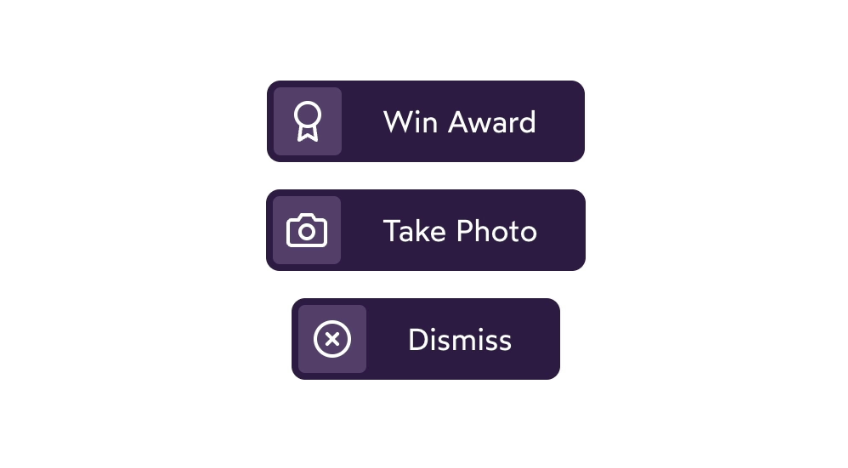
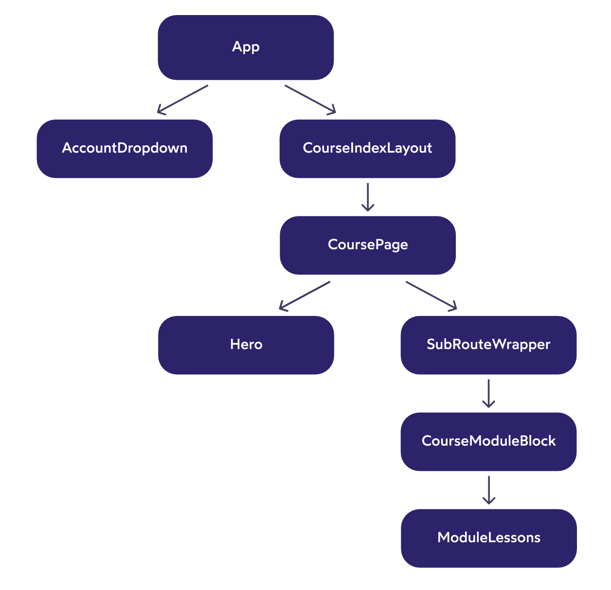

# The Joy of React - Module 4 - Course Notes

- [Course Outline Notes](course-notes.md)

## Component API Design

### Introduction

- Most common question, 'How do I create a React apps that scale?"

- Going to learn techniques that keep complexity manageable as apps grow larger and larger.
- Gain new mental models, ways of thinking that will help make architectural decisions in our apps.

- Producers and consumers
- Think of this, the restaurant analogy, the waiter is your 3rd party API, and the waiter is the interface that you use to access you meal. You don't see all that goes on in the kitchen.

- Twitter for example, teams of people just working on that API layer, they decide what the parameters should be, the routes, authentication, permissions.
- Producing and consuming, Twitter developers produce this API, and we consume it.
- Common pattern, every time we install an NPM package, we are consuming something another developer has produced.

- A React component is also like a closed system, like the Twitter example. A React component closes up the markup and styles, we don't have access to that directly, instead, we have access to the interface, which is props.

- As the person developing the components, we can control what props are included and excluded. And we don't think about it. In a React producer and consumer, we wear both hats.

- It may take some time to produce the component, but for years, you will be consuming it.
- If the props, are intuitive and easy to use, it will be easy to use.

- If a component is designed well, produced in a thoughtful manner, the prop interface, will be nice to work with in the future.

### The Spectrum of Components

- Here is a simple implementation of a `<Banner/>` component, meant to show teh user a message.

```JAVASCRIPT
import React from 'react';

import styles from './Banner.module.css';

function Banner({ type, user, children }) {
  const backgroundColor = type === 'success'
    ? 'var(--color-success)'
    : 'var(--color-error)';
  
  // Only logged in, verified users are
  // allowed to see the banner
  if (
    !user ||
    user.registrationStatus === 'unverified'
  ) {
    return null;
  }
  
  return (
    <div
      className={styles.banner}
      style={{ backgroundColor }}
    >
      {children}
    </div>
  );
}

export default Banner;
```

- What do you think about this structure?
- An opportunity to do things, in a more flexible and scalable way.

- The spectrum of components.
- On the left, primitive lego bricks we build our application with, reusable and generic.


- But we need things that are more application specific and tied into our business logic.
- As you move along the spectrum we start to be more and more tied into our specific application.


- At the end of the spectrum, the components that are the most tied into our application and business logic.

- Good mental model, every component should be clear where they sit on the spectrum.

- With this in mind, where should this go in our spectrum? How would you structure this?
- Whenever you render our <LoggedInBanner/> it does the business logic check, then it defers to our generic <Banner/>.

```JAVASCRIPT
// Create a new component
// this component can be responsible for the logic
// and then you can return a generic <Banner/>
function LoggedInBanner({ type, user, children }) {
  // Only logged in, verified users are
  // allowed to see the banner
  if (
    !user ||
    user.registrationStatus === 'unverified'
  ) {
    return null;
  }  

  return (
    <Banner type={type}>
      {children}
    </Banner>
  )
}
```

- And now, you have two separate components, that have two separate concerns.
- Purely cosmetic, based on it's type.

```JAVASCRIPT
// Generic Banner
function Banner({ type, children }) {
  const backgroundColor = type === 'success'
    ? 'var(--color-success)'
    : 'var(--color-error)';
   
  return (
    <div
      className={styles.banner}
      style={{ backgroundColor }}
    >
      {children}
    </div>
  );
}
```

- You can export `<LoggedInBanner>`, so you can use it in your `<App>`.
- Then you can use this in the `<App>` component, and if you wanted to just show, if you wanted to just show something all the time. Whether they are logged in or not.

```JAVASCRIPT
// BANNER
import React from 'react';

import Banner from './Banner';

const EXAMPLE_USER = {
  name: 'Sayen',
  registrationStatus: 'verified',
};

function App() {
  return (
    <Banner
      type="success"
    >
      Email to reset password sent!
    </Banner>
    
  );
}

export default App;
```

- But, if you wanted to conditionally show the `Banner` based on log in.
- Import your `LoggedInBanner` and use that in the place of `Banner`

```JAVASCRIPT
import React from 'react';

import { LoggedInBanner } from './Banner';

const EXAMPLE_USER = {
  name: 'Sayen',
  registrationStatus: 'verified',
};

function App() {
  return (
    <LoggedInBanner
      type="success"
      user={EXAMPLE_USER}
    >
      Successfully logged in! Welcome aboard, {EXAMPLE_USER.name}!
    </LoggedInBanner>
    
  );
}

export default App;
```

- Now you have two different components, that occupy different parts of the spectrum.
- `Banner`, is the primitive, and `LoggedInBanner` is the one with business logic.


- Benefits, you have these two differ components you can use depending on which banner is most appropriate.
- The real benefit, is the structure of your application.
- The problem is, when you cram all the logic in the low level component, it's impossible to maintain or follow. Early returns, conditions, etc.
- And every time the product changed, a new requirement, you end up cramming all that logic into one area of the app. Cannot tell what that part of the app is rendering.

- When you restructure it, it becomes very clear what each component does and renders.
- 📣 And as the product changes and scales, you can solve that by creating new components.
- The cool thing, is all the new components you are spinning off, all use the same underlying banner.

### Exercises

#### Product Details Page

Imagine you are building nan e-commerce site. You have received a mockup, and we implemented as one big component.

In terms of our spectrum of abstraction, we have created a very high  level component, but there are two lower level components hiding within. Begging to be extracted into their own components.

Your mission (is you choose it) is to identify a spectrum related problem and to extract at least 1 lower level component.

- AC's
  - Extract at least 1 lower-level, potentially-reusable component.
  - The extracted component can be defined inside `/ProductDetails.js`, below the main component.
  - If you are not sure where to start / which components should be extracted, I provide my suggestions below the sandbox.

👩‍💻 Code Sandbox - [Product Details Page](https://codesandbox.io/s/rp4htb?file=/ProductDetails.js&utm_medium=sandpack)

- Attempted to extract the `buttons`, within the photo carousel. And create a new component called `PhotoButtons`.
- Passing in as props, product, and the state, `selectedPhotoIndex` and `setSelectedPhotoIndex`

```JAVASCRIPT
// My attempt to abstract the photos button. 
function PhotoButtons({ product, selectedPhotoIndex, setSelectedPhotoIndex }) {
  return (
          <div className="buttons">
            {product.photos.map((photoSrc, index) => {
              const isSelected = selectedPhotoIndex === index;
  
              return (
                <button
                  key={index}
                  className="thumbnail-button"
                  onClick={() => setSelectedPhotoIndex(index)}
                >
                  <VisuallyHidden>
                    Toggle image #{index + 1}
                  </VisuallyHidden>
                  
                  <span
                    className="selected-ring"
                    style={{
                      opacity: isSelected ? 1 : 0,
                    }}
                  />
                </button>
              );
            })}
          </div>  
  )
}
```

- Solution: Try and do the star rating, because it's a low level component with a bunch of logic in it.
- Pass in the `product` as a prop.

```JAVASCRIPT
// Star rating
function StarRating({ product }) {
  return (
        <div className="star-rating">
          {range(5).map((num) => {
            const className =
              product.rating > num
                ? 'star filled'
                : 'star hollow';
            return <Star className={className} />;
          })}
        </div>
  )
}
```

- You can take this a step further, by updating the prop name, to `rating`, and just pass in the product.rating to make it clear you are only using a single object.

```JAVASCRIPT
function ProductDetails({ product }) {
    return (
        <StarRating 
          rating={product.rating}
        />
        // rest of component code
    )
}
// Star rating component
function StarRating({ rating }) {
  return (
        <div className="star-rating">
          {range(5).map((num) => {
            const className =
              rating > num
                ? 'star filled'
                : 'star hollow';
            return <Star className={className} />;
          })}
        </div>
  )
}
```

- Another thing you can pull out, is the photo toggle functionality.
- And move the state, inside that component, since it's not used anywhere else.

```JAVASCRIPT
function PhotoToggle({ photos }) {
  // move the state, inside the photos toggle
    const [
    selectedPhotoIndex,
    setSelectedPhotoIndex,
  ] = React.useState(0);
  
  return (
      <div>
                  
          <div className="buttons">
            {photos.map((photoSrc, index) => {
              const isSelected = selectedPhotoIndex === index;
  
              return (
                <button
                  key={index}
                  className="thumbnail-button"
                  onClick={() => setSelectedPhotoIndex(index)}
                >
                  <VisuallyHidden>
                    Toggle image #{index + 1}
                  </VisuallyHidden>
                  
                  <span
                    className="selected-ring"
                    style={{
                      opacity: isSelected ? 1 : 0,
                    }}
                  />
                </button>
              );
            })}
          </div>  
      </div>
  )
}
```

- Then take a look at the higher level component, much easier to see what is going on.
- In the props, you can see at a high level, what the data structure each component uses.

```JAVASCRIPT
// Uses the low level components, StarRating and PhotoToggle defined above. 
function ProductDetails({ product }) {

  return (
    <article className="product-details">
      <div className="photos-wrapper">
        <div>
          <PhotoToggle 
            photos={product.photos}
          />
        </div>
      </div>
      <div className="product-info">
        <h1>{product.title}</h1>
        <StarRating 
          rating={product.rating} 
        />
        <p className="product-description">
          {product.description}
        </p>
      </div>
    </article>
  );
}
```

- Full Solution of `ProductDetails.js`
- Code Sandbox - [Product Component Spectrum](https://codesandbox.io/s/magical-microservice-td2ghh?file=/ProductDetails.js)


```JAVASCRIPT
// ProductDetails.js
import React from 'react';
import { Star } from 'react-feather';

import { range } from './utils';
import VisuallyHidden from './VisuallyHidden';

function ProductDetails({ product }) {

  return (
    <article className="product-details">
      <div className="photos-wrapper">
        <div>
          <PhotoToggle 
            photos={product.photos}
          />
        </div>
      </div>
      <div className="product-info">
        <h1>{product.title}</h1>
        <StarRating 
          rating={product.rating} 
        />
        <p className="product-description">
          {product.description}
        </p>
      </div>
    </article>
  );
}

function StarRating({ rating }) {
  return (
        <div className="star-rating">
          {range(5).map((num) => {
            const className =
              rating > num
                ? 'star filled'
                : 'star hollow';
            return <Star className={className} />;
          })}
        </div>
  )
}

function PhotoToggle({ photos }) {
  // move the state, inside the photos toggle
    const [
    selectedPhotoIndex,
    setSelectedPhotoIndex,
  ] = React.useState(0);
  
  return (
      <div>
                  
          <div className="buttons">
            {photos.map((photoSrc, index) => {
              const isSelected = selectedPhotoIndex === index;
  
              return (
                <button
                  key={index}
                  className="thumbnail-button"
                  onClick={() => setSelectedPhotoIndex(index)}
                >
                  <VisuallyHidden>
                    Toggle image #{index + 1}
                  </VisuallyHidden>
                  
                  <span
                    className="selected-ring"
                    style={{
                      opacity: isSelected ? 1 : 0,
                    }}
                  />
                </button>
              );
            })}
          </div>  
      </div>
  )
}

export default ProductDetails;
```

#### Extracting a Card Component

In the sandbox below, we have two separate components that each implement a similar 'card' design. Let's extract into it's own `Card` component.

- 👩‍💻 Code sandbox - [Card Component](https://codesandbox.io/s/xrdbfl?file=/App.js&utm_medium=sandpack)

AC's

- Two files, `Card.js` and `Card.module.css`, have been created. Your mission is to populate them with the component + styles.
- You should use this component within `UserProfileCard` and `ProductInfoCard`.
- Note that the two cards have slightly differ styles: they have a different `box-shadow` value. Each card should be able to specify the elevation level for the shadow, to be applied dynamically inside `Card`.

- Create a `Card` component, with a `children` prop so you can use it in the other components `UserProfileCard` and `ProductInfoCard`

```JAVASCRIPT
import React from 'react';

import styles from './Card.module.css';

function Card({ children }) {
  /* TODO */
  return (
    <div className={styles.card}>
      {children}
    </div>
  )
}

export default Card;
```

- Make sure you bring over the base `.card` styles into your CSS module `Card.module.css`

```CSS
.card {
  background: white;
  padding: 16px;
  border-radius: 8px;
}
```

- Now you need to account for the different elevations within the CSS global variables, `var(--elevation-1)`, `var(--elevation-2)`, `var(--elevation-3)`.

- Add an `elevation` prop to your `Card` component
- Create a boxShadow variable, and interpolate the CSS variable using the value of the prop `elevation`
- And add it to the DOM element via the `style` attribute.

```JAVASCRIPT
import React from 'react';

import styles from './Card.module.css';

function Card({ 
  elevation = 2, // values 1 | 2 | 3
  children,
}) {
  /* TODO */
  // Create a style for the elevation prop, and interpolate into a string using the CSS variable
  const boxShadow = `var(--elevation-${elevation})`;
  return (
    <div className={styles.card} style={{ boxShadow }}>
      {children}
    </div>
  )
}

export default Card;
```

- Then, on your other components, import and then wrap with `Card` component. You can just pass in the elevation value you want, 1, 2, or 3.

```JAVASCRIPT
function UserProfileCard({ user }) {
  const profileUrl = `/users/${user.handle}`;
  const imageAlt = `${user.avatarDescription} (user profile photo)`;

  return (
    <>
    <Card elevation={1}>
      
      <a
        href={profileUrl}
        className={styles.userProfileLink}
      >
        {user.name}
      </a>
    </Card>
      
    </>
  );
}

export default UserProfileCard;
```

### Component Libraries

- A component library is a collection of low-level generic components. The LEGO bricks that every application needs. Things like buttons, date pickers and auto-pickers.

- This is mostly third-party component libraries. The most popular being Material UI.

- Josh doesn't recommend using these sorts of tools in most cases. Can be useful for prototyping, internal tools, but not well suited for production applications.

- Why not? Check out the blog post on the subject. [You don't need a UI framework.](https://www.smashingmagazine.com/2022/05/you-dont-need-ui-framework/)

- The most critical part, very few tech companies actually rely on these tools. If your goal is to become a better React developer, you will need to know how to build applications without relying on these tools.

- Most tech companies build their own first-party component libraries. At DigitalOcean, built [Walrus](https://www.digitalocean.com/blog/introducing-walrus-digitaloceans-reimagined-design), at Khan Academy, built [Wonder Blocks](https://khan.github.io/wonder-blocks/?path=/docs/overview--docs)

#### Usability and Accessibility

Tools that focus exclusively on usability and accessibility without prescribing a bunch fo styles.

- [Reach UI](https://reach.tech)
- [Headless UI](https://headlessui.com)
- [Radix Primitives](https://www.radix-ui.com)
- [React ARIA](https://react-spectrum.adobe.com/react-aria/)

Other mentions:

- [Chakra UI](https://chakra-ui.com)
- Tailwind

#### Design Systems

To understand why very few product-focused companies use third party component libraries. We need to talk about design systems.

- A design system is what gives a brand its unique identity. It is a collection of rules that govern how a product loos, feels and behaves. It includes tokens for colors, typography styles, and in-depth designs for specific UI elements.

- Design systems are built by designers using design software, like Figma or Sketch. They provide the documents to developers to implement components based on their designs.

- In terms of an analogy, the design system is like a recipe book. The component library is the set of prepared ingredients required, chopped onions, tomatoes and mushrooms. And the web application is the finished meal.

- **Here is the problem**, third party component libraries have their own design system baked in.

- Material UI for example, uses Google's 'Material Design' system. It's a very specific aesthetic, used by official Google applications across the web and Android.

- Now, third-party component libraries do allow us to customize/tweak the styles, but it would be incredibly difficult and annoying to try and swap out an  entire design system this way. Developers who have done this, have regretted it.

- 📣 the bottom line: very few tech companies rely on 'pre-styled' component libraries like Material UI, because they want complete control over the branding / aesthetic.

#### Application Structure

When building a first-party component library, it's common for the component library to be its own project. It has its own git repository, its own landing page, and its own documentation.

- This is useful when our components need to be shared across multiple projects, but honesty, it adds a ton of friction.
- Josh's practice, is to keep all the components, from the entire spectrum, in a single directory.
- For example; the components from this course platform.


- Components with a single purple asterisk *, lowest-level components.
- Moving up the spectrum, components marked with **, higher level components, like `AccountDropDown`
- Finally, high-level components marked with, ***, things like `AccountPage` which renders all the main content of the Account Page.

- Good way to work, it's a spectrum and all the components are at your finger tips.

- Also, some directories have multiple components, for example the `Account Page`.
- Allow you to keep all the related content together.
- Here, the `MyAccountInfo` component will never be used outside of `AccountPage` component, and so it doesn't make sense to clutter up my `/src/components` directory.


- Blog post on this topic, [Delightful React File Structure](https://www.joshwcomeau.com/react/file-structure/)

## Prop Delegation

In teh `Banner` example from the Spectrum lesson, we saw how our `LoggedIn` banner had to "forward" some props along:

```JAVASCRIPT
function LoggedInBanner({
  user,
  // These two props:
  type,
  children,
}) {
  if (
    !user ||
    user.registrationStatus === 'unverified'
  ) {
    return null;
  }

  // ...are forwarded along to Banner:
  return <Banner type={type}>{children}</Banner>;
}
```

- 🤔 What if the component had 10 forwarded props instead of 2? We would have to list them all out, one by one?
- React has a solution for that, instead we can take advantage of rest parameters and spread syntax
  - [JS Primer: Rest and Spread](https://courses.joshwcomeau.com/joy-of-react/10-javascript-primer/12-rest-spread)

- Here is what it looks like:

```JAVASCRIPT
function LoggedInBanner({
  user,
  // Collect all unspecified props:
  ...delegated
}) {
  if (
    !user ||
    user.registrationStatus === 'unverified'
  ) {
    return null;
  }

  // And pass them onto Banner:
  return <Banner {...delegated} />
}
```

- Chosen the name `delegated` ebcause it feels symantically appropriate, but we can name this variable whatever we want, some prefer `rest`:

- If you `console.log` the `delegated` variable, we see an object containing all of the other props provided to this component. For example:

```JAVASCRIPT
console.log(delegated);
/*
  {
    type: 'success',
    children: 'Account registered!',
  }
*/
```

- To apply these props onto our `Banner` element, we create an expression slot with curly brackets, and spread the props along using the spread syntax `...`:

```JAVASCRIPT
// This code: 
<Banner {...delegated} />

// ...is equivalent to this code: 
<Banner
    type={delegated.type}
    children={delegated.children}
/>

// ...which is the same thing as this code:
<Banner type={delegated.type}>
  {delegated.children}
</Banner>
```

- To go one step further in demystifying this new syntax, here's hwo it gets transpiled to plain JS:

```JAVASCRIPT
// This JSX...
<UserProfileCard user={currentUser} {...delegated} />

// ...turns into this JavaScript:
React.createElement(
  UserProfileCard,
  {
    user: currentUser,
    ...delegated
  }
);
```

- 🛑 One gatcha, the `...delegated` item needs to be the final item in the list. And cannot have a trailing comma, you will get an error.

```JAVASCRIPT
function Slider({
  label,
  ...delegated, // <-- This comma is a problem
}) {}
```

### Supercharged HTML tags

- Imagine you have a component, that is a text input.

```JAVASCRIPT
import React from 'react';

function TextInput({ 
    id, 
    label, 
    type,
    value,
    onChange,
}) {
  const generatedId = React.useId();
  const appliedId = id || generatedId;
  
  return (
    <div className="text-input">
      <label htmlFor={appliedId}>
        {label}
      </label>
      <input
        id={appliedId}
        type={type}
        value={value}
        onChange={onChange}
      />
    </div>
  );
}

export default TextInput;
```

- You only have access to the things you exposed via props.
- You cannot provide, whatever attribute you would normally put on a text input, `required={true}` or a `minLength={12}` for example.
- React will not recognize those attributes if not provided via props. React has no idea that a component is supposed to be a wrapper around your `input` field
- All React knows, is we created a component, and it returns some JSX.
- And given them `props`, to work with.

- 📣 If you want your component `TextInput`, to work with attributes of the `input`, you have to use the prop delegation trick.

- If you have a bunch of props, you can combine them into a `...delegated` object

```JAVASCRIPT
function TextInput({ id, label, ...delegated }) {
    return (
        // JSX here...
    )
}
```

- Then in your JSX, spread the delegated object onto your element, this case the `input` field.
- 🆒 You can choose where to put your `...delegated` props, can go on any element, and be passed in.

```JAVASCRIPT
// TextInput.js
import React from 'react';

function TextInput({ id, label, ...delegated }) {
  const generatedId = React.useId();
  const appliedId = id || generatedId;
  
  return (
    <div className="text-input">
      <label htmlFor={appliedId}>
        {label}
      </label>
      <input
        id={appliedId}
        // spread the ...delegated props
        {...delegated}
      />
    </div>
  );
}

export default TextInput;
```

- When you use the component, you can add a bunch of props, and passing into the component.
- All of the stuff you specify in the `input` is automatically being delegated along.

```JAVASCRIPT
    <TextInput
      required={true}
      data-test-id="login-email-field"
      label="Email"
      type="email"
      value={email}
      onChange={(event) => {
        setEmail(event.target.value);
      }}
    />
```

- Full component: [LogIn Form, Delegated](https://codesandbox.io/s/ckz6pc?file=/LoginForm.js&utm_medium=sandpack)

```JAVASCRIPT
// LogIn form...adding a bunch of properties to the TextInput
import React from 'react';

import TextInput from './TextInput';

function LoginForm() {
  const [email, setEmail] = React.useState('');
  const [password, setPassword] = React.useState('');

  function handleLogin() {
    alert(`Logged in with ${email}`);
  }

  return (
    <form onSubmit={handleLogin}>
      <TextInput
        required={true}
        data-test-id="login-email-field"
        label="Email"
        type="email"
        value={email}
        onChange={(event) => {
          setEmail(event.target.value);
        }}
      />
      <TextInput
        required={true}
        minLength={12}
        label="Password"
        type="password"
        value={password}
        onChange={(event) => {
          setPassword(event.target.value);
        }}
      />
      <button>
        Submit
      </button>
    </form>
  );
}

export default LoginForm;
```

### Exercises, Prop Delegation

Exercises for Prop Delegation

#### A Slider Component

- In the [sandbox](https://codesandbox.io/s/f6m2ku?file=/Slider.js&utm_medium=sandpack), you have a `Slider` component.

- Internally, this component renders an `<input type"range">` the built-in DOM neod for creating ranges and sliders. And so we can think of thi s`Slider` component as a "supercharged" range input.

- Unfortunately, we've only exposed a subset of attributes we might wish to set on this DOM node through props.
- Your mission is to forward all props on to the input, so that we can treat `<Slider>` as a supercharged range input.

**ACs**

- The `Slider` component should use the prop delegation technique to forward all unspecified props to the `<input type="range">` that renders.

- Add the `...delegated` rest parameter to your component as a prop.
- And then spread that onto your element in the JSX, the `<input>` slider.

```JAVASCRIPT
import React from 'react';

import styles from './Slider.module.css';

// add the ...delegated rest parameter
function Slider({ label, ...delegated }) {
  const id = React.useId();
  
  return (
    <div className={styles.wrapper}>
      <label
        htmlFor={id}
        className={styles.label}
      >
        {label}
      </label>
      <input
        type="range"
        id={id}
        className={styles.slider}
        // spread that onto the input
        {...delegated}
      />
    </div>
  );
}

export default Slider;
```

#### A Toggle Component

- Toggle components are similar to checkboxes. They are often used to flip a value on or off.
- We have a custom `Toggle` component, like this:


- We want to be abe to pass a custom `className` to provide custom styles. For example, passing a CSS class that updates the color of the toggle circle.


- Your mission is to update the `Toggle` component so that it can be customized, by passing a `className`. It should also support additional custom props, like data attributes.

**ACs**

- In the example below, the second `<Toggle>` instance has a prop: `className="green-toggle`. This class should be applied to the `<button>` inside the `Toggle` component, producing the green circle shown in the GIF above.
- Other props (eg. data attributes) should also be forwarded along to the `<button>` element.

Note: It may be helpful to review the [Conflicts section](https://courses.joshwcomeau.com/joy-of-react/10-javascript-primer/12-rest-spread) of the Rest/Spread primer lesson.

- [Code Sandbox Toggle](https://codesandbox.io/s/0t2xol?file=/App.js&utm_medium=sandpack)

- Want to have the built in CSS class `toggle`, as well as the modifier CSS class `green-toggle`.
- The way to do this, is to make a prop for `className`, and to manually add the class in our component.
- Create an expression slot, and use a template string, and then interpolate in the CSS `className`

```JAVASCRIPT
// Toggle.js
function Toggle({
    label,
    checked,
    onClick,
    className,
    ...delegated
}) {
    return (
      <button
        id={id}
        // template string to interpolate the supplied className
        className={`toggle ${className}`}
        type="button"
        aria-pressed={checked}
        onClick={onClick}
        {...delegated}
      >
    )
}
```

- Small bug 🐛: When you interpolate a prop, without providing a value, React will translate to the string `undefined`. And you end up with a CSS `className` of `undefined`, which is kind of strange.


- To fix this, just set a default value of `''`, on the `className` prop, which resolve to nothing.

```JAVASCRIPT
function Toggle({
  label,
  checked,
  onClick,
  className = '',
  ...delegated
}) {
    // code here
}
```

- Full solution: Toggle Component

```JAVASCRIPT
// Toggle.js
import React from 'react';

function Toggle({
  label,
  checked,
  onClick,
  className = '',
  ...delegated
}) {
  const id = React.useId();
  
  // This style updates the UI, to move the ball
  // and indicate whether it's toggled or not.
  const ballStyle = {
    transform: checked
      ? `translateX(100%)`
      : `translateX(0%)`,
  };
  
  return (
    <div className="wrapper">
      <label
        htmlFor={id}
        className="label"
      >
        {label}
      </label>
      <button
        id={id}
        className={`toggle ${className}`}
        type="button"
        aria-pressed={checked}
        onClick={onClick}
        {...delegated}
      >
        <span className="ball" style={ballStyle} />
      </button>
    </div>
  );
}

export default Toggle;
```

```JAVASCRIPT
// App.js
import React from 'react';

import useToggle from './hooks/use-toggle';
import Toggle from './Toggle';

function App() {
  const [enableWifi, toggleEnableWifi] = useToggle(true);
  const [lowPowerMode, toggleLowPowerMode] = useToggle(false);
  
  return (
    <main>
      <Toggle
        label="Enable Wi-Fi"
        checked={enableWifi}
        onClick={toggleEnableWifi}
      />
      <Toggle
        className="green-toggle"
        label="Low Power Mode"
        checked={lowPowerMode}
        onClick={toggleLowPowerMode}
      />
    </main>
  );
}

export default App;
```

#### Conflicts

In the "Toggle" exercise from previous lesson, we saw how delegated props can lead to some issues if there are conflicts.

- For example:

```JAVASCRIPT
function Checkbox({ label, ...delegated}) {
  const id = React.useId();

  return (
    <>
      <label htmlFor={id}>
        {label}
      </label>
      <input
        id={id}
        type="checkbox"
        {...delegated}
      />
    </>
  );
}
```

- This `Checkbox` component applies two hardcoded attributes to the `<input>`, `type` and `id`.
- Now suppose the consumer of this component uses it like this:

```JAVASCRIPT
<Checkbox 
  label="Do you agree with terms?"
  type="button"
  onClick={handleAgreeTerms}
/>
```

- The `type` and `onClick` props are not specified in the `Checkbox` component, and so thy are collected into the `delegated` object, and pasted onto the `<input>`:

```JAVASCRIPT
// Here's the React element that will be created:
<input
  id={id}
  type="checkbox"
  type="button"
  onClick={handleAgreeToTerms}
/>
```

- We have specified two different values for `type` and when there are conflicts like this, **later values overwrite earlier ones**. And this input will be a button instead of a checkbox.

📣 Essentially the consumer has "hacked" our Checkbox component to not render a checkbox!

- Instead, re-write our `Checkbox` component to spread the provided props first:

```JAVASCRIPT
function Checkbox({ label, ...delegated}) {
  const id = React.useId();

  return (
    <>
      <label htmlFor={id}>
        {label}
      </label>
      <input
        {...delegated}
        id={id}
        type="checkbox"
      />
    </>
  );
}
```

- With this change, the same `<Checkbox>` element produces a different result:

```JAVASCRIPT
<input
  // Delegated props:
  type="button"
  onClick={handleAgreeToTerms}
  // Built-in attributes:
  id={id}
  type="checkbox"
/>

// After removing the duplicate `type`, we're left with:
<input
  onClick={handleAgreeToTerms}
  id={id}
  type="checkbox"
/>
```

- 📣 Because we flipped the order, the user-supplied `type="button"` will now be overwritten by the built-in `type="checkbox`.

#### A powerful tool in API design

- When we produce React components, we get to decide how much power we want to give consumers. We can choose which properties they are allowed to overwrite, adn which ones are mandatory / locked in.

- In the example above, the `Checkbox` should always render an `<input type="checkbox">`, and so I don't want to let consumers overwrite the `type` attribute.

- But this is not always the case. Sometimes, you want the consumer to overwrite the built-in attributes.

```JAVASCRIPT
function ArrowIcon({ size, ...delegated }) {
  return (
    <svg
      xmlns="http://www.w3.org/2000/svg"
      viewBox="0 0 24 24"
      width={size}
      height={size}
    >
      <path
        d="M 20 0 L 24 12 L 0 12 L 24 12 L 20 24"
        stroke="black"
        strokeLinecap="round"
        {...delegated}
      />
    </svg>
  );
}
```

- By default, this component will render a black arrow with rounded lines, but I can supply my own overrides:

```JAVASCRIPT
<ArrowIcon stroke="red" strokeLinecap="square" />
```

- No right/wrong answer when it comes to where the `{...delegated}` should go.
- It is a choice we can use as a tool, to decide how much power/flexibility I want to grant to the developers consuming the component.

#### Manually managing conflicts

Sometimes, delegated props is to blunt of a tool, we need to do some manual work to resolve the conflict.

- For example, when it comes to CSS classes, we often want to apply both the user-supplied class as well as the built-in one.

- In teh Toggle exercise, we manually merged teh two classes together sot hat we were applyign the `toggle` class as well as the `green-toggle` class.

- I've built a lot of components that follow this exact template. Here is the bare bones example:

```JAVASCRIPT
function Template({ className = '' }) {
  const appliedClass = `built-in-class ${className}`;

  return (
    <div
      className={appliedClass}
    />
  );
}
```

- In a sense, we seen this example of this pattern already, when we talked about the Rules of Hooks:

```JAVASCRIPT
function TextInput({ id, label, type }) {
  let generatedId = React.useId();
  let appliedId = id || generatedId;

  return (
    <div className="text-input">
      <label htmlFor={appliedId}>
        {label}
      </label>
      <input
        id={appliedId}
        type={type}
      />
    </div>
  );
}
```

- If the user supplies an `id` prop, it will be used for the input's `id`, and the label's `htmlFor`.
- If they don't , we will use the generated value we get from the `React.useId` hook.

- We could rely on rest/spread to apply the correct `id` on the `<input>`, but we also need to set the exact same value on the `<label>`, via the `htmlFor` attribute. As a result we need to manage ths conflict manually.

- Here is one more example, where we can supply custom inline styles to a component that already has some.

```JAVASCRIPT
function ExampleComponent({
  // User-specified styles.
  // Defaults to an empty object so that we always receive an
  // object, never “undefined”:
  style = {},
  children,
  ...delegated
}) {
  const builtInStyle = {
    padding: 16,
    background: 'red',
  };

  return (
    <div
      {...delegated}
      style={{
        // Merge both sets of styles, prioritizing the
        // built-in styles:
        ...style,
        ...builtInStyle,
      }}
    >
      {children}
    </div>
  );
}
```

- To review, we have several options when it comes to conflicting attributes.

1. If we want the consumer to overwrite a particular hardcoded attribute, we can place the `{...delegated}` syntax afterwards.
2. If we want to prioritize the hardcoded attribute, however, the `{...delegated}` syntax should come first.
3. If we want to merge both values, we will need to manage it ourselves, without using `{...delegated}`.

All 3 of these options are valid in different situations. 📣 It all comes down to how much control we want to grant the consumer.

#### Delegating Styles

- How do you manage low level component, and allow them to be used and styled in many differ situations.
- Allow for flexibility when it comes to styles.
- A low level component `<Slider/>`, on the spectrum, might be used in many places in a larger React application.
- 📣 Lots of different context, lots of different designs, we want to be flexible enough, to adapt to all those circumstances.

- In the example; building a `VolumeSlider` component that consumes the lower level `<Slider />` component, and we want to make a couple tweaks
  - Update the handle size
  - And the color of the handle

```JAVASCRIPT
import React from 'react';

import Slider from './Slider_props';
import styles from './VolumeSlider.module.css';

function VolumeSlider({ volume, setVolume }) {
  return (
    <Slider
      label="Volume"
      min={0}
      max={100}
      value={volume}
      onChange={(event) => {
        setVolume(event.target.value);
      }}
    />
  );
}

export default VolumeSlider;
```

- 🤔 How do you allow the lower level `<Slider />` component to be customized? Two main ways:

1. Add explicit `props` for all the things, we want to customize. For example, add the `handleSize`, `handleColor` and `handleActiveColor` props to the low level `Slider` component

```JAVASCRIPT
function VolumeSlider({ volume, setVolume }) {
  return (
    <Slider
      label="Volume"
      min={0}
      max={100}
      value={volume}
      // explicitly customize
      handleSize={12}
      handleColor="green"
      handleActiveColor="lightGreen"
      //
      onChange={(event) => {
        setVolume(event.target.value);
      }}
    />
  );
}
```

2. Add a `className = ''` prop to the low level component, and the consumer can supply whatever `className` they want. Then create a variable, that will combine the consumer supplied `className` with the baseline styles.

```JAVASCRIPT
import React from 'react';

import styles from './Slider.module.css';

function Slider({ label, className = '', ...delegated }) {
  const id = React.useId();
  
  // Combine the baseline styles, with the consumer supplied
  const sliderClassName = `${styles.slider} ${className}`;

  return (
    <div className={styles.wrapper}>
      <label htmlFor={id} className={styles.label}>
        {label}
      </label>
      <input
        {...delegated}
        type="range"
        id={id}
        // Pass all styles in
        className={sliderClassName}
      />
    </div>
  );
}

export default Slider;
```

- And instead of setting all the `props` individually like above, you just set `className={styles.volumeSlider}` on the low level component. And the styles, will be within your CSS module `VolumeSlider.module.css`.

```JAVASCRIPT
// VolumeSlider
import React from 'react';

import Slider from './Slider_className';
// Add your styles
import styles from './VolumeSlider.module.css';

function VolumeSlider({ volume, setVolume }) {
  return (
    <Slider
      label="Volume"
      min={0}
      max={100}
      value={volume}
      // Pass styles into the component
      className={styles.volumeSlider}
      onChange={(event) => {
        setVolume(event.target.value);
      }}
    />
  );
}

export default VolumeSlider;
```

- Any modification you want to make, just add to your CSS module

```CSS
.volumeSlider {
  --handle-size: 12px;
  --handle-color: red;
  --handle-active-color: lightgreen;
}
```

- 📣 Pass a `className` and declare whatever tweaks we want in the CSS file.
- 📣 Or, create a limited number of props, and use those props within the body of the component.

- 🤔 Which of these approaches do you prefer, and Pros and Cons?

- Big debate with no consensus among the React community. The biggest difference here is how much power you want to grant the consumer of your component.

- With the `className` approach, developers can apply any CSS they want to the `<input>`.
- For example; we could add some CSS to make the slider `vertical`.

```CSS
.verticalSlider {
  width: 100px;
  transform: rotate(-90deg);
  margin: 50px;
}
```

- 📣 By exposing the `className` prop, we grant teh consumer a lot of control. With individual props, we limit that control.

#### The arguments for specific props

- When building low level components, likely to implement them according to a design system.

- A design system is a document that provides guidelines and rules on using each component. The components we implement should only allow the customizations specified in the design system.

- In other words, we want to make sure that developers "color within the lines". By exposing a `className` prop, a rogue developer could radically change how this component is styled, in violation of the design system.

- Components are meant to encapsulate markup, logic and styles. What is the point of having a DS if the developer can do whatever they want with the aesthetic?

- We can always update the DS as requirements change. But it's chaos to allow developers to apply any CSS they like to these components.

#### The argument for "className" prop

- In a real world app, the 'specific props' approach becomes unwieldy.
- What if wanted to speficy a hover color? Customize the handle size, but only for a specific media query?

- CSS is a huge and sprawling language. We could end up with 50+ props, which would be a nightmare to maintain.
- What if a designer comes up with a legitimate use case that doesn't work with our specific props?

- Here is what will happen, developers will reach around React altogether, and apply whatever CSS they want.

```CSS
/* HACK: Apply rotation to Slider component */
.some-wrapper form input[type="range"] {
  margin: 50px !important;
  transform: rotate(90deg) !important;
}
```

- Cannot stop a developer from applying CSS to a particular element. A determined developer can still apply whatever styles they want.
- Or worse, they decide to create an `SliderAlt` that is 95% the same, but different in this one regard. Some codebase have multiple near-identical components because the prop interface wasn't flexible enough.

- 📣 It is just not realistic to come up a handful of style-related props that work for every possible use case. The world is to messy for that.

### Final thought

- Go with the `className` approach.

### Forwarding Refs

- `ref` is a reserved work in React, so you cannot use it as a custom prop on a React component.
- In your `App` component, you are consuming the `Slider` component. Thinking of it as a super charged input. Giving it a bunch of props and you want to capture the input via a `ref`
- This doesn't work, because we are not allowed to capture `references` of functional components, `<Slider />`.

```JAVASCRIPT
// App.js
import React from 'react';

import Slider from './Slider';

function App() {
  const [volume, setVolume] = React.useState(50);
  
  // Create a React ref:
  const sliderRef = React.useRef();
  
  React.useEffect(() => {
    // Focus the slider on mount:
    sliderRef.current.focus();
  }, []);
  
  return (
    <main>
      <Slider
        // Capture a reference to the slider:
        ref={sliderRef}
        label="Volume"
        min={0}
        max={100}
        value={volume}
        onChange={(event) => {
          setVolume(event.target.value);
        }}
      />
    </main>
  );
}

export default App;
```

- To solve this, we can capture that reference, on the actual component.
- If someone tries to use a `ref` on the component, we can do that, my adding the `React.forwardRef` to the export of the component, `Slider`.
- Also adding `ref` as an argument.
- And `ref={ref}` to your element.

```JAVASCRIPT
// Slider.js
import React from 'react';

import styles from './Slider.module.css';

function Slider({ label, ...delegated }, 
  // add the ref
  ref) {
  const id = React.useId();
  
  return (
    <div className={styles.wrapper}>
      <label
        htmlFor={id}
        className={styles.label}
      >
        {label}
      </label>
      <input
        // add ref to your element
        ref={ref}
        {...delegated}
        type="range"
        id={id}
        className={styles.slider}
      />
    </div>
  );
}

// Add the forwardRef helper
export default React.forwardRef(Slider);
```

- Then in `App.js`, you can just pass along the `ref`.

```JAVASCRIPT
import React from 'react';

import Slider from './Slider';

function App() {
  const [volume, setVolume] = React.useState(50);
  
  // Create a React ref:
  const sliderRef = React.useRef();
  
  React.useEffect(() => {
    // Focus the slider on mount:
    sliderRef.current.focus();
  }, []);
  
  return (
    <main>
      <Slider
        // Capture a reference to the slider:
        ref={sliderRef}
        label="Volume"
        min={0}
        max={100}
        value={volume}
        onChange={(event) => {
          setVolume(event.target.value);
        }}
      />
    </main>
  );
}

export default App;
```

- 🤔 This is known as a higher-order component in React. It takes a component as input, and produces a new component as output.

- Note, if you want to use `React.memo` and `React.forwardRef` on the same component?

```JAVASCRIPT
export default React.memo(React.forwardRef(Slider));
```

#### Exercises, Supercharged Button

Get some practice forwarding refs along.

- In the [sandbox](https://codesandbox.io/s/755kcr?file=/App.js&utm_medium=sandpack), have a `<Button>` component, and we want to set i tup to be a 'supercharged' button. This means we should be able to capture a reference to it, as well as forward all props along to it.

ACs:

- When hovering or focusing the button in the DOM, it should log "Captured ref: HTMLElement" in the console.
- There should be no console warning.

- My solution:

```JAVASCRIPT
// Button.js
import React from 'react';

import styles from './Button.module.css';

// Add ref as a parameter to forward along
// And add the ...delegated prop
function Button({ children, ...delegated }, ref) {
  return (
    <button 
      className={styles.btn} 
      // Put ref on the element
      ref={ref}
      // Spread any props onto the button
      {...delegated}
    >
      {children}
    </button>
  );
}

// Add the React.forwardRef
export default React.forwardRef(Button);
```

- App.js

```JAVASCRIPT
// App.js
import React from 'react';

import Button from './Button';

function App() {
  // Capture the element
  const buttonRef = React.useRef();
  
  // Console log the element on onFocus
  function logRef() {
    console.log('Captured ref:', buttonRef.current);
  }
  
  return (
    <Button
      // add ref as prop
      ref={buttonRef}
      onMouseEnter={logRef}
      onFocus={logRef}
    >
      Hover or Focus Me
    </Button>
  );
}

export default App;
```

#### Exercise, SquareSlider forwarding

One of the great things about Rect is the ability to 'compose' components. For example, we can build a `SquareSlider` component that builds on the lower-level `Slider` component, locking in specific values.

In the sandbox below, we are trying to capture a ref on a `<SquareSlider>` component, but it isn't working. Your mission is to fix it.

ACs

- The `sliderRef` ref should hold a reference to the `<input type="range">`.
- You can verify this in teh console. It should show that `sliderRef` holds an `HTMLElement`.

- Code Sandbox - [Square Slider Forwarding](https://codesandbox.io/s/mfr63n?file=/App.js&utm_medium=sandpack)

- In this one, you have to pass down the `ref` to the lower level component. `App` > `SquareSlider` > `Slider`. Using the `React.forwardRef` on the two lower level components.

```JAVASCRIPT
// App.js
import React from 'react';

import SquareSlider from './SquareSlider';

function App() {
  // Define the ref
  const sliderRef = React.useRef();
  
  React.useEffect(() => {
    // Log the value on mount
    console.log(sliderRef.current);
  }, []);
  
  return (
    <main>
      <SquareSlider
        // Define the ref prop
        ref={sliderRef}
        label="Intensity"
        min={0}
        max={10}
      />
    </main>
  );
}

export default App;
```

- `SquareSlider` Component

```JAVASCRIPT
// SquareSlider.js
import React from 'react';

import Slider from './Slider';
import styles from './SquareSlider.module.css';

// add ref prop
function SquareSlider(props, ref) {
  return (
    <Slider 
      // pass down to lower level
      ref={ref}
      {...props}
      className={styles.squareSlider} 
    />
  );
}

// wrap in forwardRef, to pass it down to lower level
export default React.forwardRef(SquareSlider);
```

- And low level `Slider` component

```JAVASCRIPT
// Slider.js
import React from 'react';

import styles from './Slider.module.css';

// add the ref as a parameter
function Slider({ label, className = '', ...delegated }, ref) {
  const id = React.useId();
  
  return (
    <div className={styles.wrapper}>
      <label
        htmlFor={id}
        className={styles.label}
      >
        {label}
      </label>
      <input
        {...delegated}
        // define the element to use ref
        ref={ref}
        type="range"
        id={id}
        className={`${styles.slider} ${className}`}
      />
    </div>
  );
}

// Wrap in an forwardRef
export default React.forwardRef(Slider);
```

### Polymorphism

In order to build usable, accessible interfaces, it's important to understand the semantics of different HTML tags.

- For example; if an element can be clicked to perform an action in JS, it should be a button. Unless that action is to navigate the user to a new page, in which case, it should be an anchor `<a>`.

- When choose an HTML tag, it is much more important to focus on the semantics than the aesthetics.
- You should use a `<button>` even if you don't want it to look like a button.
- With CSS, we can strip away all those built in button stles.
- It is easier to remove a handful of CSS rules than it is to recreate all of the usability benefits built into the `<button>` tag.
- With that in mind, let's suppose our designer wants us to build the following UI.


- See the top right corner, actions the user can take
- Looks like links? It depends on whether clicking them changes teh URL or not.
- "Export All Data" doesn't sound like a link to me; I imagine it generating a .csv and emailing it to the user.

- So, we can build a `LinkButton` component. It's always going to look like a link, but it's going to be flexible in its implementation: it can either render a `<a>` tag or a `<button>` tag, depending on whether an `href` is supplied.

- [Check out the sandbox](https://codesandbox.io/s/wor88z?file=/LinkButton.js&utm_medium=sandpack)

ACs:

- The `LinkButton` component has an optional prop, `href`
- If an `href` is provided, `LinkButton` should render an `<a>` tag, otherwise it should render a `<button>` tag.

- One approach, you can add a `if` conditional statement to check if you have an `href` and then return the anchor.
- This approach works, but, the problem is, you have two separate branches that have to be maintained.

```JAVASCRIPT
import React from 'react';

import styles from './LinkButton.module.css';

function LinkButton({ href, children }) {
  // TODO: render an <a> tag if “href” is provided.
  if (href) {
    <a href={href} className={styles.button}>
      {children}
    </a>
  };

  return (
    <button className={styles.button}>
      {children}
    </button>
  )
}

export default LinkButton;
```

- Instead, use this concept called, **Polymorphism**, 🤔 the condition of occurring in several different forms.
- First, create a variable, `Tag` and it will hold either a anchor tag `a`, or a button tag `button`.
- And decide which of those to choose, based off the `href` property. `typeof` is equal to a `string` and if so, render a `a` or a `button`

```JAVASCRIPT
const Tag = typeof href === 'string' ? 'a' : 'button';
```

- 🤔 Here is the tricky part, now going to take the variable, `Tag` and going to render it, as it it was a React component. And add the `href` prop to it.
- Why doesn't it always have an `href` since you are adding one a prop? This is React doing some clean up for us, when the prop is resolved to `undefined`, React will strip it out, before it creates the element.

```JAVASCRIPT
  return (
    <Tag 
      className={styles.button}
      href={href}
      {...delegated}
    >
      {children}
    </Tag>
  )
```

- Full component, with **Polymorphism**

```JAVASCRIPT
import React from 'react';

import styles from './LinkButton.module.css';

function LinkButton({ href, children, ...delegated }) {
  // TODO: render an <a> tag if “href” is provided.
  const Tag = typeof href === 'string' ? 'a' : 'button';
  
  return (
    <Tag 
      className={styles.button}
      href={href}
      {...delegated}
    >
      {children}
    </Tag>
  )
}

export default LinkButton;
```

- 🤔 How is this actually working? Remember `React.createElement`.
- The `Tag` variable, is going to resolve to either, string `a` or string `button`.
- Why is this using an uppercase? `Tag`, if you did a lower case `tag` you would end up with an element rendered as `<tag>` in your HTML. So you cannot use a lower case.
- 📣 The JSX compiler, uses the case of the first letter, to determine if it should render a DOM primitive, `div`, `a` etc. Or a React component, `Tag`.
- The uppercase, tells JSX how to treat it, as a string, or as a variable.

```JAVASCRIPT
return (
  React.createElement(
    Tag,
    {
      href,
      className: styles.button,
      ...delegated
    },
    children
  )
)
```

### Exercises, Polymorphism

#### A List component

Suppose you are building a list component. There are two types of lists in HTML: unordered list `<ul>` and ordered list `<ol>`. Our list component should be able to render either.

ACs:

- The consumer should be able to specify whether they want to render an `ol` or a `ul`, by passing a prop to `List`.
- The component should restrict the user so that it can only render `ul` and `ol`, and not for example a `p` or a `button`.

- Code Sandbox - [List Component](https://codesandbox.io/s/728sr2?file=/List.js&utm_medium=sandpack)

- A more standardized approach, is the `as` prop. Use object destructuring to extract the `as` prop, rename it to `Tag`.
- 👀 more on the [Object Destructuring JS lesson](https://courses.joshwcomeau.com/joy-of-react/10-javascript-primer/05-object-destructuring)

- A standard practice, derived from styled components, 'as' [polymorphic prop](https://styled-components.com/docs/api#as-polymorphic-prop)

```JAVASCRIPT
function App() {
  return (
    <main>
      <List
        // add 'as' as a prop
        as='ol'
      >
        <li>Item 1</li>
        <li>Item 2</li>
        <li>Item 3</li>
      </List>
    </main>
  );
}

export default App;
```

- But how do you make this work?
- In the `List` component, add `as` as a prop, then define your `Tag` and assign it to equal `as`.

```JAVASCRIPT
import React from 'react';

import styles from './List.module.css';

function List({ 
  // ol and ul
  // add 'as' prop
  as,
  className = '', 
  children, 
  ...delegated 
}) {

  // define Tag
  const Tag = as;
  
  return (
    <Tag
      {...delegated}
      className={`${styles.wrapper} ${className}`}
    >
      {children}
    </Tag>
  )
}

export default List;
```

- Use some JS features, to rename destructured keys in an object 🤔
- `as: Tag`

- Now, what happens if I omit the 'as' prop? You get an error. Can solve this by setting a default tag.
- 🤔 Lots of JS tricks here, destructuring, rename the variable, and then setting a default value.
- `as: Tag = 'ul'`

- Next problem, what happens if you pass another tag? Button for example; should only be able to render a `ul` and a `ol`.
- Throw an error, and interpolate the Tag.

```JAVASCRIPT
  // Check the tag
  if (!VALID_TAGS.includes(Tag)) {
    throw new Error(`Unrecognized tag: ${Tag}`);
  }
```

- Full solution:

```JAVASCRIPT
// List.js
import React from 'react';

import styles from './List.module.css';

// define the valid tags
const VALID_TAGS = ['ul', 'ol'];

function List({ 
  // ol and ul
  // reassigns the variable, then sets the default
  as: Tag = 'ul',
  className = '', 
  children, 
  ...delegated 
}) {

  // Check the tag
  if (!VALID_TAGS.includes(Tag)) {
    throw new Error(`Unrecognized tag: ${Tag}`);
  }
  
  return (
    <Tag
      {...delegated}
      className={`${styles.wrapper} ${className}`}
    >
      {children}
    </Tag>
  )
}

export default List;
```

```JAVASCRIPT
// App.js
import React from 'react';

import List from './List'

function App() {
  return (
    <main>
      <List
        as='ul'
      >
        <li>Item 1</li>
        <li>Item 2</li>
        <li>Item 3</li>
      </List>
    </main>
  );
}

export default App;
```

#### Exercise, Customized heading levels

HTML gives us 6 different heading tags, `<h1>` through `<h6>`.

Some developers believe that you are supposed to pick the one based on the size of the text: `<h1>` for large, `<h6>` for small ones. But, we can use CSS to make any heading tag any size. We should never pick HTML tags based on their aesthetics, we should pick them based on semantics.

- The goal with heading tags is to organize the content as a hierarchy.

- Hardcoding headings can be a challenge. Suppose you have this code:

```JAVASCRIPT
function SectionWithHeading({ heading, children, ...delegated }) {
  return (
    <section {...delegated}>
      <h2>{heading}</h2>
      {children}
    </section>
  );
}
```

- This component bundles together a chunk of stuff with a heading. But it hardcodes an `<h2>` tag, which might not always be the right heading level.
- You can fix that with polymorphism.

ACs:

- Update the `<SectionWithHeading>` component so that it allows the cunsumer to specify the heading level.
- In `App.js`, add a prop to each instance to set the heading level to the correct value.
- When properly set, styles will be applied automatically to the heading tags, and teh final results should look like this:


- My solution:

```JAVASCRIPT
// SectionWithHeading.js
import React from 'react';

// define valid heading tags
const VALID_TAGS = ['h1', 'h2', 'h3', 'h4', 'h5'];

function SectionWithHeading({ 
  // add the as prop and assign to Tag with default value of h1
  as: Tag = 'h1',
  title, 
  children 
}) {

  // check valid heading tags
  if(!VALID_TAGS.includes(Tag)) {
      throw new Error(`Unrecognized tag: ${Tag}, valid tags are ${VALID_TAGS}`);
  }
  
  return (
    <section>
      <Tag>{title}</Tag>
      {children}
    </section>
  );
}

export default SectionWithHeading;
```

```JAVASCRIPT
//App.js
import React from 'react';

import SectionWithHeading from './SectionWithHeading';

function App() {
  return (
    <SectionWithHeading as='h1' title="George Mouzalon">
      <p>
        George Mouzalon (Greek: Γεώργιος Μουζάλων, romanized: Geōrgios Mouzalōn; c. 1220 – 25 August 1258) was a high official of the Empire of Nicaea under Theodore II Laskaris (r. 1254–1258).
      </p>
      <p>
        Of humble origin, he became Theodore's companion in childhood and was raised to high state office upon the latter's assumption of power. This caused great resentment from the aristocracy, which had monopolized high offices and opposed Theodore's policies. Shortly before Theodore's death in 1258, he was appointed regent of Theodore's under-age son John IV Laskaris (r. 1258–1261).
      </p>

      <SectionWithHeading as='h2' title="Biography">
        <SectionWithHeading
          as='h3'
          title="Early life and service under Theodore II"
        >
          <p>
            The Mouzalon family is first attested in the 11th century, but produced few notable members until the mid-13th century, with exception of Nicholas IV Mouzalon, Patriarch of Constantinople in 1147–1151.[1][2] George Mouzalon was born at Adramyttium on the western Anatolian coast in c. 1220.
          </p>
          <p>
            His family was considered as low-born, but he and his brothers became the childhood friends of the future Theodore II Laskaris, being raised with him in the palace as his paidopouloi (παιδόπουλοι, "pages"). It is assumed that they were also educated along with Theodore, sharing his classes under the scholar Nikephoros Blemmydes.[3][4][5] There were also at least two sisters, one of whom was later married to a member of the Hagiotheodorites family.[5]
          </p>
        </SectionWithHeading>
        <SectionWithHeading
          as='h3'
          title="Appointment as regent and assassination"
        >
          <p>
            Shortly before Theodore II died on 16 August 1258, he left George Mouzalon as regent and guardian of his eight-year-old son John IV. Patriarch Arsenios Autoreianos may have shared guardianship of John: although the later historians Nikephoros Gregoras and Makarios Melissenos say the Patriarch was named in this context, the contemporary historians George Pachymeres and George Akropolites name only Mouzalon.[16]
          </p>
          <p>
            This appointment further enraged the aristocracy, and Mouzalon's position became extremely precarious.[4][17][18] Mouzalon was also unpopular with the clergy because he was associated with Theodore's high-handed treatment of the Church, and with the people, who feared that he would try to usurp the throne.
          </p>
          <p>
            Most importantly, however, he faced the hostility of the army, in particular the Latin mercenaries, who had apparently been denied the usual stipends and donatives. In addition, they probably resented Theodore's intention to raise a "national" army composed solely of Byzantine Greeks, and Mouzalon is recorded by Pachymeres to have taken such measures.
          </p>
        </SectionWithHeading>
      </SectionWithHeading>
    </SectionWithHeading>
  );
}

export default App;
```

- An alternative solution to this, to create an `level` prop and just pass in the level number.

```JAVASCRIPT
// SectionWithHeading.js
import React from 'react';

function SectionWithHeading({
  level,
  title,
  children,
}) {
  if (
    typeof level !== 'number' ||
    level < 1 ||
    level > 6
  ) {
    throw new Error(
      `Unrecognized heading level: ${level}`
    );
  }

  const HeadingTag = `h${level}`;

  return (
    <section>
      <HeadingTag>{title}</HeadingTag>
      {children}
    </section>
  );
}

export default SectionWithHeading;
```

### Compound Components

You may incounter this pattern in the wild with third-party packages that look something like this:

```JAVASCRIPT
// Example from React Bootstrap
import Dropdown from 'react-bootstrap/Dropdown';

function UserButton() {
  return (
    <Dropdown>
      <Dropdown.Toggle>
        Actions
      </Dropdown.Toggle>

      <Dropdown.Menu>
        <Dropdown.Item href="/change-email">
          Change Email
        </Dropdown.Item>
        <Dropdown.Item href="/reset-pwd">
        Reset Password
        </Dropdown.Item>
        <Dropdown.Item href="/delete">
        Delete account
        </Dropdown.Item>
      </Dropdown.Menu>
    </Dropdown>
  );
}
```

- If you are not familiar with this pattern, looks strange. Why do some elements have dot in the names?
- This pattern is called compound components. And honestly, I'm not a big fan.

#### The big trick

Functions can have properties.

```JAVASCRIPT
function addNums(a, b) {
  return a + b;
}

addNums.hello = "world";

console.log(addNums.hello); // "world"
```

In JS, functions are secretly objects. We can assign properties to them, the same way we read/write the properties on an object.

This means we can attach one component to another, using the same notation:

```JAVASCRIPT
function Dropdown({ children }) {
  return (
    <div>{children}</div>
  );
}

function DropdownToggle({ children }) {
  return (
    <button>{children}</button>
  );
}
function DropdownMenu({ children }) {
  return (
    <nav>{children}</nav>
  );
}
function DropdownItem({ href, children }) {
  return (
    <a href={href}>{children}</a>
  );
}

Dropdown.Toggle = DropdownToggle;
Dropdown.Menu = DropdownMenu;
Dropdown.Item = DropdownItem;

export default Dropdown;
```

- You can hang a bunch of smaller components on one main component.
- JSX can obfuscate things a bit, see how these get compiled:

```JAVASCRIPT
// in JSX:
<Dropdown.Item href="/change-email">
  Change Email
</Dropdown.Item>

// Compiled to JS:
React.createElement(
  Dropdown.Item,
  { href: '/change-email' },
  'Change Email'
)
```

- We accessing the `Item` property on the `Dropdown` function, which resolves to the `DropdownItem` component defined above.

#### An alternative structure

Another way to structure things:

```JAVASCRIPT
function Dropdown({ children }) {
  return (
    <div>{children}</div>
  );
}

export function DropdownToggle({ children }) {
  return (
    <button>{children}</button>
  );
}
export function DropdownMenu({ children }) {
  return (
    <nav>{children}</nav>
  );
}
export function DropdownItem({ href, children }) {
  return (
    <a href={href}>{children}</a>
  );
}

export default Dropdown;
```

- Instead of hanging all of our secondary components on the `Dropdown` function, we are exporting them as named exports.
- Then on the consumer side, we can import and render them:

```JAVASCRIPT
import Dropdown, {
  DropdownToggle,
  DropdownMenu,
  DropdownItem,
} from 'hypothetical-react-bootstrap/Dropdown';

function UserButton() {
  return (
    <Dropdown>
      <DropdownToggle>
        Actions
      </DropdownToggle>

      <DropdownMenu>
        <DropdownItem href="/change-email">
          Change Email
        </DropdownItem>
        <DropdownItem href="/reset-pwd">
        Reset Password
        </DropdownItem>
        <DropdownItem href="/delete">
        Delete account
        </DropdownItem>
      </DropdownMenu>
    </Dropdown>
  );
}
```

- Some frameworks prefer this, because it simplifies the import statement. But the downsides are..

- Confusing syntax
- Loose bundler optimizations like tree shaking
- Compatibility issues like Next 13

#### DIY API design

meh

### Slots

- You can use slots to pass any markup to a component. An alternative to having to define a bunch of props, and think of every case.
- We have been using slots all along, the `{children}` prop for example.

```JAVASCRIPT
function YourComponent({ children }) {
  return (
    <div>{children}</div>
  )
}
```

- Imagine you want to render a photo, and use the `<picture>` tag to render the correct density photo for the device. You end up with a lot of image sources, hard to maintain through props.

```CODE
<picture>
  <source
    type="image/webp"
    srcSet={`
      https:/img/spaceship.webp 1x,
      https:/img/spaceship@2x.webp 2x,
      https:/img/spaceship@3x.webp 3x
  `}
  />
  <source
    type="image/png"
    srcSet={`
      https:/img/spaceship.png 1x,
      https:/img/spaceship@2x.png 2x,
      https:/img/spaceship@3x.png 3x
  `}
  />
  
</picture>
```

- A better pattern is to use the **slots pattern**. Here is what it looks like:

```JAVASCRIPT
function CaptionImage({ image, caption }) {
  return (
    <figure>
      {image}
      <div className="divider" />
      <figcaption>{caption}</figcaption>
    </figure>
  );
}
```

- And the consumer would use it like this:

```JAVASCRIPT
<CaptionedImage
  image={
    
  }
  caption="Illustration by Josh Comeau"
/>
```

- The `image` prop takes a React element. It creates a 'slot' inside the `<figure>` for the consumer to include whatever markup we need.

- We have been doing this all along, with the `{children}` prop, not a new idea.
- The `children` prop isn't special, we can pass React elements to any prop, not just `{children}`.

- 🤔 The cool thing is, we can pass multiple slots in a single component. It's like being able to specify multiple distinct children.

- For example, we can pass a `caption` and a `image` prop.

```JAVASCRIPT
<CaptionedImage
  image={
    
  }
  caption={
    <>
      Photo by <a href="">Manuel Capellari</a>, shot in August 2019 and
      published on <strong>Unsplash</strong>.
    </>
  }
/>
```

- And then specify the slots in the component.

```JAVASCRIPT
function CaptionedImage({ image, caption }) {
  return (
    <figure>
      {image}         {/* <— Slot 1 */}
      <div
        className="divider"
      />
      <figcaption>
        {caption}     {/* <— Slot 2 */}
      </figcaption>
    </figure>
  );
}
```

- 📣 This pattern provides maximum control and power to the consumer:

- With delegated props, we are able to provide additional props to a particular element.
- With polymorphism, we are able to change a particular element's HTML tag.
- With slots, able to provide any markup we want, without restrictions.

- 🤔 This is a tradeoff, the more power you give to the consumer, the more flexible our component is, but more likely things can go awry. The consumer can potentially introduce bugs, use the component in ways not intended.

- Code Sandbox - [Slots](https://codesandbox.io/s/0ulfh7?file=/App.js&utm_medium=sandpack)

#### Exercises, Slots

Exercises for Slots

##### Icon Buttons

Build an `IconButton` component.



- Will use the `react-feather` package to provide the icons. Here is how we render an icon from `react-feather`.

```JAVASCRIPT
import { Award } from 'react-feather';

<Award size={32} />
```

ACs:

- We should be able to pass any icon we want, as a React element, to the button. We can test using the imported icons from the `react-feather` package.
- The `IconButton` component should render the icon in the appropriate slot.

- My solution:

- First, design the consumer experience for the component, how you would like to pass in the properties.

```JAVASCRIPT
import React from 'react';
import {
  Award,
  Camera,
  Frown,
  Slash,
  XCircle,
} from 'react-feather';

import IconButton from './IconButton';

function App() {
  // TODO: Render an “IconButton
  // Add an 'icon' prop and just pass in the icon
  // as a component, <Award/>, literally
  return (
  <>
    <IconButton icon={<Award/>}>
      Win an award
    </IconButton>
    <IconButton icon={<Camera/>}>
      Take a picture
    </IconButton>

  </>
  )
}

export default App;
```

- Then, design the component with the correct props to support the consumer experience.

```JAVASCRIPT
import React from 'react';

import styles from './IconButton.module.css';

// Add the props, children and icon and include the slots
// inside the JSX
function IconButton({ children, icon }) {
  return (
    <button className={styles.wrapper}>
      <span className={styles.iconWrapper}>
        { icon }   {/* <— Slot for icon */}
      </span>
      <span className={styles.childrenWrapper}>
        { children }  {/* <— Slot for children */}
      </span>
    </button>
  );
}

export default IconButton;
```

##### Stretch Goal, to much control

The problem here, is we have given to much control over the `icon`.

ACs:

- The `IconButton` should still have an icon prop, which gives it an icon to render. `IconButton` should not be the one importing the icons from 'react-feather'.
- `IconButton` should have 100% control over the props being applied to the icon.

- Solution: Passing the component through the `icon` prop, rather than an element in App.js

```JAVASCRIPT
// App.js
import React from 'react';
import {
  Award,
  Camera,
  Frown,
  Slash,
  XCircle,
} from 'react-feather';

import IconButton from './IconButton';

function App() {
  return (
    <>
      <IconButton icon={Award}>
        Collect Award
      </IconButton>
      <IconButton icon={Frown}>
        Rate Our Product
      </IconButton>
      <IconButton icon={XCircle}>
        Dismiss
      </IconButton>
    </>
  );
}

export default App;
```

- Then we render the component inside `IconButton`.

```JAVASCRIPT
// IconButton.js
import React from 'react';

import styles from './IconButton.module.css';

// rename the icon prop using destructuring
function IconButton({ icon: Icon, children }) {
  return (
    <button className={styles.wrapper}>
      <span className={styles.iconWrapper}>
        <Icon size={20} strokeWidth={1.5} />
      </span>
      <span className={styles.childrenWrapper}>
        {children}
      </span>
    </button>
  );
}

export default IconButton;
```

ℹ️ Icons in React, collection

- [Feather Icons](https://feathericons.com)
- [Lucide Icons](https://lucide.dev)

### Context

- The main way to pass data inside a React app is through props. Like a train network, props allow us to pass state and other data across the application.

- It can be tedious to pass data through props. To help improve quality of life, React includes a secondary mode of transportation: Context.

- Context is like an express train, it alow us to skip certain stop s and hop straight from one component to another.

#### The Problem

- The problem 'Context' is solving.
- Have a large application with a lot of nested components, and you want to use a piece of data, you have to pass that along through all the components. Called 'prop drilling'.
- But if you have a change in the design, it becomes a nightmare to remember to clean up all the props. You end up with a codebase, with unused props.



- Context solves this problem, similar to Mario, skipping between worlds, context will allow you to jump to any component that is an child.
- Or an express bus stop, going straight from the terminal to the airport.

#### Syntax

- A an example, suppose we have a `favoriteColor` help in state, and we want to make it available to every compoennt in the app. Using context.

- There are two steps to providing context: **providing** and **consuming**.

##### Step 1: Providing

In Step 1, we use a provider to make a particular value available through context. We do this by wrapping our application in a Provider component, which we get from React when creating a context.

- Looks like this:

```JAVASCRIPT
// App.js
import React from 'react';

import Home from './Home';

// Create a new context
export const FavouriteColorContext = React.createContext();

function App() {
  const [
    favouriteColor,
    setFavouriteColor
  ] = React.useState('#EBDEFB');

  // Wrap everything `App` would normally render inside
  // a Provider, and pass our `favouriteColor` state
  // variable as the value:
  return (
    <FavouriteColorContext.Provider value={favouriteColor}>
      <Home />
    </FavouriteColorContext.Provider>
  );
}

export default App;
```

- First, we create a 'context' with the `React.createContext()` method.

- A 'context' can be thought of as a channel, a radio frequency we can use to broadcast data down through the app. 📻 It's the vehicle we use to deliver a value from one spot to another.

- `FavouriteColorContext` is a plain old JS object. It includes a bunch of stuff that react ue internally. It also includes a `Provider` component for us to render.

- When we render `<FavouriteColorContext.Provider>`, we start to broadcast a value, making it available to any descendant component. In this case, we are broadcasting the `favouriteColor` state variable.

- Often, Provider components are kept at the very top of our applications, so that their broadcast can reach anywhere in the app.

##### Step 2: Consuming

- When we want to access this value, we do so like this:

```JAVASCRIPT
import { FavouriteColorContext } from './App';

function Sidebar() {
  const favouriteColor = React.useContext(FavouriteColorContext);
}
```

- `useContext` is a hook designed to 'plug in' to a particular context and pluck out its current value. IN this case, we are handing it the `FavouriteColorContext` object we created in `App`, and it's grabbing the `favouriteColor` value that was funneled through.

- To extend the channel/frequency analogy, `useContext` is like a radio 📻. By passing it the `FavouriteColorContext` value, we are tuning this radio to the correct frequency and `favouriteColor` music starts playing.

- Code Sandbox - [Context](https://codesandbox.io/s/vss206?file=/App.js&utm_medium=sandpack)

##### Updating value in context

- In the example above, the `favoriteColor` state variable is being passed through context as a read-only value. There is no way to change that value.

- What if we wanted to allow some descendant to be able to change the color?

- We can solve for this by **passing the setter function through context as well**. This is similar to the pattern we learned in the Lifting State Up lesson.

- [Updated Sandbox](https://codesandbox.io/s/8tfi1m?file=/App.js&utm_medium=sandpack), the `Sidebar` component now uses both the current state value and teh setter function, to allow the use to change the sidebar's color:

- Pass the `value` as ab object directly in the `Provider`.

```JAVASCRIPT
<PlaybackContext.Provider value={{ playbackRate, setPlaybackRate }}>
  // JSX
</PlaybackContext.Provider>
```

- In your consuming component, don't forget to 'destructure' to consume the values passed in.

```JAVASCRIPT
  function VideoPlayer () {
      // define the context, destructure the values
      const { playbackRate, setPlaybackRate } = React.useContext(PlaybackContext);

      return (
        //JSX
      )
  }

  export default VideoPlayer;
```

- In practice, we almost always pass an object through context, since this allows us to package up multiple values together.

**📣 Here is the basic formula:**

1. Create a new context with `React.createContext`.
2. Use the `Provider` component, from that context, to wrap around the application. Pass it a bundle of values that you ned in other parts of the app.
3. Pluck the data you need from context, with the `useContext` hook.

ℹ️ When to use context:

- When should we use context to pass state around the app, adn when should we use prop-drilling?

- Context is most commonly used for global sate. Global state refers to state that is needed across many different parts of the application, like color theme, or a current logged in user.
- This is in contrast to 'local state', which is used only in a single place within the app.

- 👍 Rule of thumb, keep having to pass prop though a component, probably use context.

```JAVASCRIPT
function AccountSettings({ user }) {
  return (
    <section>
      <UserProfile user={user} />
    </section>
  )
}
```

- The `AccountSettings` component doesn't actually use the `user` prop. It passes it right along to `UserProfile`.
- No right/wrong way, subjective.

#### Exercises, Passing a use object

- Let's update the 'Prop Drilling' sandbox from a couple lessons ago sot hat it uses context.

ACs:

- A new context should be created in App.js, making the `user` state variable available to all other components.
- The `ModuleLessons` component should pluck `user` from context, instead of receiving it through props.
- No need to update `AccountDropdown`, it can continue to receive `user` via props.

- [Solution Sandbox](https://codesandbox.io/s/yt4p7f?file=/ModuleLessons.js&utm_medium=sandpack)

```JAVASCRIPT
// App.js
import React from 'react';

import useUser from './use-user.hook';
import AccountDropdown from './AccountDropdown';
import CourseIndexLayout from './CourseIndexLayout';

// Provide a Context
export const UserContext = React.createContext();

function App() {
  const user = useUser();
  
  // Wrap the context Provider around the App
  return (
    <UserContext.Provider value={user}>
      <AccountDropdown user={user} />
      <CourseIndexLayout />
    </UserContext.Provider>
  );
}

export default App;
```

- Consume the context

```JAVASCRIPT
import React from 'react';

// consume context, import from App
import { UserContext } from './App';

function ModuleLessons() {

  // define context to use below
  const user = React.useContext(UserContext);
  return (
    <>
      User email: {user?.email || 'Not provided'}
    </>
  );
}

export default ModuleLessons;
```

##### Video Playback Rate

- Context is mostly used for 'global' state, things that are necessary all over the application.

- One example might be the 'playback rate' for videos. When a user changes the playback speed for one video, it should change for al videos, no matter where they are in the app!

- Update the sandbox below so that `playbackRate` is stored in context.

ACs:

- The `VideoPlayer` component should receive `playbackRate` through context, rather than through props.
- The `VideoPlayer` component should also receive the setter function, `setPlaybackRate`, through context instead of props.

- [Code Sandbox](https://codesandbox.io/s/pgrn04?file=/App.js&utm_medium=sandpack)

- Step one, define context

```JAVASCRIPT
import React from 'react';

import VideoPlayer from './VideoPlayer';

// set up the context
export const PlaybackContext = React.createContext();

function App() {
  const [playbackRate, setPlaybackRate] = React.useState('1');

  return (
    // Wrap around the App
    // pass in the values as an object
    <PlaybackContext.Provider value={{ playbackRate, setPlaybackRate }}>
      <main>
        <h1>Video Archives</h1>
        
        {DATA.map(({ id, video, createdBy, license }) => (
          <article key={id}>
            <VideoPlayer
              src={video.src}
              caption={video.caption}
              playbackRate={playbackRate}
              setPlaybackRate={setPlaybackRate}
            />
            <dl>
              <dt>Created by</dt>
              <dd>{createdBy}</dd>
              <dt>Licensed under</dt>
              <dd>{license}</dd>
            </dl>
          </article>
        ))}
      </main>
    </PlaybackContext.Provider>
  );
}

const DATA = [
  {
    id: 'snowstorm',
    video: {
      src: 'https://sandpack-bundler.vercel.app/videos/snowstorm.mp4',
      caption: 'A peaceful snowstorm in a residential area',
    },
    createdBy: 'Karolina Grabowska',
    license: 'Creative Commons Zero (CC0)',
  },
  {
    id: 'flowers',
    video: {
      src: 'https://sandpack-bundler.vercel.app/videos/flowers.mp4',
      caption: 'Macro video of a flower blowing in the wind',
    },
    createdBy: 'Imam Hossain',
    license: 'Creative Commons Zero (CC0)',
  },
  {
    id: 'plane',
    video: {
      src: 'https://sandpack-bundler.vercel.app/videos/plane.mp4',
      caption: 'Plane flying over the clouds',
    },
    createdBy: 'Ahmet Akpolat',
    license: 'Creative Commons Zero (CC0)',
  },
];

export default App;
```

- Step two, consume the context provider

```JAVASCRIPT
import React from 'react';

// consume the provider
import { PlaybackContext } from './App';

function VideoPlayer({
  src,
  caption,
}) {
  // Define the context
  // Object Destructure the values
  const { playbackRate, setPlaybackRate } = React.useContext(PlaybackContext);
  
  const playbackRateSelectId = React.useId();

  const videoRef = React.useRef();

  React.useEffect(() => {
    videoRef.current.playbackRate = playbackRate;
  }, [playbackRate]);

  return (
    <div className="video-player">
      <figure>
        <video ref={videoRef} controls src={src} />
        <figcaption>{caption}</figcaption>
      </figure>

      <div className="actions">
        <label htmlFor={playbackRateSelectId}>
          Select playback speed:
        </label>
        <select
          id={playbackRateSelectId}
          value={playbackRate}
          onChange={(event) => {
            setPlaybackRate(event.target.value);
          }}
        >
          <option value="0.5">0.5</option>
          <option value="1">1</option>
          <option value="1.25">1.25</option>
          <option value="1.5">1.5</option>
          <option value="2">2</option>
          <option value="3">3</option>
        </select>
      </div>
    </div>
  );
}

export default VideoPlayer;
```

#### Provider Components

- Should you have one context for everything or separate context for every item?
- Best practice to have separate context for each piece of functionality.

```JAVASCRIPT
// App.js
export const UserContext = React.createContext();
export const ThemeContext = React.createContext();
export const PlaybackRateContext = React.createContext();

function App() {
  const [user, setUser] = React.useState(null);
  const [theme, setTheme] = React.useState('light');
  const [playbackRate, setPlaybackRate] = React.useState(1);

  return (
    <UserContext.Provider value={user}>
      <ThemeContext.Provider value={theme}>
        <PlaybackRateContext.Provider value={playbackRate}>
          <Homepage />
        </PlaybackRateContext.Provider>
      </ThemeContext.Provider>
    </UserContext.Provider>
  );
}
```

- Can't you combine all this into one context?

```JAVASCRIPT
export const AppContext = React.createContext();
```

- Not a good practice? Why?

- For performance, you don't want to cause unnecessary re-renders.
- And code readability.

- What about all the logic for each provider? Your `App.js` can get really cluttered up with logic for each provider.
- Recommended you use a **provider component pattern**.
- This will manage everything for each provider, and make for better code readability.

- 🤔 Here is the `App.js` using this pattern. All of the logic for each provider is included within the 'provider component'.

```JAVASCRIPT
//App.js
import Homepage from './Homepage';
import UserProvider from './UserProvider';
import ThemeProvider from './ThemeProvider';
import PlaybackRateProvider from './PlaybackRateProvider';

function App() {
  return (
    <UserProvider>
      <ThemeProvider>
        <PlaybackRateProvider>
          <Homepage />
        </PlaybackRateProvider>
      </ThemeProvider>
    </UserProvider>
  );
}
```

##### Practice - extracting two more provider components

The sandbox picks up from the above. The `UserProvider` component has been created and it' sup to you to create two new provider components: `ThemeProvider` and `PlaybackRateProvider`.

ACs:

- The `ThemeProvider` component should manage everything related to the `theme` state and context.
- The `PlaybackRateProvider` component should manage everything related to the `playbackRate` state and context.
- `App.js` should import and use the two new components, matching the style/format of the `UserProvider` component.
- Inside `Homepage.js` the imports should be updated so that we are importing the contexts from the provider components, not the `App`.

- [Code Playground](https://codesandbox.io/s/d5p7w2?file=/App.js&utm_medium=sandpack)

- Meh, very confusing, which is the context and which is the provider. 🤔 Probably need more practice with this one.
- Checkout the solution code here, [Provider Component Exercise](https://codesandbox.io/s/kosxl6?file=/App.js&utm_medium=sandpack).

##### Performance

In the last module, we learned hwo to crete 'pure' components with React.memo. A pure component is one that doesn't re-render unless its props or state changes.

- 🤔 But what happens when a pure component consumes a context? For example;

```JAVASCRIPT
import { FavouriteColorContext } from './App';

function Sidebar() {
  const favouriteColor = React.useContext(FavouriteColorContext);

  return (
    <div style={{ backgroundColor: favouriteColor }}>
      Sidebar
    </div>
  )
}

export default React.memo(Sidebar);
```

- By wrapping `Sidebar` with `React.memo`, we produce a pure component, but what effect does that have? WHen will this component re-render?

- You can think of context as 'internal props'. It follows all the same rules as props. If the value held in context changes, this component will re-render.

- It is functionally equivalent to this:

```JAVASCRIPT
function Sidebar({ favouriteColor }) {
  return (
    <div style={{ backgroundColor: favouriteColor }}>
      Sidebar
    </div>
  )
}

export default React.memo(Sidebar);
```

So, our updated definition for how pure components work:

```CODE
A pure component will re-render if a prop, state variable, or context value changes.
```

##### Memoizing context values

In most situations we won't be passing a single value through context. We pass several things, packaged up in an object. For example;

```JAVASCRIPT
// App.js
export const FavouriteColorContext = React.createContext();

function App() {
  const [
    favouriteColor,
    setFavouriteColor
  ] = React.useState('#EBDEFB');

  return (
    <FavouriteColorContext.Provider
      value={{ favouriteColor, setFavouriteColor }}
    >
      <Home />
    </FavouriteColorContext.Provider>
  );
}
```

- We are passing the state value, `favouriteColor`, as well as the state-setter function, `setFavouriteColor`.
- When we pass multiple values like this, it tends to wreak havoc on pure components.

- Let's solve this, the playground has a `ColorPicker` component that consumes the `FavouriteColor` context.
- There is also an unrelated piece of state, `count`.

- `ColorPicker` is a pure component, and it doesn't depend at all on the `count` variable, but it re-renders when a `count` changes.
- Your mission is to figure out why this happens, and to fix it, sot hat `ColorPicker` only re-renders when the `favouriteColor` state changes.

ACs:

- Clicking the 'Count: 0' button should NOT cause the `ColorPicker` component to re-render.
- A 'ColorPicker rendered' message is logged whenever `ColorPicker` re-renders, and so you will know you have succeeded once clicking the 'Count' button doesn't spawn a console message.

- 🤔 What is going on here?
- Have to remember, you can only pass a single value through context, `value={{ favouriteColor, setFavouriteColor }}`, we are not passing two different values, we are passing a single object, that holds multiple values. An object with two key value pairs.

- To prove the point, you can pull it out and make a single value, and pass it along to your `Provider`.
- 🤔 The problem is, the `value` object is being regenerated on every single render. Triggering a re-render.
- Whenever something changes in the object `value={{ favouriteColor, setFavouriteColor }}`, it creates a new object, which triggers a re-render.

```JAVASCRIPT
import React from 'react';

export const FavouriteColorContext = React.createContext();

function FavouriteColorProvider({ children }) {
  const [
    favouriteColor,
    setFavouriteColor
  ] = React.useState('#EBDEFB');

  // make it a single value to pass to your provider
  const value = { favouriteColor, setFavouriteColor };
  
  return (
    <FavouriteColorContext.Provider
      value={value}
    >
      {children}
    </FavouriteColorContext.Provider>
  );
}

export default FavouriteColorProvider;
```

- How to solve this?
- We store the value in a `useMemo` and define the dependency so that it only triggers a re-render when the state variable is changed.

```JAVASCRIPT
// FavouriteColorProvider.js
import React from 'react';

export const FavouriteColorContext = React.createContext();

function FavouriteColorProvider({ children }) {
  const [
    favouriteColor,
    setFavouriteColor
  ] = React.useState('#EBDEFB');

  // Store the value, in a useMemo
  // add the dependency favouriteColor to trigger a re-render
  const value = React.useMemo(() => {
    return { favouriteColor, setFavouriteColor };
  }, [favouriteColor])
  
  return (
    <FavouriteColorContext.Provider
      value={value}
    >
      {children}
    </FavouriteColorContext.Provider>
  );
}

export default FavouriteColorProvider;
```

- 🤔 This hurts my brain, but a shortcut to remember, as you are working with a `.Provider`.
- Anytime you pass an object to an context provider, `<FavouriteColorContext.Provider value={value}>`, which is most of the time.
- 📣 You want to 'memoize' that object, so that we only re-render when something inside the object changes.

```JAVASCRIPT
  const value = React.useMemo(() => {
    return { favouriteColor, setFavouriteColor };
  }, [favouriteColor])
```

#### Modals

Just about every modern we app needs a good `<Modal>` component.

A modal is an in-window popup that displays a message. Sometimes, it has buttons to confirm an action, in which case it's often called a 'dialog box'.

However, modals are deceptively tricky, they have complex usability expectations and accessibility requirements.

##### Building a modal

In the sandbox below, you have an incomplete `Modal` component. Your job is to see how many issues you can find + fix.

[Sandbox Code - Modal](https://codesandbox.io/s/kgtwu5?file=/Modal.js&utm_medium=sandpack)

- When opening the modal, focus state should be on the modal, in this case, the close button.
- Do this by applying a `useEffect` within the `Modal` component to apply the `.focus()` on the button element. Or whatever element you want, using the `useRef`.

```JAVASCRIPT
import React from 'react';
import { X as Close } from 'react-feather';

import styles from './Modal.module.css';

function Modal({ handleDismiss, children }) {
  // Get button reference
  const closeBtnRef = React.useRef();

  console.log(closeBtnRef.current);

  // Apply the focus state for keyboard navigation
  React.useEffect(() => {
    closeBtnRef.current.focus();
  }, [])

  return (
    <div className={styles.wrapper}>
      <div className={styles.backdrop} />
      <div className={styles.dialog}>
        <button
          // apply ref
          ref={closeBtnRef}
          className={styles.closeBtn}
          onClick={handleDismiss}
        >
          <Close />
        </button>
        {children}
      </div>
    </div>
  );
}

export default Modal;
```

- The next thing, is when you close the modal, to return the focus state, to the previously focused element used to launch the modal.
- You can use an existing property for this, `document.activeElement`, this will tell you which element is currently focused as you browse the page/DOM.
- With that, you can store that in a variable, to use within our `useEffect`. To restore focus when the component unmounts. And add a cleanup function to re-focus the element.

```JAVASCRIPT
import React from 'react';
import { X as Close } from 'react-feather';

import styles from './Modal.module.css';

function Modal({ handleDismiss, children }) {
  // Get button reference
  const closeBtnRef = React.useRef();

  console.log(closeBtnRef.current);

  // Apply the focus state for keyboard navigation
  React.useEffect(() => {
    // Store previously focused element
    const currentlyFocusedElement = document.activeElement;

    // Focus on the close button on mount
    closeBtnRef.current.focus();

    // Cleanup function, when component unmounts
    // Add the optional chaining operator ?, that way if wasn't anything focused, don't do anything at all
    return () => {
      currentlyFocusedElement?.focus();
    }
  }, []);

  return (
    <div className={styles.wrapper}>
      <div className={styles.backdrop} />
      <div className={styles.dialog}>
        <button
          // apply ref
          ref={closeBtnRef}
          className={styles.closeBtn}
          onClick={handleDismiss}
        >
          <Close />
        </button>
        {children}
      </div>
    </div>
  );
}

export default Modal;
```

- The next issue, when the modal is launched, you can still tab through and into the page in the background.
- How do you lock focus withing a container, element? With this one, can use a third party library, `react-focus-lock`
- How does it work? [react-focus-lock](https://www.npmjs.com/package/react-focus-lock)

```JAVASCRIPT
 import FocusLock from 'react-focus-lock';

 const JailForAFocus = ({onClose}) => (
    <FocusLock>
      You can not leave this form
      <button onClick={onClose} />
    </FocusLock>
 );
```

- This will make it possible to navigate inside the modal.

```JAVASCRIPT
import React from 'react';
import { X as Close } from 'react-feather';
// import the focus trap
import FocusLock from 'react-focus-lock';

import styles from './Modal.module.css';

function Modal({ handleDismiss, children }) {
  // Get button reference
  const closeBtnRef = React.useRef();

  console.log(closeBtnRef.current);

  // Apply the focus state for keyboard navigation
  React.useEffect(() => {
    // Store previously focused element
    const currentlyFocusedElement = document.activeElement;

    // Focus on the close button on mount
    closeBtnRef.current.focus();

    // Cleanup function, when component unmounts
    // Add the optional chaining operator ?, that way if wasn't anything focused, don't do anything at all
    return () => {
      currentlyFocusedElement?.focus();
    }
  }, []);

  return (
    <FocusLock>
    <div className={styles.wrapper}>
      <div className={styles.backdrop} />
      <div className={styles.dialog}>
        <button
          // apply ref
          ref={closeBtnRef}
          className={styles.closeBtn}
          onClick={handleDismiss}
        >
          <Close />
        </button>
        {children}
      </div>
    </div>
    </FocusLock>
  );
}

export default Modal;
```

- Another issue, is you can scroll the background page behind the modal. We can use another library by the same developer to solve this, [react-remove-scroll](https://www.npmjs.com/package/react-remove-scroll).

```JAVASCRIPT
import React from 'react';
import { X as Close } from 'react-feather';
// import the focus trap
import FocusLock from 'react-focus-lock';
// remove scroll
import {RemoveScroll} from 'react-remove-scroll';

import styles from './Modal.module.css';

function Modal({ handleDismiss, children }) {
  // Get button reference
  const closeBtnRef = React.useRef();

  console.log(closeBtnRef.current);

  // Apply the focus state for keyboard navigation
  React.useEffect(() => {
    // Store previously focused element
    const currentlyFocusedElement = document.activeElement;

    // Focus on the close button on mount
    closeBtnRef.current.focus();

    // Cleanup function, when component unmounts
    // Add the optional chaining operator ?, that way if wasn't anything focused, don't do anything at all
    return () => {
      currentlyFocusedElement?.focus();
    }
  }, []);

  return (
    <FocusLock>
      <RemoveScroll>
        <div className={styles.wrapper}>
          <div className={styles.backdrop} />
          <div className={styles.dialog}>
            <button
              // apply ref
              ref={closeBtnRef}
              className={styles.closeBtn}
              onClick={handleDismiss}
            >
              <Close />
            </button>
            {children}
          </div>
        </div>
      </RemoveScroll>
    </FocusLock>
  );
}

export default Modal;
```

- Another thing, when you cannot click on the outside element to close the modal. We need to fix this.
- For this, just add an `onClick` to the backdrop element and pass along the `handleDismiss` function.
- You can just add it to the `div`, not an issue since it's redundant functionality, you already have the button for the close.

```JAVASCRIPT
  return (
    <FocusLock>
      <RemoveScroll>
        <div className={styles.wrapper}>
          <div onClick={handleDismiss} className={styles.backdrop} />
          <div className={styles.dialog}>
            <button
              ref={closeBtnRef}
              className={styles.closeBtn}
              onClick={handleDismiss}
            >
              <Close />
            </button>
            {children}
          </div>
        </div>
      </RemoveScroll>
    </FocusLock>
  );
```

- Another common thing, is to hit the `esc` key to close. We need to add that as well.
- This requires another `useEffect`, to listen for the keyboard, and also to cleanup the event

```JAVASCRIPT
  // add another effect for the keyboard
  React.useEffect(() => {
    function handleKeyDown(event) {
      if (event.code === `Escape`) {
        handleDismiss();
      }
    }

    // add the listener for keyboard
    window.addEventListener('keydown', handleKeyDown);

    // cleanup function to undo the event listener
    return () => {
      window.removeEventListener('keydown', handleKeyDown);
    };

  }, [handleDismiss]);
```

- Screen reader issues, they don't know what the context is.
- Use the `VisuallyHidden` component for the close button on a screen reader.
- For the dialog, add `role="dialog" aria-modal="true" aria-label={title}`, and pass in the title as a prop.

```JAVASCRIPT
  return (
    <FocusLock>
      <RemoveScroll>
        <div className={styles.wrapper}>
          <div 
            onClick={handleDismiss} 
            className={styles.backdrop} 
          />
          <div 
            className={styles.dialog}
            role="dialog"
            aria-modal="true"
            aria-label={title}
          >
            <button
              ref={closeBtnRef}
              className={styles.closeBtn}
              onClick={handleDismiss}
            >
              <Close />
              <VisuallyHidden>
                Dismiss Modal
              </VisuallyHidden>
            </button>
            {children}
          </div>
        </div>
      </RemoveScroll>
    </FocusLock>
  );
```

- Full Modal Component and forked solution

- [Forked Solution](https://codesandbox.io/s/modal-accessibility-react-y6dr3c)

```JAVASCRIPT
import React from 'react';
import { X as Close } from 'react-feather';
// import the focus trap
import FocusLock from 'react-focus-lock';
// remove scroll
import {RemoveScroll} from 'react-remove-scroll';

import styles from './Modal.module.css';
import VisuallyHidden from './VisuallyHidden';

function Modal({ title, handleDismiss, children }) {

  // add the ref
  const closeBtnRef = React.useRef();
  console.log(closeBtnRef);

  // create a useEffect, that will only run when the component mounts
  React.useEffect(() => {
    // run this
    // capture to refocus when closed
    const currentlyFocusedElem = document.activeElement;

    // focus the close btn
    closeBtnRef.current.focus();

    // cleanup function, refocus
    return () => {
      currentlyFocusedElem?.focus();
    }
  }, []);

  // add another effect for the keyboard
  React.useEffect(() => {
    function handleKeyDown(event) {
      if (event.code === `Escape`) {
        handleDismiss();
      }
    }

    // add the listener for keyboard
    window.addEventListener('keydown', handleKeyDown);

    // cleanup function to undo the event listener
    return () => {
      window.removeEventListener('keydown', handleKeyDown);
    };

  }, [handleDismiss]);

  return (
    <FocusLock>
      <RemoveScroll>
        <div className={styles.wrapper}>
          <div 
            onClick={handleDismiss} 
            className={styles.backdrop} 
          />
          <div 
            className={styles.dialog}
            role="dialog"
            aria-modal="true"
            aria-label={title}
          >
            <button
              ref={closeBtnRef}
              className={styles.closeBtn}
              onClick={handleDismiss}
            >
              <Close />
              <VisuallyHidden>
                Dismiss Modal
              </VisuallyHidden>
            </button>
            {children}
          </div>
        </div>
      </RemoveScroll>
    </FocusLock>
  );
}

export default Modal;
```

#### Exercises -

##### Hamburger Navigation

- The hamburger menu is a common convention, clicking or tapping the hamburger menu icon will open a nav menu. Common on mobile and can be found on desktop.

- In the sandbox is an incomplete hamburger menu. Your job is to finish implementing it, taking care to consider usability and accessibility of this feature.

ACs:

- While the menu is open, focus should be trapped within the modal (you can use the provided `FocusLock` component)
- When the menu is closed, focus should be restored to the last-focused element.
- While the menu is open, scrolling should be disabled (you can use the provided `RemoveScroll` component)
- Hitting 'Escape' should close the menu.
- Clicking the backdrop should close the menu.
- The markup should be structured correctly, for screen-reader users. Her are some links to help out.
  - [ARIA menu button pattern](https://www.w3.org/WAI/ARIA/apg/patterns/menu-button/)
  - [Example HTML](https://www.accede-web.com/en/guidelines/rich-interface-components/hamburger-menu/)

- ℹ️ Note: We do not want to automatically focus the dismiss button when the menu opens, like we did in the previous Modals lesson.

- [Forked Code Sandbox - Hamburger Menu](https://codesandbox.io/s/hamburger-menu-exercise-react-csqcsg?file=/Header.js)

- Note on Accessibility, reference markup examples from this resource, [AcceDe Web](https://www.accede-web.com/en/guidelines/rich-interface-components/hamburger-menu/)

```HTML
<nav role="navigation" aria-label="Main menu">
  <button aria-expanded="true">
    <svg aria-hidden="true" focusable="false">[…]</svg>
    Menu
  </button>
  <ul class="visible">
    [Main navigation menu]
  </ul>
</nav>
```

- Full Drawer Component:

```JAVASCRIPT
import React from "react";
import { X as Close } from "react-feather";
import FocusLock from "react-focus-lock";
import { RemoveScroll } from "react-remove-scroll";

import styles from "./Drawer.module.css";

function Drawer({ handleDismiss, children }) {
  // Create a hook for the keyboard, see below
  useEscapeKey(handleDismiss);

  return (
    <FocusLock>
      <RemoveScroll>
        <div className={styles.wrapper}>
          <div onClick={handleDismiss} className={styles.backdrop} />
          <div className={styles.drawer}>
            <div>{children}</div>
            <button className={styles.closeBtn} onClick={handleDismiss}>
              <Close size={18} /> Dismiss
            </button>
          </div>
        </div>
      </RemoveScroll>
    </FocusLock>
  );
}

// Hook for the keyboard functionality
function useEscapeKey(callback) {
  // Effect to capture and refocus element
  React.useEffect(() => {
    // store previously focused element
    const currentlyFocusedElem = document.activeElement;

    // cleanup and refocus when closed
    return () => {
      currentlyFocusedElem?.focus();
    };
  }, []);

  // Effect to capture the keyboard actions
  React.useEffect(() => {
    // keydown function
    function handleKeydown(event) {
      if (event.code === "Escape") {
        callback();
      }
    }

    // listener for the keyboard
    window.addEventListener("keydown", handleKeydown);

    // cleanup function
    return () => {
      window.removeEventListener("keydown", handleKeydown);
    };
  }, [callback]);
}

export default Drawer;
```

#### Unstyled Component Libraries

- Earlier in this module, discussed how component libraries like React Boostrap and Material UI are NOT often used by product companies, because they come with their own built in design system.

- But as we know, building our own UI components from scratch can be surprisingly challenging. Libraries like Material UI come with a robust, battle tested components for things like modals, auto completes and dropdowns.

- Fortunately we can separate the baby from the bathwater with unstyled component libraries.

- These libraries focus on purely the mechanics and usability. Often, accessibility is a first class concern. They have no built in design system adn the few styles that re included can be easily overridden.

- ℹ️ Mix and Match!

- Because these libraries are unstyled, you don't need to pick one an stick with. We can 'mix and match' components from multiple libraries.
- 📣 But won't it bloat our JS bundles to depend on multiple component libraries?
- Nope, all the libraries we are talking about support 'tree shaking', which means our bundles only include the specific component we `import`. Might be some small additional cost but very minimal.

- Why would we mix and match?
- We can assemble our own bespoke collection of our favorite components.
- If the package we choose becomes unmaintained, we can gradually migrate to a newer solution, one component at a time. We don't have to drop everything and spend weeks moving everything over.

##### Reach UI

- [Reach UI](https://reach.tech)
- Not being actively maintained at the moment, and recommended that folks us a different option.
- And incompatible with React 18

##### Radix Primitives

- [Radix Primitives](https://www.radix-ui.com/primitives), unstyled accessible components, with a ton of components.
- Top recommendation for using this library.

##### Headless UI

- [Headless UI](https://headlessui.com)

##### Ariakit

- [Ariakit](https://ariakit.org)

##### React Aria

- [React Aria](https://react-spectrum.adobe.com/react-aria/)

##### Base UI

- [Base UI](https://mui.com/base-ui/getting-started/)
