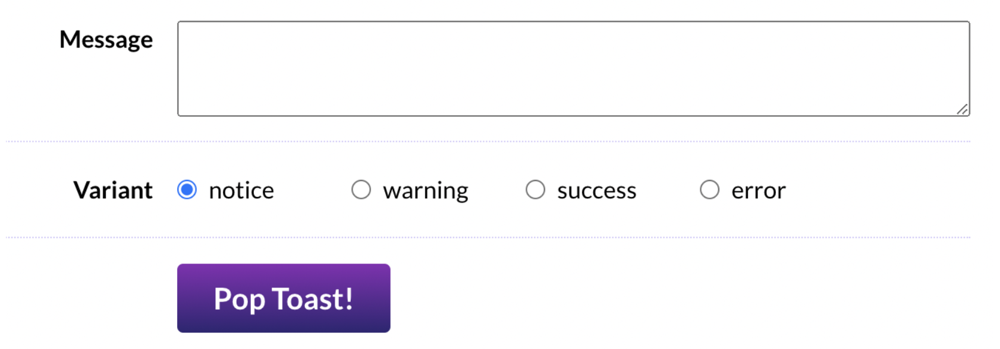

# The Joy of React - Project, Toast Component

- [Course Outline Notes](course-notes.md)

## Exercise 1: Wiring up form controls

In order to test oru `Toast` component, we will start by building a little playground. This wil allow us to test our component throughout development.



In `ToastPlayground.js`, you will find most of the markup you will need, but two problems.

1. All the inputs are uncontrolled, meaning we cannot easily access their values in React. We should be using React state to drive all form controls.
2. We are only given a single radio button. We need one for each valid variant.

Our `Toast` component should support 4 different variants.

- notice
- warning
- success
- error

This exercise is a review of the concept in Module 1 and module 2. Brush up on those lessons, you can refer to the [Input Cheatsheet](https://courses.joshwcomeau.com/joy-of-react/02-state/11-bonus-cheatsheet)bonus lesson for the differ inputs.

ACs:

- The "Message" textarea should be driven by React state
- Using the data in the `VARIANT-OPTIONS` array, render 4 radio buttons within the "Variant" row. They should all be part of the same group (so that only one can be selected at a time). They should also be driven by React state.
- There should be no key warnings in teh console.

### Wire up the textarea

- Add state to the `ToastPlayground.js` component to manage the state

```JAVASCRIPT
  const [message, setMessage] = React.useState('');
```

- Then add the management to the `textarea` input

```JAVASCRIPT
    <textarea 
      id="message" 
      className={styles.messageInput} 
      value={message}
      onChange={event => {
        setMessage(event.target.value);
      }}
    />
```

- Refer to your notes on [controlled vs. uncontrolled](https://github.com/clewisdavis/The-Joy-of-React/blob/main/course-notes-module-2c.md#controlled-vs-uncontrolled-inputs) forms.

### Iterate through the radio options

- Add state for the radio variants, and set a default value

```JAVASCRIPT
  const [variants, setVariants] = React.useState('notice');
```

- `.map` through the variants, to set up the radio options, and define all the attributes.
- Set values for `id`, `value`, `checked` and `onChange`

```JAVASCRIPT
        <div className={styles.row}>
          <div className={styles.label}>Variant</div>
          <div
            className={`${styles.inputWrapper} ${styles.radioWrapper}`}
          >
            {/* <label htmlFor="variant-notice">
              <input
                id="variant-notice"
                type="radio"
                name="variant"
                value="notice"
              />
              notice
            </label> */}

            {VARIANT_OPTIONS.map(option => (
              <div key={option}>
              <label htmlFor={option}>
              <input
                id={option}
                type="radio"
                name="variant"
                value={option}
                checked={option === variants}
                onChange={event => {
                  setVariants(event.target.value);
                }}
              />
              {option}
            </label>
            </div>
            ))}
 
          </div>
        </div>
```
