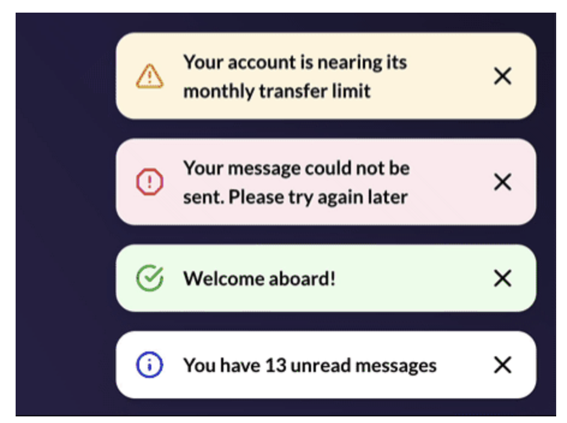
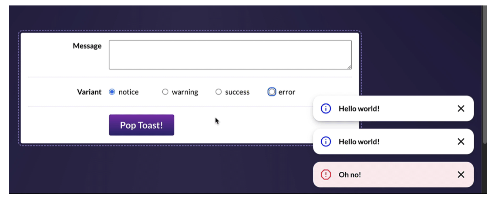

# The Joy of React - Project, Toast Component

- [Course Outline Notes](course-notes.md)

- Exercise 1: [Wiring up form controls](./exercise-1-wiring-up.md)
- Exercise 2: [Live editable toast preview](./exercise-2-toast-preview.md)
- Exercise 3: [Toast Shelf](./exercise-3-toast-shelf.md)
- Exercise 4: [Context](./exercise-4-context.md)
- Exercise 5: [Keyboard and Screen Reader Support](./exercise-5-keyboard-screen-reader.md)
- Exercise 6: [Extracting custom hooks](./exercise-6-custom-hooks.md)

## Exercise 3: Toast Shelf

One of hte core defining characteristics of a toast notification is they stack.



- In this exercise restructure things so that our `ToastsPlayground` allow us to create multiple toasts.
- For help, you will find a `ToastShelf` component in this project. It will automatically apply the styles and animations.

- You will need to replace the `Toast` live demo with this new `ToastShelf` component, inside the `ToastPlayground`:

```JAVASCRIPT
<header>
  
  <h1>Toast Playground</h1>
</header>

// <Toast />
<ToastShelf />

<div className={styles.controlsWrapper}>
  <div className={styles.row}>
```

- By the end of this exercise, it should look like this:



- This is a very tricky exercise. Use the hints to help get started. And refer back to these lessons.
  - The onClick Parable
  - Dynamic Key Generation

ACs:

- Instead of live-editing a single Toast instance, the playground should be used to push new toast messages onto a stack, rendered inside `ToastShelf` and shown in the corner of the page.
- When 'Pop Toast' is clicked, teh message/variant form controls should be reset to their default state, `message` should be an empty string, `variant` should be 'notice'.
- Clicking the 'x' button inside the toast should remove that specific toast (but leave the rest untouched).
- A proper `<form>` tag should be used int he `ToastPlayground`. The toast should be created when submitting the form.
- There should be no key warnings in the console. Keys should be unique and should not sure the index.
