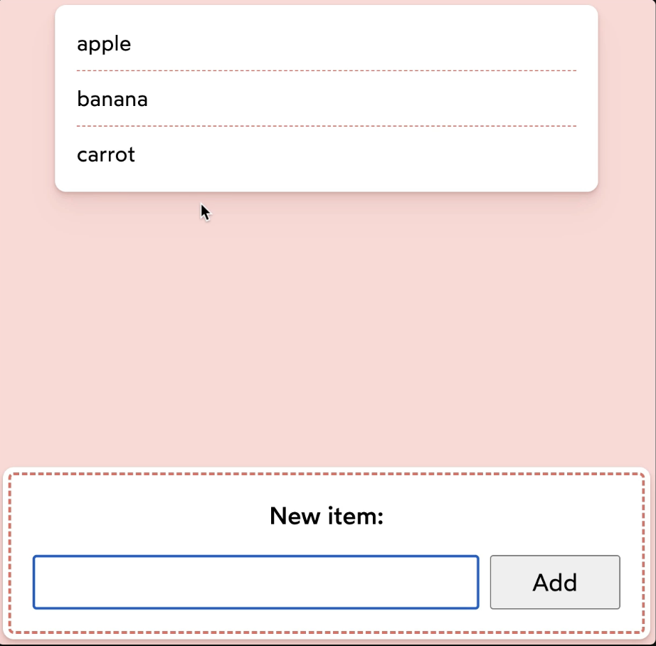
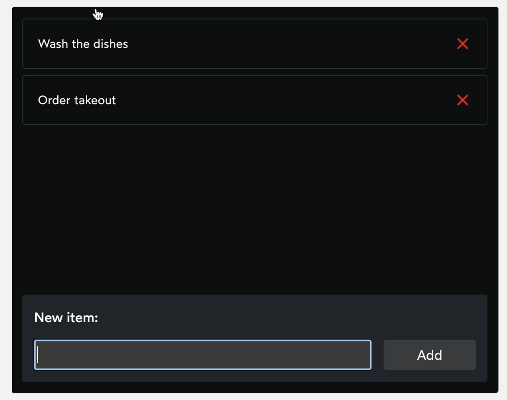

# The Joy of React - Module 5 - Happy Practice

- [Course Outline Notes](../course-notes.md)

## Principle of Least Privilege

The idea is that every member of the organization, only has enough access in order to do their job. Like a bank teller, need to be able to open accounts and cash checks, but does not have permissions to issue montages or open brokerage accounts. Outside the scope of that role, so the computer system should not let the employee perform those actions.

- Now imagine that every component in your application is like one of those employees. And the corporation is your application.

- In our shopping list example, the `AddNewItemForm` component has only one job, to take the value the person has entered, and add it to the list of items.



- If you pass the state setter function `setItems` to the component, you are giving it a LOT of control, and can have unintended consequences in large codebase.

- When you give a component so much power and privilege by passing a state setter function directly, you run the risk of accidentally break things.

- 🤔 The preferred pattern, is to wrap up your state setter functions, and add any business logic, before you hand them down to children components.

```JAVASCRIPT
import React from 'react';

import AddNewItemForm from './AddNewItemForm';

function App() {
  const [items, setItems] = React.useState([]);
  
  //   Wrap up your state setter function and business logic
  function handleAddItem(label) {
    const newItem = {
      label,
      id: Math.random(),
    };

    const nextItems = [...items, newItem];
    setItems(nextItems);
  }

  return (
    <div className="wrapper">
      <div className="list-wrapper">
        <ol className="shopping-list">
          {items.map(({ id, label }) => (
            <li key={id}>{label}</li>
          ))}
        </ol>
      </div>
      // Pass function down to child components
      <AddNewItemForm
        handleAddItem={handleAddItem}
      />
    </div>
  );
}

export default App;
```

### Exercises, Todo List Application

Let's suppose we are building a Todo app:



This app has 3 main pieces of functionality:

1. Adding new todos
2. Marking a todo as complete/incomplete
3. Deleting a todo

Your mission is to refactor the code below so that none of the descendant components have more privilage than they need to accomplish these tasks.

ACs

- The `CreateNewTodo` component should only be abel to modify the state in one specific way: to add a new todo to the list
- The `TodoList` component should only be able to modify the state in two specific ways: toggling a todo between complete/incomplete, and deleting a todo.
