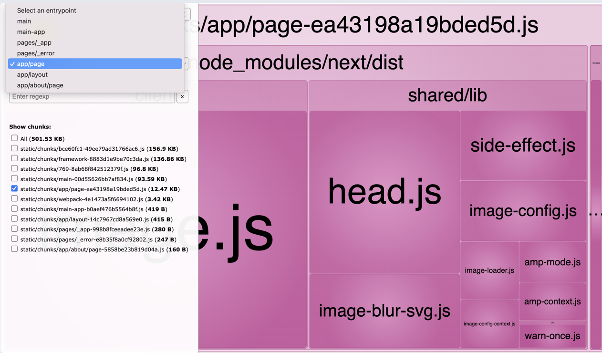

# The Joy of React - Module 6 - Full Stack React

- [Course Outline Notes](../course-notes.md)

## Building for Production

What are the differences between 'development mode' and 'production mode'.

- In 'development mode', React and Next are both optimized for the developer experience. We get things like:

➡️ Better error messages
➡️ Improved integration with React developer tools
➡️ React Strict Mode, helping us catch edge case issues by doing things like running our effects twice.

- In 'production mode', it is optimized for the user experience. Essentially, it is a slimmed down mode focused on performance. The JS bundles become way smaller, and React's render performance becomes much better.

- You can check how your app performs in 'production mode'. Will give you a much more accurate picture of what it's like to use your app.

- Video Summary:
- Using our simple app we created in the previous exercise.
- Step 1, is to stop the 'dev' server, in order for the build to compile correctly, you cannot run multiple terminals.
- Step 2, run the `npm run build` command, this will generate our application. Bundle and minify everything, you can see the results in the terminal. And the break down for each route, `/`, `/about`.
  - Where is this stuff built? Puts everything in the, '.next' directory. At any point in time you can delete it, and re-generate. This is not an area you are supposed to dig through.
  - Next does the static site generation, and pre-renders, does the SSR ahead of time.
- Step 3, the final script, `npm run start`, it serving everything from the 'build' process, and runs Next in production.
  - Now you can do some performance testing, see what the network performance is like.
  - In Chrome / DevTools / Network, be sure to throttle to slow down the network a little, now you are seeing the actual production bundles being downloaded.
  - ℹ️ This does not have a 'reload' if you make any changes, so you would have to make your change, re-run the build then run the 'start' command.


- To Summarize:
- You can generate a production build by running `npm run build`.
- You can run a local production server by running `npm run start`.
- Take care to stop your dev server before running either of these commands.

### Port Conflicts

Both development and production server default to running on port 3000. The development server is flexible. If port 3000 is taken, it will try 3001. Then 3002. It keeps going until it finds an available one.

- The production server, is not flexible like that. I will complain if something is already running on that default port.
- It will throw an error if something is already running on that port, rather than try the next port.


- A little workaround, create a new NPM script, `start:local`. It does the same thing as the standard `start` script, btu it specifies a custom port using the `-p` flag.

- 🤔 Why not edit the existing `start` script? The `start` script will also eb used when we deploy the site, on the server. If we edit this script, we might break our deployments. So it's better to create a separate script we can use on local machines.

### Analyzing our bundles

- When you run the build script in Next, `npm run build`, it prints out a table, a high level overview of your bundles. You see the size of each route and the size of each bundle.


- Helpful, but what action do you take on this?
- Use a tool, '[webpack-bundle-analyzer](https://www.npmjs.com/package/@next/bundle-analyzer)' to get some insights, visualization, of the routes and bundles.


- The boxes are proportional to their file size. So you can see which modules are taking up the most space inside the bundles. You can click on the box to go deeper.

- You can also filter base don the 'entry point', so you can see the bundles for each route.



- How to set this up?

- 1. Install the package, `npm install @next/bundle-analyzer`
- 2. Copy this code to your `next.config.js` file

```JAVASCRIPT
const withBundleAnalyzer = require('@next/bundle-analyzer')({
  enabled: process.env.ANALYZE === 'true',
});

module.exports = withBundleAnalyzer({});
```

- 3. Then add the NPM script, 'analyze', to the `package.json` file.

```JAVASCRIPT
{
  "name": "sample-next-app",
  "scripts": {
    "dev": "next dev",
    "build": "next build",
    "start": "next start",
    "analyze": "ANALYZE=true npm run build",
    "lint": "next lint"
  }
}
```

- When you run, `npm run analyze`, it sets the ANALYZE environment variable, and runs the standard build. Opens the relevant HTML file in-browser, once the build is completed.

- See more about this tool, on the NPM package page: [@next/bundle-analyzer](https://www.npmjs.com/package/@next/bundle-analyzer)

### Assessing NPM packages
