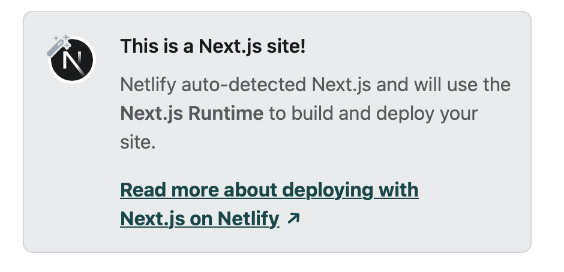

# The Joy of React - Module 6 - Full Stack React

- [Course Outline Notes](../course-notes.md)

## Deploying

Using Netlify, pretty straight forward...

- On the Sites page, choose 'Add New Site' > 'Import an existing project'
- Choose 'Deploy with Github', and connect your Github account to get access to repo you want to deploy (assumes you already have your site in Github)
- Choose your repo, Next project, and Netlify will automatically detect this is a Next site!

- Add any custom fields, but pretty much just choose 'deploy site' command, and the CDN will start the build process.
- Then you have a site overview, and you can preview the site on the generated url, and take it from there, setup a custom domain or anything like that. Really cool stuff...

- Then all you have to do, to make updates, is just publish to your 'main' branch via Github, 🚀 Really cool...
