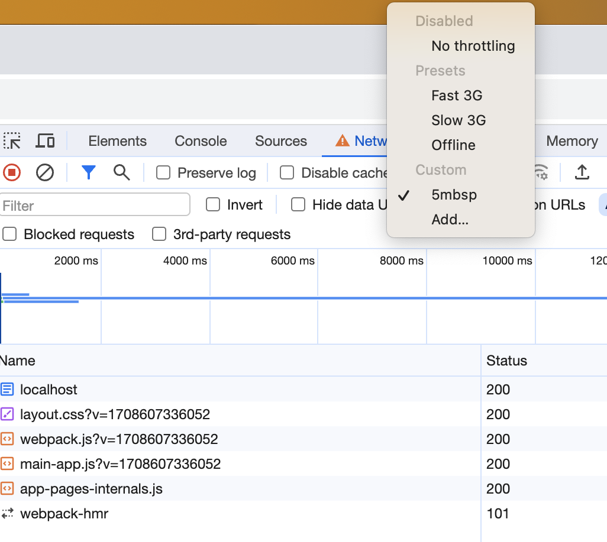
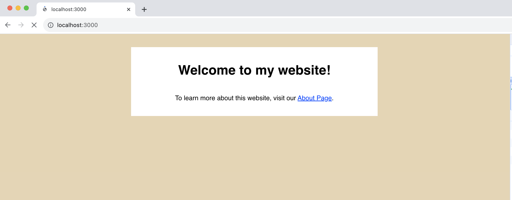
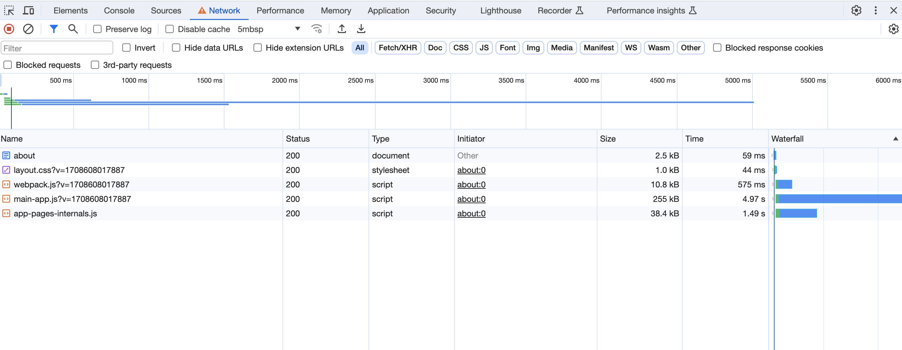

# The Joy of React - Module 6 - Full Stack React

- [Course Outline Notes](../course-notes.md)

## Routing

- History lesson, in the late 1980s, a computer scientist, Tim Berners-Lee, had a novel idea: Hypertext but for the internet.

- "Hypertext", is a document format that includes, hyperlinks, shortcuts that you can use to jump from one document to another.
- Been around for a long long time, an acedemic paper published in the 1940s, and could become part of Doug Engelbart's 1968 talk, known as the '[Mother of All Demos](https://youtu.be/yJDv-zdhzMY?si=hSGXl8ILUCUhu1fN)'.

- To this day, 'links' are a killer feature on the web. Any project you have to be able to construct multiple pages and link between them.

- In this section, go deeper into how routing works in Next. Clever tricks that Next does to improve performance, see how to move programmatically from one page to another, and how to dynamically generate pages based on the URL.

### Page Transitions

- We have seen how to create multiple routes in Next, by creating `page.js` components and placing them in subdirectories.
- We yet to see how to connect those routes with links!
- Seems simple, but an incredible amount of engineering behind the scenes.

- Forked Repo - [Next 13 Routing](https://github.com/clewisdavis/next-13-routing/tree/main)

- You have multiple pages, that are very similar in style, but when using an `<a>`, anchor tag, the network has to request all the information each time.
- An important optimization we are not taking advantage of when using the 'anchor' tag.

```JAVASCRIPT
// page.js, Homepage
import React from 'react';
import Link from 'next/link';

function Home() {
  return (
    <main>
      <h1>Welcome to my website!</h1>
      <p>
        To learn more about this website, visit
        our <a href="/about">About Page</a>.
      </p>
    </main>
  );
}

export default Home;
```



- Run the app, and view the home page.

- To help illustrate the benefits, run the repo above, and put a light throttle on the Chrome/Network, 5mbps, in the DevTools.



- The 'localHost' is the html file generated by our Node server, during server side rendering. And all the other dependencies, CSS and JS. All the stuff that needs to be downloaded to run this application.

- When you click on the 'about' link, watch the Network / Dev Tools, and notice how it starts the process all over again, downloading all those same assets to run the app.



- But the app, is 99.8% the same, from one page to another 🤔 The only difference is the content of the page. Seems wasteful.

- In the early 2010s, JS frameworks, you started to see the rise of Angular and Ember, and they brought this new idea, for routing, **the application would be a single HTMl file, and all the other routes, would be created using JS.**
- When the user clicks a link, it will fetch the JS required to swap out the content.

- This became known as the, Single Page Application architecture, more commonly referenced as SPA.
- If you start a new project, with 'create React app', this is the architecture you are using, via React Router. Single HTML file, and then you setup your 'routes' to be react components.

- 🤔 Next does not use the SPA architecture, instead it uses 'server side rendering'. So we do have many different HTML files. You can see them being downloaded in the example above, in the DevTools / Network tab.

- 📣 The team at Next.js, found a way, to combine the benefits of, SPA architecture, with Server Side Rendering (SSR). 📣

- This requires a little tweak on the `<a>` tag.
- Import the `Link` component; `import Link from 'next/link';`
- And replace any 'anchor' tag, with a `Link`.

```JAVASCRIPT
// page.js, Homepage
import React from 'react';
import Link from 'next/link';

function Home() {
  return (
    <main>
      <h1>Welcome to my website!</h1>
      <p>
        To learn more about this website, visit
        our <Link href="/about">About Page</Link>.
      </p>
    </main>
  );
}

export default Home;
```

- Do the same thing on the about page.

```JAVASCRIPT
// About Page
import React from 'react';
import Link from 'next/link';

function AboutPage() {
  return (
    <main>
      <h1>About This Website</h1>
      <p>It is a website.</p>
      <p>
        <Link href="/">Return home</Link>
      </p>
    </main>
  );
}

export default AboutPage;
```

- 📣 Now, open the DevTools / Network tab again, and watch what happens when you click on the link.
- Notice how quick that was, only had to download one file, and it only took 26ms to download, lighting quick.

- What it is doing, is fetching the JS representation of what needs to be swapped in at that route / url. Not the entire page.
- When it receives this update, it does what React is really good at and updates the DOM based on some new sketch.
- Another nice benefit, notice what happens when you hover over a link, it already starts to download, although, I am not seeing this in my dev environment.

- Every route that you create supports two different modes,
  - One, when you visit a page and press enter, you do the standard Server Side Rendering, generating the HTML and sending it to the browser so we can download all the files.
  - Two, when you visit that exact same page, using the, `Link` component, it doesn't send us an HTML file, it sends us a chunk of JS that represents the content for that page.

- Curious how this work, so used a tool called '[Postman](https://www.postman.com)', tool you can use to submit network request.
- When you make a GET request to the url for that dev server, you can see what you get back, a chunk of HTML. Looking at the request headers that are being sent in the browser, see one called, 'Rsc', that one send the JS instead of the HTML.

- 📣 Every route in Next.js has the ability to send either send HTML or JS, it depends on the request header being sent.

- Any downsides?
- You can use the browser back and forward, using the browser, PushState API, allows to access the native browser history via JS.
- And the 'Link' component replaces it with a native 'a' tag. And if you turn off JS, it will still work.
- For accessibility, if you look at the markup, you can see 'next-route-announcer', which addresses screenreaders and announcing the correct link.
