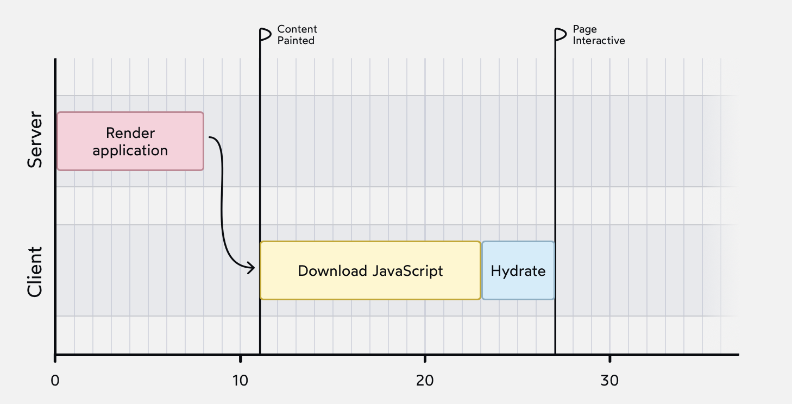

# The Joy of React - Module 6 - Full Stack React

- [Course Outline Notes](../course-notes.md)

## Client vs. Server Rendering

- How is it that you can see a fully built out site, with JS disabled?
- Get a fully formed HTML document that includes all the content on the page. This is known as, 'Server Side Rending', SSR

- 💡 **Server Side Rending**, SSR, when you visit a website, visit a website and press 'enter', it makes a request to your server.
- And instead of serving a static HTML file, we are going to dynamically create the HTML file, using React on the server.

- 📣 Generate the HTML, using React on the server, and then the client receives a fully ready to go HTML document.

- The benefit of this, is in the browser, you do not have to wait for all the JS to download. The compiled HTML document and content shows up really quickly.

- For content heavy websites, like this course, being able to who that content, while we are downloading the JS, is big UX enhancement.

### Graphing it out

- Graph it out, the graph below shows the SSR flow, or the server doing the initial render, then the HTML fil being sent to the client.


- First the server does the initial React render. Then the HTML file is sent to the client, and finally the JS bundle is downloaded and executed, adding interactivity to our application.

- And notice the flags to indicate the UX during this timeline:

- Content Paint - The moment the user sees teh main content on the page. Also referred to as '[Largest Contentful Paint (LCP)](https://web.dev/articles/lcp)'
- Page Interactive - this is when the page becomes fully dynamic; referred to as '[Time to Interactive (TTI)](https://web.dev/articles/tti)'

- Another graph showing traditional 'client side rendering'


The swoopy arrow at the start represents teh server sending along an empty HTML file. Once that file has been received by the client, it can start downloading the JS bundle. Once the JS bundle is ready, the React application can finally be rendered.

### Hydration

When we use server-side rendering, the browser receives a fully formed page. Ideally, all of the necessary HTMl and CSS should be included.

A huge part of React is the interactivity. Building dynamic, stateful apps. Most of the time, we spend learning about how to make our apps interactive with state and effects.

📣 The process of turning the initial HTML file into an interactive web application is called **hydration**.

"Hydration is like watering the dry HTML with the water of interactivity and event handlers."

At a high level, the process of hydration goes something like:

- Perform a 'speed render' to figure out the shape of our component tree, and to initialize our component instances.
- Wire up all the interactivity (add event listeners, attach refs, etc)

In a **client side** rendering environment, the initial render is responsible for creating all of the DOM nodes.

With a server **side rending**, all of those DOM nodes already exist. Instead, React has to 'adopt' the DOM.

Here is what SSR graph looks like, with hydration:



Now the 'Load JS' step has been broken into two phases: Downloading the JS bundle, and hydrating the React application.

## SSR Flavors

Different types of SSR.

On demand SSR, Josh's course platform as an example;

- User visits a lesson page.
- The server receives the request, and does the first React render, generating the initial HTML.
- User receives a fully formed HTML document, so they can start reading even while the JS bundles are downloading.
- The HTML is generated 'just in time' when the server receives the request.

This is not the only strategy we can use. Can also use 'Static Site Generation', SSG.

**SSG, Static Site Generation** - HTML is generated ahead of time. Instead of rending our React application on demand, when a request is received, we do the render at compile time.

When React apps need to be compiled, the process is like:

- Turns JSX into browser friendly JS.
- Runs any checks, like ESLint.
- Bundles all of our individual JS files into a handful of scripts.

With SSG, add one more step to this pipeline: **Generate an initial HTML for each page by doing the first React render.**

🆒 We then upload all the HTML files to our server, and those files are served 'as-is' when the user requests them.

🤔 Think about what that means from a performance perspective. When a user visits your app/site, the server immediately sends along the fully formed HTML document. The server doesn't have to do any processing at all.

### A note on terminology

Clear up some terminology stuff. The term "Server Side Rendering" refers to one thing: Using `react-dom/server` APIs to generate the HTML in Node.js.

No matter when you run it, on-demand, or at compile time, they both fit under SSR, because they both fit under the SSR umbrella, because they both use the same APIs. **The only difference between them is the timing.**

```JAVASCRIPT
import { renderToString } from 'react-dom/server';

import App from './components/App';

const html = renderToString(<App />);
```

- With **SSG**, we call the `renderToString` method when we compile our site, adn save the HTML files to disk, to be served to users when they visit the page.

- With **on-demand SSR**, we call the `renderToString` in response to a user request, to generate the HTML right as it's needed. These are two different flavors of SSR.

- A third flavor, created by Next.js, is called **Incremental Static Regeneration (ISR)**.
The ISR flow is a bit hard to explain in notes.

- The first time a user requests a particular page, the server will generate the HTML and send it to the user, same as **'on-demand'** server side rendering.

- The difference is that it hangs onto that generated HTML. The next time someone requests that same page, Next will automatically server up that pre-generated HTML, same as SSG.

- In order to prevent that generated file from growing too stale, ew can configure Next to regenerate the HTML file after a certain amount of time has passed. This is known as **revalidation**.

- For example, suppose we set the revalidation time of 60 minutes. When someone visits this page after 61 minutes, the Next server will serve that user the stale HTMl file, but will start a brand new Server Side Render in the background. The next user will get the fresh, newly generated file. 🤔

- Why isn't this course using SSG?
  - Because of the interactive elements, more on demand
  - To big, would be to much to generate all at once

Some downsides to SSG

- Personalization, with a single HTML file, you are serving the same experience to everyone.
- Authorization, on a paid product, no secure way to have a 'private' content when using SSG, because all users receive the exact same HTML.
- Stale pages, pages can grow stale
- Build Times, for smaller sites, this isn't a problem, but apps with 10k pages or more
