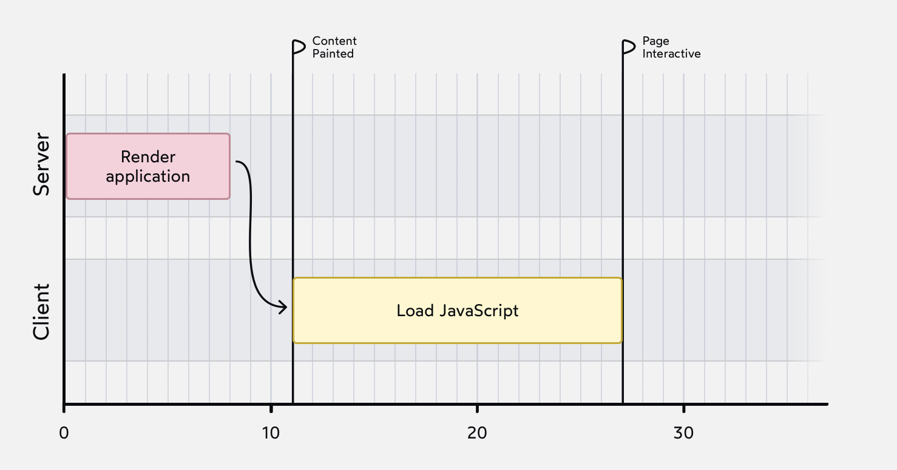
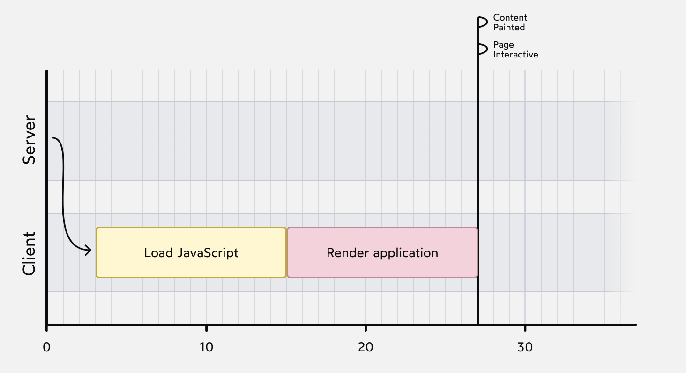

# The Joy of React - Module 6 - Full Stack React

- [Course Outline Notes](../course-notes.md)

## Client vs. Server Rendering

- How is it that you can see a fully built out site, with JS disabled?
- Get a fully formed HTML document that includes all the content on the page. This is known as, 'Server Side Rending', SSR

- 💡 **Server Side Rending**, SSR, when you visit a website, visit a website and press 'enter', it makes a request to your server.
- And instead of serving a static HTML file, we are going to dynamically create the HTML file, using React on the server.

- 📣 Generate the HTML, using React on the server, and then the client receives a fully ready to go HTML document.

- The benefit of this, is in the browser, you do not have to wait for all the JS to download. The compiled HTML document and content shows up really quickly.

- For content heavy websites, like this course, being able to who that content, while we are downloading the JS, is big UX enhancement.

### Graphing it out

- Graph it out, the graph below shows the SSR flow, or the server doing the initial render, then the HTML fil being sent to the client.

- First the server does the initial React render. Then the HTML file is sent to the client, and finally the JS bundle is downloaded and executed, adding interactivity to our application.

- And notice the flags to indicate the UX during this timeline:

- Content Paint - The moment the user sees teh main content on the page. Also referred to as '[Largest Contentful Paint (LCP)](https://web.dev/articles/lcp)'
- Page Interactive - this is when the page becomes fully dynamic; referred to as '[Time to Interactive (TTI)](https://web.dev/articles/tti)'

- Another graph showing traditional 'client side rendering'

The swoopy arrow at the start represents teh server sending along an empty HTML file. Once that file has been received by the client, it can start downloading the JS bundle. Once the JS bundle is ready, the React application can finally be rendered.
