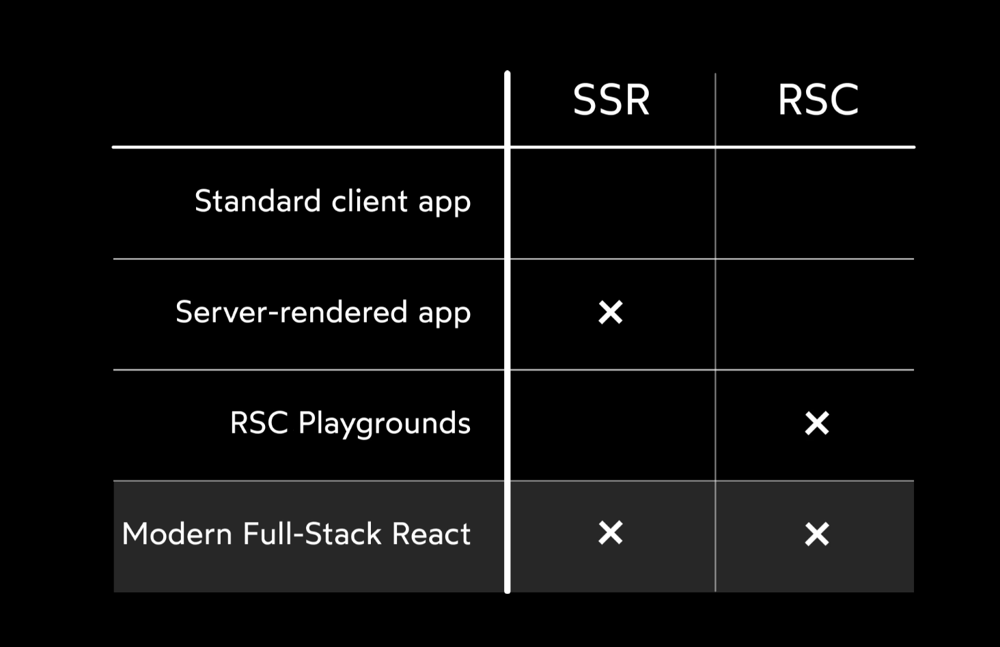
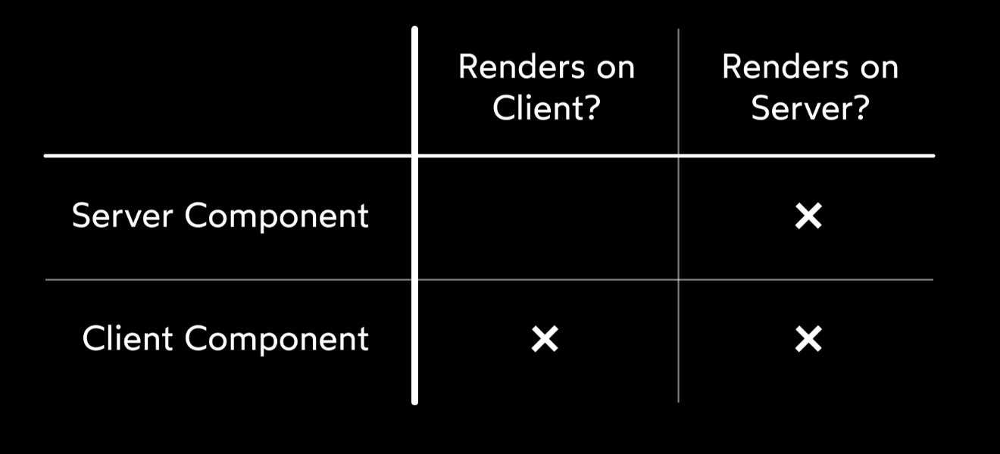
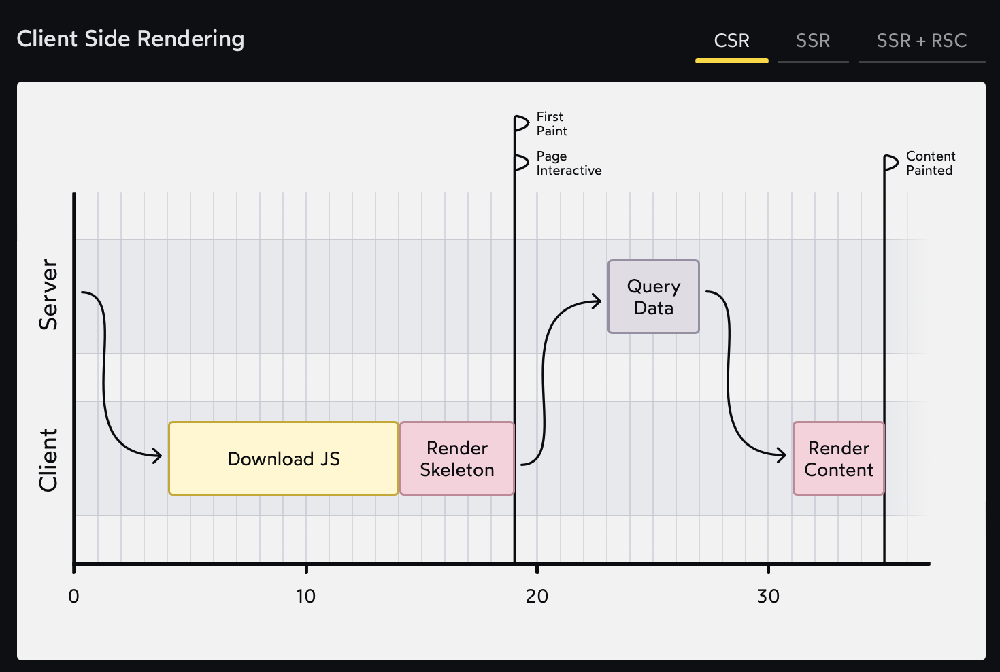
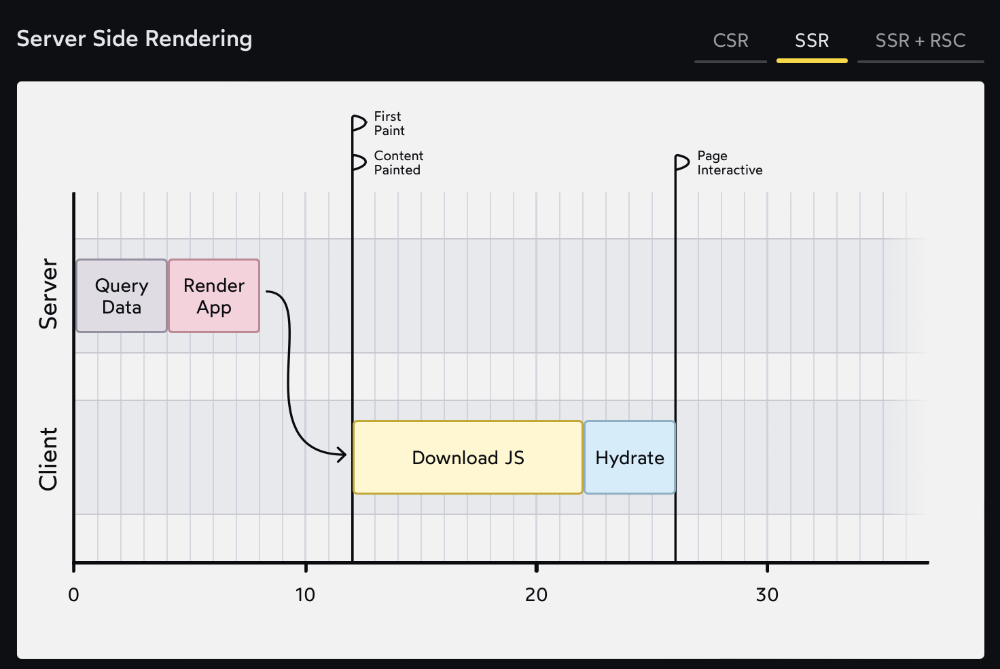
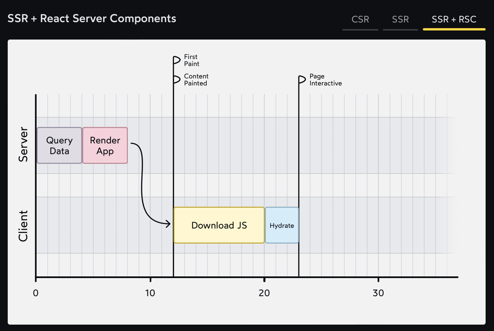

# The Joy of React - Module 6 - Full Stack React

- [Course Outline Notes](../course-notes.md)

## React Server Components

- If the code can only run on the client, you don't have a choice
  - First, users browser has to make a request all the way to our server.
  - Then the server has to do the 'db' query.
  - And finally the results have to be sent all the way back to the client.

- And we are left with a less than ideal UX, but do not have a choice if the code can only run on the client.

- Service Side Rendering, had for a while, the first version of Next.js from 2016.

- Other frameworks, Gatsby, Remix that do SSR.

- Some downsides to these frameworks, conventions
  - The `async` call is not part of React, it is a next specific feature.
  - Next is very specific about where you can call your `async` data call. Has to be at the very top of the app.
  - These components will hydrate on the client even if they don't need to. They run on the server and then again on the client.

- React team has been working to solve these problems and integrate into React, **React Server Components**
- RSC - here is what the code looks like.

```JAVASCRIPT
import React from 'react';

async function TrendingProducts() {
  const link = mysqliConnect('localhost', 'root', 'passw0rd');
  const data = await mysqliQuery(link, 'SELECT * FROM products');

  return (
    <>
      <h1>Trending Products</h1>
      {data.map((item) => (
        <article key={item.id}>
          <h2>{item.title}</h2>
          <p>{item.description}</p>
        </article>
      ))}
    </>
  );
}

export default TrendingProducts;
```

- Notice right away, you have a React component, `TrendingProducts` but it is also an `async` function.
- And you can see you are doing some 'db' request right inside the component.
- The idea 💡, is this is a server component and will never run on the client, only on the server. Never be hydrated and we can structure things differently.

- First thing to understand is, this is a new and optional mode for React, **RSC mode**. Sorta like Strict Mode.
- The example above, `TrendingProducts`, this is a server component that is classified as a server component within React.
- Is this an alternative to SSR? Does one replace the other, RSC vs. SSR? Not the case, totally separate things, but the intention is that these are used together.



- Two types of components now, Server Components and Client Components.
- SC, only render once to generate the initial HTML. As a results, cannot use a lot of the other things, 'state', or 'useEffect' because it has no way to re-render.
- 🤔 You can think of SC as a limited subset of a typical React Component.

- A CC, client component, every other type of component, like all the components in this course.
- A Client Component, will render on the server, during SSR, Server Side Rendering, and then hydrate on the client and potentially re-render.



### Client and Server Directives

- 📣 You have to specify on the component, if it's a 'Server' component or a 'Client' component.
- The way you do that is with 'directives'.
- For client components, you have to write `use client` at the top of your component.
- This means it should run both on the server and the client.

```JAVASCRIPT
'use client';
import React from 'react';

function Counter() {
  const [count, setCount] = React.useState(0);

  return (
    <button onClick={() => setCount(count + 1)}>
      Count: {count}
    </button>
  );
}

export default Counter;
```

- For server components, you have to use a `use server` directive.
- But, you don't have to specify a component is a server component, as it's the assumed default. You don't have to opt in.

- 🆒 The cool thing about this, is you can mix the two types of components.
- You can 'import' your client component within your server components. And it will still work with all the 'state', 'effects' and 'refs'.

### The benefits of React Server Components

Why go through all this trouble? The most obvious is performance. But it's still to be determined what the benefits are.

- If half the components in your application are Server Components, it means that your JS bundle will be significantly smaller, since all of that code can be omitted. It does not get passed down to the client side.

### Graphs

See the graphs to visualize how the different approaches change.

**Client Side Rendering**



**Server Side Rendering**



**SSR + React Server Components**


