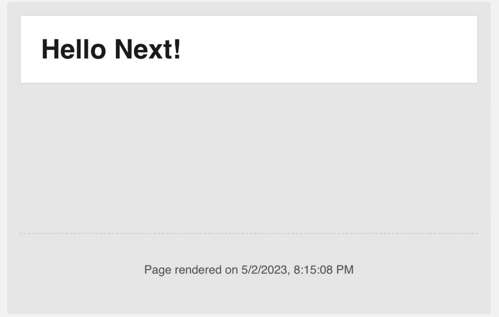
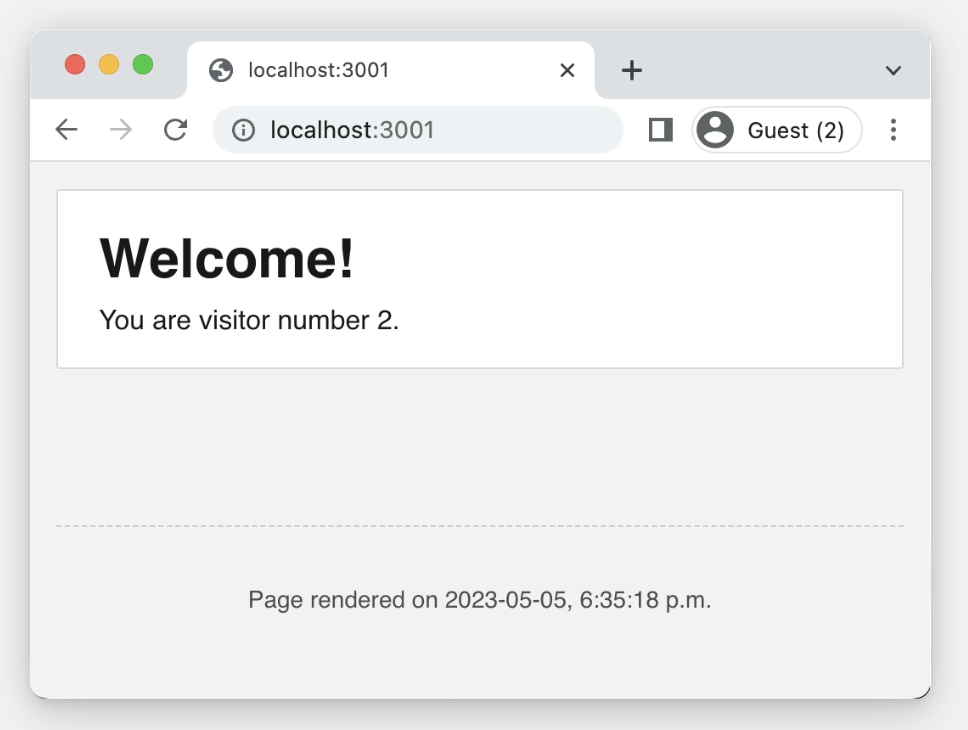

# The Joy of React - Module 6 - Full Stack React

- [Course Outline Notes](../course-notes.md)

## Intro to Next.js

Next.js, known as Next, is a popular full stack React meta-framework, as of mid-2023. And the only framework to take advantage of React's new full stack model, including React Server Components (RSC).

📔 Two different Next js

- Important to know about Next is that it has changed dramatically this year.
- In May, 2023, Next released 'v13.4', which is the official stable release of the 'App Router'.
- A complete re-write of Next.js, done to integrate all teh new React features like RSC.

How can you tell is something is out of date, using an older version?

- A directory structure that involves `/pages` directory.
- Methods named `getServerSideProps` and `getStaticProps`
- Files named `_app.js` and `_document.js`
- API Routes

### Hello Next

Running a local Next server, and the files required. Have standard 'package.json' that holds your dependencies and your npm commands for building.

- In the 'src' folder, this holds are our source code. And inside that, we have our 'app' directory. `src > app`.
- The `app` directory is new, and this is new for Next 13, and this is the home for all of our routes.

```CODE
package.json
--src
    --app
```

- Within the app directory, have a style sheet, with some default styles, 'styles.css'
- And then we have two separate components.
  - Inside of 'page.js', a `Home` component.
  - And a `RootLayout` component inside of 'layout.js'
- 🤔 Next uses a **file based routing system**, 📣 which means I have to name my file, 'page.js' if you want it to be publicly viewable 📣.
- When you put a 'page.js' file right inside the 'app' directory, not nested inside any sub-directories, **this becomes the component that is rendered on the homepage**. Your root directory 'localhost:3000'.

- In Next.js, pages cannot be used on their own, they have to use a layout.
- Think of layouts as the wrapper around our pages. Multiple pages will share the same layout.

- The difference here, in `create react app`, it would generate an `index.html` document. And we used `<div id="root"></div>` to place our React app.

- In Next, it's totally different, Next renders the entire HTML document and there are no HTML files anywhere in the project.
- This is all generated by the `app/layout.js` file.
- Layout forms the shell, 'html' and 'body' tags, then use `{children}` prop to pass through the page, essentially a slot.

```JAVASCRIPT
// layout.js
import './styles.css';

function RootLayout({ children }) {
    return (
        <html lang="eng">
          <body>
            {children}
            <footer>Copyright 2000</footer>
          </body>
        </html>
    )
}

export default RootLayout;
```

- Suppose you want to have a new route, an about page.
- Create a new folder in the app directory, `app/about` and add a new file `page.js`.

```JAVASCRIPT
// app/about/page.js
import React from 'react';

function AboutPage() {
    return (
        <p>About this site</p>
    )
}

export default AboutPage;
```

- Now, you can view the site, `localhost:3000/about` and it will show your about page.
- The route matches a differ page, `app/about/page.js`, but they both share the same layout.
- 🫢 And now, you see the same footer from the `RootLayout`

- This opens up all kinds of possibilities, you can have dynamic route segments, you can decide which layout you want to use for each page, nested layouts etc.

- The Next.js documentation has more detailed descriptions.

- Server Components, in Next.js, all components are **server components by default**. Which means you cannot do things like, `useEffects` or `state`. You get an error, only works in Client Components.
- If you want to use any of those, you have to add the directive, `use client` to the top of your component.

```JAVASCRIPT
// app/about/page.js
// add the use client directive 
'use client'
import React from 'react';

function AboutPage() {
    React.useEffect(() => {
        console.log('about page here');
    });
    return (
        <p>About this site</p>
    )
}

export default AboutPage;
```

- You are not loosing anything when using a client.
- 📣 A client component does everything a server component does, but additionally hydrates on the client to allow it to re-render.

- Any components can be made into client components. The only gotcha is if you do a `db query` in the component, it will cause the client to blow up, why are you trying to do a data base query from the browser.

- Summary:
- Generally, with Next.js, inside the `app` directory, you can create sub directory when you want to create a new route. And you do that by creating `page.js` file. Which is the component you want to render at that url.
- Every page needs to have a `layout`, which is the global UI you need, which is typically found in an 'index.html' file.
- And all these components are `server` components by default, but you can opt in to be a client component, by setting the `use client` directive.

- All coming together, file based routing and server components all coming together to be really powerful.

- Note, you need 'Node version 16.14 or higher to work with Next. Update to the current LTS (Long Term Support) version.

### Next Exercises

- Getting setup, Next.js is a full stack framework, so will need to work from a local server. Or you could run an online using CodeSandbox.

- Instructions on setting up a [Local Development](https://courses.joshwcomeau.com/joy-of-react/project-wordle/03-dev-server) via NPM.

### Exercise, Server Timestamp

- Back in the day, it was common for websites to have a timestamp in the footer, to show when the HTML was generated.
- Let's add a timestamp to a basic Next.js starter app.



ACs:

- Add a `<footer>` tag that shows a timestamp.
- The time should reflect when the page was generated. Refreshing teh page should re-generate the page, and update the timestamp.
- The JS code should only run on the server, not the client.
- To format the time, you can use the `toLocalString()` method on a date object.

```JAVASCRIPT
  const timestamp = new Date().toLocalString();
```

- Getting Started, you can use this [hello-next](https://github.com/joy-of-react/hello-next) repo

- Solution with cloned repo: [hello-next](https://github.com/clewisdavis/hello-next)

Solution Code:

```JAVASCRIPT
// /src/app/layout.js
import React from 'react';

import './styles.css';

function RootLayout({ children }) {
  return (
    <html lang="en">
      <body>
        {children}
        <footer>
          Page rendered on{' '}
          {new Date().toLocaleString()}
        </footer>
      </body>
    </html>
  );
}

export default RootLayout;
```

### Exercise, Hit Counter

Now let's create a hit counter using Next.js



In a production app, we store the number of hits in a database. To keep things simple for us, we will read and write from a locally store JSON fie:

```JAVASCRIPT
// /src/database.json
{
  "hits": 0
}
```

- You will find some helper methods in the project file `/src/helpers/file-helpers.js`. A small example of how to use these methods in the projects `page.js` file.

ACs:

- The current number of hits should be shown. The current number should be read from the `database.json` file.
- Visiting the site should increment the number by 1. This new number should be saved by overwriting the `database.json` file.
- Bot that you will need to convert between strings and objects with `JSON.parse` and `JSON.stringify`.

Links to exercise starter:

Forked Repo - [hit-counter](https://github.com/clewisdavis/hit-counter)

- Solution Code:

```JAVASCRIPT
// /src/app/page.js
import React from 'react';
import {
  readFile,
  writeFile,
} from '../helpers/file-helpers';

const DATABASE_PATH = '/src/database.json';

function Home() {
  let { hits } = JSON.parse(
    readFile(DATABASE_PATH)
  );

  hits += 1;

  writeFile(
    DATABASE_PATH,
    JSON.stringify({ hits })
  );

  return (
    <main>
      <h1>Welcome!</h1>
      <p>You are visitor number {hits}.</p>
    </main>
  );
}

export default Home;
```

### Client Components

- Review a little bit, the idea of '[Parents vs. Owners](https://courses.joshwcomeau.com/joy-of-react/05-happy-practices/04-lifting-content-up)' distinction.
- 🤔 Strategy known as: Lifting Content Up - You take a component that is being rendered as a child component. And you lift it into the parent component and you pass the element through a prop like `children`.
- Allow you to use the open and close syntax on a component.

```JAVASCRIPT
function ArticlePage({ articleSlug }) {
  return (
    <>
      <Header />
      
      <MainContent>
        <Article articleSlug={articleSlug} />
      </MainContent>
      
      <footer>
        Copyright “The News” Inc.
      </footer>
    </>
  );
}

function MainContent({ children }) {
  return (
    <main>
      <aside>
        <SocialSharingWidget />
      </aside>
      {children}
    </main>
  );
}
```

- The concept of 'owners an ownees' - the idea is most elements are owned by a particular component.
- If a component, `ArticlePage` is the one creating the element, `React.createElement(Header)` for example. It means that component, `ArticlePage` will own that element.

```JAVASCRIPT
function ArticlePage({ articleSlug }) {
  return (
    <>
      <Header />
      {/* React.createElement(Header), ArticlePage owns this element, Header */}
      
      <MainContent>
        <Article articleSlug={articleSlug} />
      </MainContent>
      
      <footer>
        Copyright “The News” Inc.
      </footer>
    </>
  );
}
```

- The owner of an element, get to decide what the props are.

- Now back to the 'Client Components' lesson.
- 🤔 🤔 One of the trickiest parts of this concept, **The Relationship between Client Components and Server Components**
- and how we are and are NOT allowed to weave them together.

- Use the 'hit counter' repo to explore this topic.
- The Goal, is to conditionally add and remove the 'censored' class to the button.
