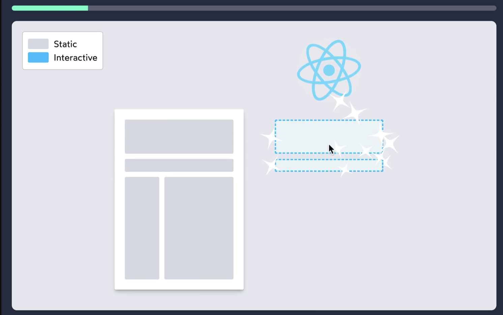
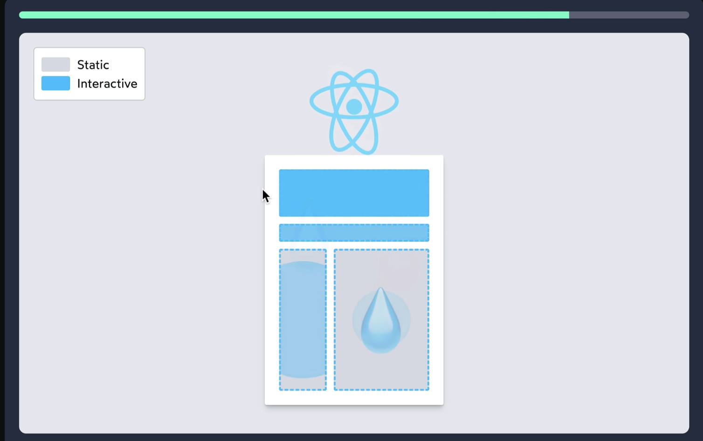
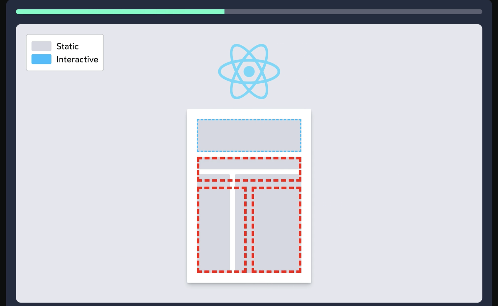
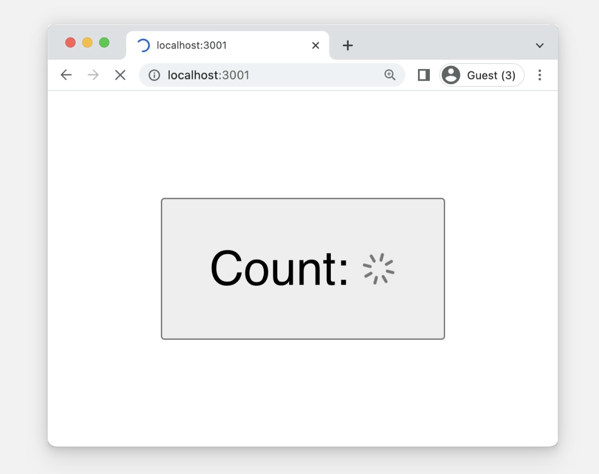

# The Joy of React - Module 6 - Full Stack React

- [Course Outline Notes](../course-notes.md)

## Intro to Next.js / SSR Gotchas

Get into one of the biggest gotchas for server side rendering. Earlier in the course, we saw how we [can persist state in localStorage](https://courses.joshwcomeau.com/joy-of-react/03-hooks/05.02-initial-effect-exercises), for example:

```JAVASCRIPT
'use client';

function Counter() {
  const [count, setCount] = React.useState(() => {
    return Number(
      window.localStorage.getItem('saved-count') ||
      0
    );
  });

  React.useEffect(() => {
    window.localStorage.setItem('saved-count', count);
  }, [count]);

  return (
    <button onClick={() => setCount(count + 1)}>
      Count: {count}
    </button>
  );
}
```

This works fine in a client side rendering app (Parcel), but blows up when we do this sort of thing in a Client Component in Next, or any other SSR framework.

See the problem? Hint, 'ReferenceError: window is not defined'.

- In order to initialize the `count` state variable during the first render, we run the following code:

```JAVASCRIPT
window.localStorage.getItem('saved-count');
```

Here is the problem: There is no `window` object on the server.

- Think about it, on the first render, server-side-render a React component, that first render happens in a 'headless' environment. In Node.js, there is no browser window. There is no DOM.
- `window.localStorage` is designed to read/write on teh user's device. The Node.js server cannot know which value is saved locally on the user's phone or computer.

- As a result, Node.js will not be able to complete the server-side render, and it will serve up a blank HTML file.
- This is one of two very common pitfalls with SSR.

1. Trying to access 'browser stuff' on the server.
2. Hydration mismatches.

Get some practice, with this repo: [next-13-ssr-gatchas](https://github.com/clewisdavis/next-13-ssr-gotchas)

Video Notes:

- **Hydration Mismatch**, one of the most common issues with server side rendering. When a value you have on the server, is different than value on the client.

Recall the React Hydration process:

- Process starts by react building up a sketch of what the DOM should look like.



- Then it fits the two together, it overlays them, for every React element, what is the corresponding DOM node.



- React isn't expecting to be any differences between the sketch and the original DOM. IF there are differences, react will try to fix it and do it's best.



- But Hydration was designed to be really quick, some static HTML we got from the server, and we want to make it interactive. It's priority is to fit the sketch that was generated, on top of the DOM we got from the server, react doesn't don't do a full re-render every time, just the elements that change.

- Hydration Mismatch, some sort of difference between the server generated HTML, and the Hydration generated sketch. React will try to fix is, but sometimes it can break things by putting the wrong nodes in the wrong container. So you could end up with some funky layout issues.

- Golden Rule - **The very first render, should produce the 'exact' same markup on the server that it does on the client during Hydration.**

```JAVASCRIPT
'use client';
import React from 'react';

function Counter() {
  const [count, setCount] = React.useState(() => {

    // are we on the server, with the typeof
    if (typeof window === 'undefined') {
      return 0;
    }

    // if make it here, we must be on the client
    //this causes a Hydration Mismatch
    return Number(
      window.localStorage.getItem('saved-count') || 0
    );
  });

  React.useEffect(() => {
    window.localStorage.setItem('saved-count', count);
  }, [count]);

  return (
    <button
      className="count-btn"
      onClick={() => setCount(count + 1)}
    >
      Count: {count}
    </button>
  );
}

export default Counter;

```

- **How to we fix this?**

- The whole idea of a server side render, is we are only generating that initial UI. Nothing after that point actually happens on the server. `useEffect` for example is 'client' only so it will not try to run them.

- You can use a `useEffect`, so the initial UI is rendered, then it will run the `useEffect` to save the value to local storage.

```JAVASCRIPT
'use client';
import React from 'react';

function Counter() {
  const [count, setCount] = React.useState(0);

  // read from the user's local storage, AFTER the first render
  React.useEffect(() => {
    const savedValue = window.localStorage.getItem('saved-count');
    // will produce value as a string, '4', or it will return null
    if (savedValue === null) {
      // bail out early
      return;
    }

    // otherwise
    setCount(Number(savedValue));
  }, [])

  React.useEffect(() => {
    window.localStorage.setItem('saved-count', count);
  }, [count]);

  return (
    <button
      className="count-btn"
      onClick={() => setCount(count + 1)}
    >
      Count: {count}
    </button>
  );
}

export default Counter;
```

- The initial render, is the same as the saved value, but then after Hydration, the `useEffect` runs and updates the state from local storage.

## Exercise, Two pass rendering

- In the count exercise above, we set the default value to '0', this creates a flicker, since the count flips to the saved value after hydration.

- See this al the time, for example, site showing the logged out version before flipping to the logged in state.

- Two-pass strategy, we first to an initial pass of the generic parts, then when we have the specific information for each box, we do a second pass to fill in those details.

- For example, in our counter button, rather than loading something wrong, 0, what if we render a placeholder. For example; a loading spinner.



- Here is what that code looks like:

```JAVASCRIPT
'use client';
import React from 'react';

import Spinner from '../Spinner';

function Counter() {
  const [count, setCount] = React.useState(null);

  React.useEffect(() => {
    const savedValue = window.localStorage.getItem('saved-count');

    setCount(savedValue ? Number(savedValue) : 0)
  }, []);

  React.useEffect(() => {
    if (typeof count === 'number') {
      window.localStorage.setItem('saved-count', count);
    }
  }, [count]);

  return (
    <button
      className="count-btn"
      onClick={() => setCount(count + 1)}
    >
      Count:{' '}
      {typeof count === 'number' ? count : <Spinner />}
    </button>
  );
}

export default Counter;
```
