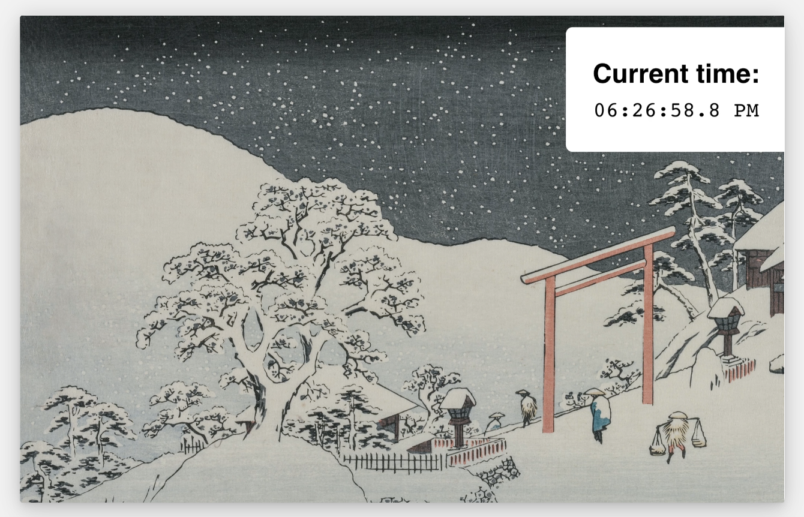

# The Joy of React - Module 6 - Full Stack React

- [Course Outline Notes](../course-notes.md)

## Intro to Next.js / SSR Exercises

Check out the github repo for these three SSR exercises, my forked repo.

## Clock

Earlier in the course ew build a clock, in this exercise we will adapt that code so that it works in a server side rendering context.



ACs:

- There should be no errors.

Getting started; you will find this exercise in `/src/app/exercises/01-clock`.

Once you started the dev server with `npm run dev`, you can visit `localhost:3000/exercises/01-clock` to view the app in-browser.

- Solution Notes:

- Have a hydration mismatch, when it renders on the server, then after hydration, the `Date))` value is different and we get errors.
  - `Error: Text content does not match server-rendered HTML.`
  - `Warning: Text content did not match. Server: "08:00:49.9 AM" Client: "08:00:50.2 AM"`

- Initial Code:

```JAVASCRIPT
'use client';
import React from 'react';
import format from 'date-fns/format';

function Clock() {
  // issue, that new Date() runs on the server
  const [time, setTime] = React.useState(new Date());

  React.useEffect(() => {
    const intervalId = window.setInterval(() => {
      // then again on the client after hydration, causing a 'hydration mismatch'
      setTime(new Date());
    }, 50);

    return () => {
      window.clearInterval(intervalId);
    };
  }, []);

  return (
    <p className="clock">{format(time, 'hh:mm:ss.S a')}</p>
  );
}

export default Clock;

```

- To fix this, take it out of the initial state and add a condition to the JSX to render a placeholder value until the hydration is complete.

```JAVASCRIPT
'use client';
import React from 'react';
import format from 'date-fns/format';

function Clock() {
  // issue, that new Date() runs on the server
  const [time, setTime] = React.useState();

  React.useEffect(() => {
    const intervalId = window.setInterval(() => {
      // then again on the client after hydration, causing a 'hydration mismatch'
      setTime(new Date());
    }, 50);

    return () => {
      window.clearInterval(intervalId);
    };
  }, []);

  return (
    // add a truthy condition, check for the time value
    // if 'time' is truthy, it will render the 'format()'
    // otherwise, just render the placeholder value
    <p className="clock">{time ? format(time, 'hh:mm:ss.S a') : '--'}</p>
  );
}

export default Clock;
```

- You can use the `suppressHydrationWarning`, which is the same as, `suppressHydrationWarning={true}`, this is an escape hatch, but not used a lot.
- The official React documentation, [Suppressing unavoidable hydration mismatch errors](https://react.dev/reference/react-dom/client/hydrateRoot#suppressing-unavoidable-hydration-mismatch-errors).

## Exercise, Neighborhood Shop

This exercise features a checkout flow or an e-commerce shop:


The goal is to persist the user's cart in Local Storage, so that their cart isn't lost when refreshing the page. Your approach should be SSR-compatible, using the techniques we learned in the previous lessons.

You will find the exercise in `/src/app/exercises/02-checkout`

ACs:

- A user's cart should not be lost when refreshing the page.
- The user should never be lied to about their cart. If they have saved items, they shouldn't see 'Your Cart is Empty', not even for a second.
  - Instead you can show the loading indicator, you will find a suitable component in `/src/components/Spinner`.
- There should be no hydration related errors, and not errors inside the server terminal.
- You will need to tweak the code in multiple files. Don't be afraid to restructure the provided code.

🤔 localStorage gotchas: This relies on localStorage, so you might run into some baffling issues. Refer to the [Local Storage Troubleshooting Guide](https://courses.joshwcomeau.com/support/local-storage-troubleshooting).

- Walk through solution video:

- See forked solution: [Next 13 SSR exercises](https://github.com/clewisdavis/next-13-ssr-exercises)
- Need to go back through 'useReducer', not clicking

## Exercises, Artist Interview
