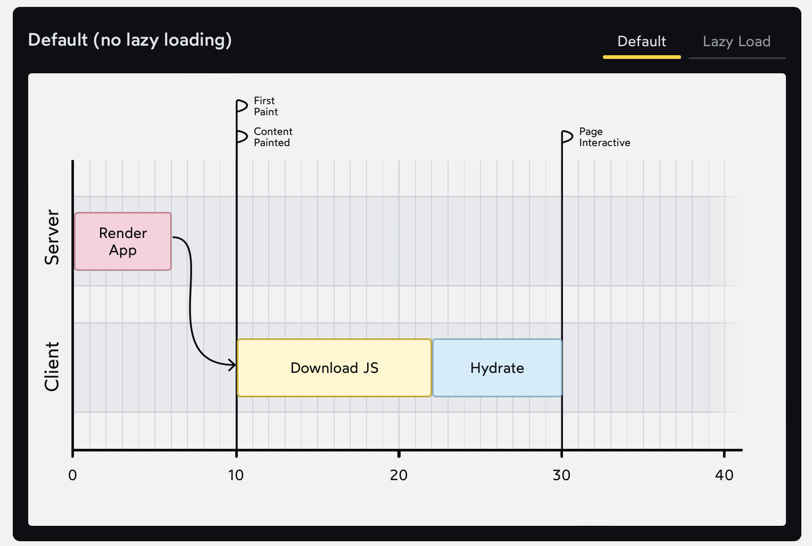
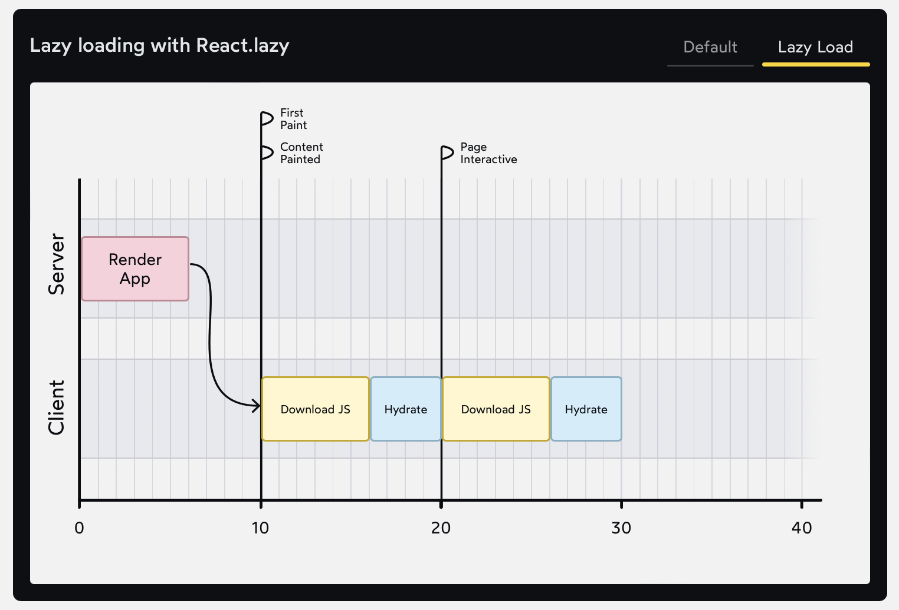

# The Joy of React - Module 6 - Full Stack React

- [Course Outline Notes](../course-notes.md)

## Lazy Loading and Server Side Rendering

- In the previous example, the `<Latex>` component was being conditionally rendered, with an initial value of `false`. But what if our component is there from the very first render?

- For example:

```JAVASCRIPT
'use client';
import React from 'react'

const Latex = React.lazy(() => import('react-latex-next'));

function LatexEditor() {
  const [expression, setExpression] = React.useState("$2^4 - 4$");

  return (
    <>
      <label htmlFor="expression-input">Enter LaTeX</label>
      <input
        id="expression-input"
        type="text"
        value={expression}
        onChange={(event) => setExpression(event.target.value)}
      />

      <h2>Output:</h2>
      <Latex>{expression}</Latex>
    </>
  );
}

export default LatexEditor;
```

- In this one, built a LaTex editor, an `expressions` state variable is controlling a text input, and the value is being passed into our `Latex` component to render the math notation.

- The difference is that the `<Latex>` element is always there. Not being conditionally rendered.
- Two questions come to mind:
  - Any benfit to this, either way the code need to be downloaded immediately?
  - In an SSR context, the first render happens on the server, how does lazy loading interact with SSR?

- Second question, the Lazy loading has no effect on the server. The server generated HTMl will include the math notation, no matter whether we do a typical import, or a dynamic lazy load import.

- This makes sense when we step back and consider the point of lazy loading. When a user visits our app for the first time, they need to download a bunch of JS before the app is interactive. And we want to improve performance by reducing the number of Kb that needs to be downloaded.

- When we are generating the initial HTML on the server, however, we don't have this concern. The server already has all the JS code, ready to go. It doesn't have to download anything.

- So what is the point? Why would we lazy loading something which is used immediately?

- Default, no lazy loading


- Lazy loading with React.lazy



- Regardless of whether ew use lazy loading or not, we still need to download the same amount of JS, and spend time hydrating our components.

- But by lazy loading the `<Latex>` component, **we break that work into two chunks**.
- We can't avoid downloading those 72kb for our math notation, but we can push it back so that is doesn't block everything else from happening.
