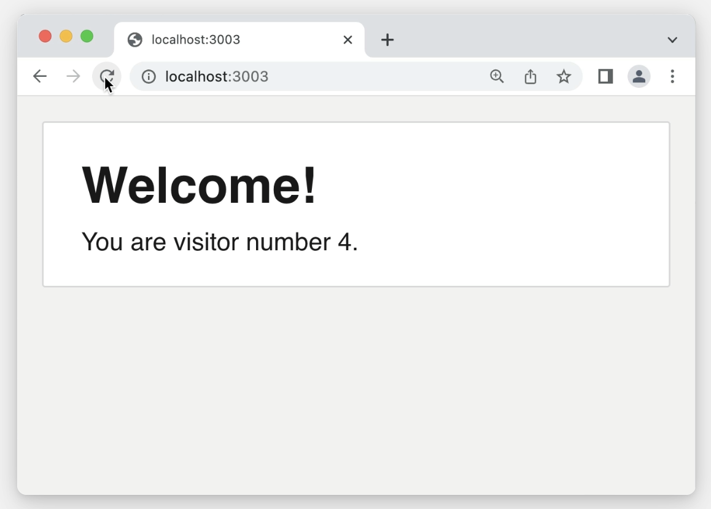

# The Joy of React - Module 6 - Full Stack React

- [Course Outline Notes](../course-notes.md)

## Rendering Strategies

To summarize:

- In development, Next always uses a “dynamic” on-demand SSR strategy
- In production, Next will try to pick the optimal strategy on a route-by-route basis.
- The default strategy is “static”, pre-generating all of the HTML during the build process.
- Using certain Next APIs will cause Next to switch to a “dynamic” strategy for a particular route. For example, if we try to access the cookies, Next knows it needs to do the SSR dynamically, for every request.
- Because our “Server timestamp” example doesn't use any of these APIs, Next can't tell that we want it to be done dynamically.

### Switching rendering strategies

We can instruct Next to use 'on-demand' SSR fo this route by exporting a special variable:

```JAVASCRIPT
// src/app/layout.js
export const dynamic = 'force-dynamic';

function RootLayout({ children }) {
  return (
    <html lang="en">
      <body>
        {children}
        <footer>
          Page rendered on{' '}
          {new Date().toLocaleString()}
        </footer>
      </body>
    </html>
  );
}
```

- You can export this `dynamic` variable in any `page.js` or `layout.js` file. There are several valid values:

  - `auto` (default) - Next will try and select the most optimal rendering strategy based on the code.
  - `force-dynamic` - Next will use 'on-demand' server-side rendering.
  - `force-static` - Next will do the server-side rendering during the build, like a static site generator.
  - `error` - Similar to `force-static`, but will throw an error if the code tries to do dynamic things

- Next will correctly select the best approach. This config is an optional escape hatch, where Next cannot infer the best approach.

### Dynamic Segments

Earlier we saw hwo to use, dynamic segments to create a 'catch all' route that will match a wide variety fo URLs, capturing the value as a variable and making it available to our components.

The example we used was a social network, URL formatted, `/profile/[profileId]`


- When we use dynamic segments, Next will automatically switch to an 'on-demand' rendering strategy.
- Think about it, with 'pre-compiled' SSG strategy, we need to create HTML files for every possible URL< and cannot do that if part of the URL is dynamic and could be anything.

### Exercise, Fixing the Hit Counter

Earlier, we built a hit counter:



But thi shit counter has the same problem that our 'Server Timestamp' has, works fine in development but gets frozen intime in production.

You mission 🪖 is to update the code sto hat it works in production:

Exercise code, Fork from Github

- You will need to do this one locally, so that you can run a local build and serve in production.

ACs:

- When running the 'production' build (`npm run build` and then `npm run start`), the hit counter should continue to function correctly, increasing by 1 for every page visit.

- Solution Notes:

```JAVASCRIPT
// src/app/page.js
import React from 'react';
import {
  readFile,
  writeFile,
} from '../helpers/file-helpers';

// tell Next the rendering strategy to be 'dynamic'
const DATABASE_PATH = '/src/database.json';

export const dynamic = 'force-dynamic';

function Home() {
  let { hits } = JSON.parse(
    readFile(DATABASE_PATH)
  );

  hits += 1;

  writeFile(
    DATABASE_PATH,
    JSON.stringify({ hits })
  );

  return (
    <main>
      <h1>Welcome!</h1>
      <p>You are visitor number {hits}.</p>
    </main>
  );
}

export default Home;
```
