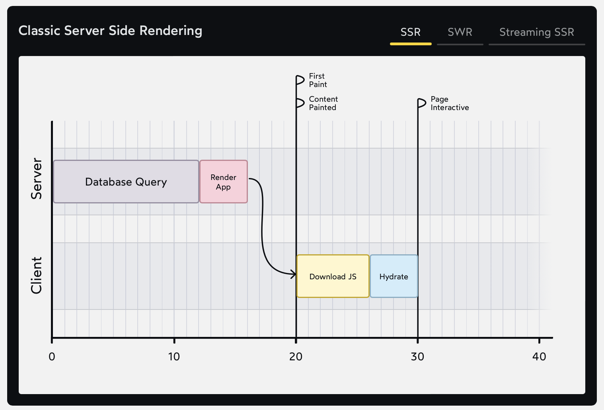
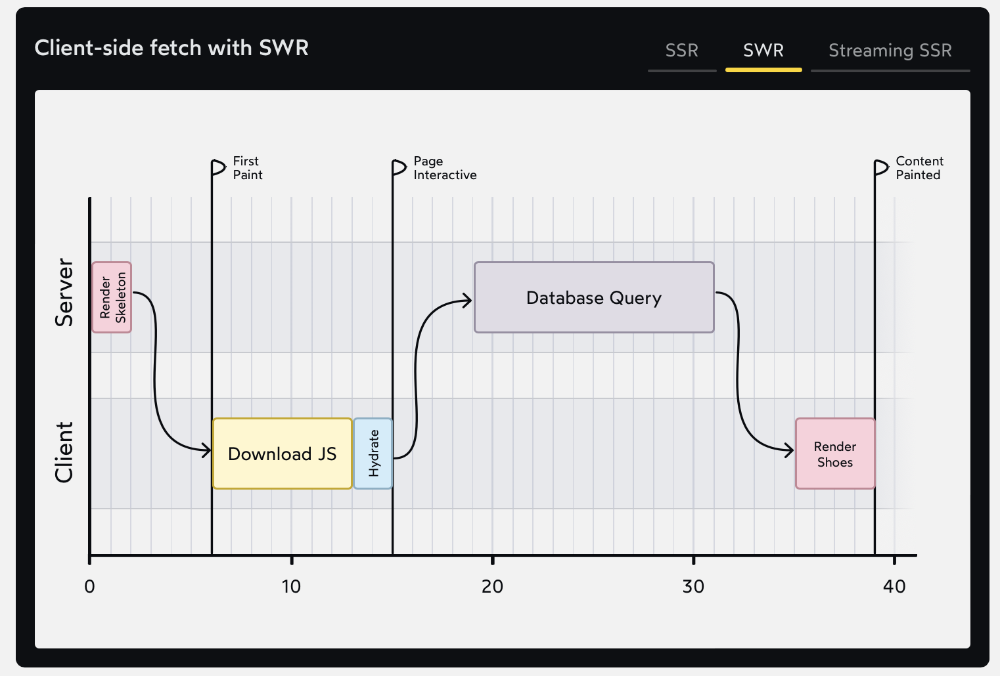
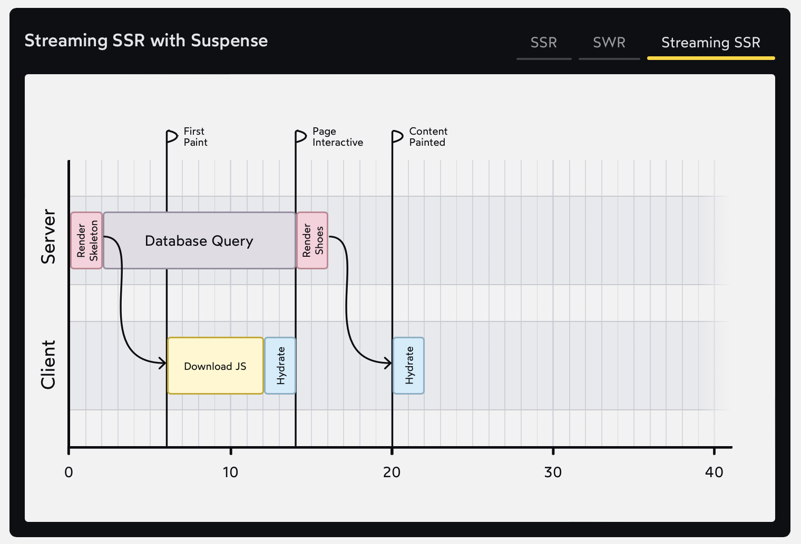

# The Joy of React - Module 6 - Full Stack React

- [Course Outline Notes](../course-notes.md)

## Suspense

One of the most advanced topics APIs in React. But it's good to understand how these things work at a conceptual level. Here is the plan for this lesson.

- Look at the practical benefits of Suspense. How to use it in combination with Streaming SSR to achieve truly spectacular performance.
- The, we will see how this performance eis achieved, looking at the order of operations, the sequence of events.
- Finally, learn exactly what Suspense is and how it works.

🫢 Stormy waters ahead.

### An Exciting New World

Best to watch the video, the comparison between Suspense and SWR.

[Video Walkthrough](https://courses.joshwcomeau.com/joy-of-react/06-full-stack-react/09.01-exciting-new-world)

- [Sole and Ankle Project](https://github.com/joy-of-react/next-sole-and-ankle)

### Graphing It Out

In the Chrome dev tools, we looked at the various data-fetching strategies using the 'Performance' tab.

Take a look at the three different strategies.

1. Traditional serer side rendering, while the db query and render app is happening, the user is looking at a blank screen.

2. Light server side render, and then fetching the data on the client with SWR, client side, we render a skeleton, with placeholder UI.

3. New solution with Suspense and Streaming SSR, now we can get to a first paint quickly, and the server keeps streaming / going to fetch what it needs from the db, the super power that servers have, the ability to send the data in chunks, know as 'streaming', for example, large assets, video for example. The server is sending things in small chunks. **Single request for HTML, and that is sent in chunks**

- With Suspense and Streaming SSR - You get the benefits of 'classic SSR' and 'client side data fetching'.
