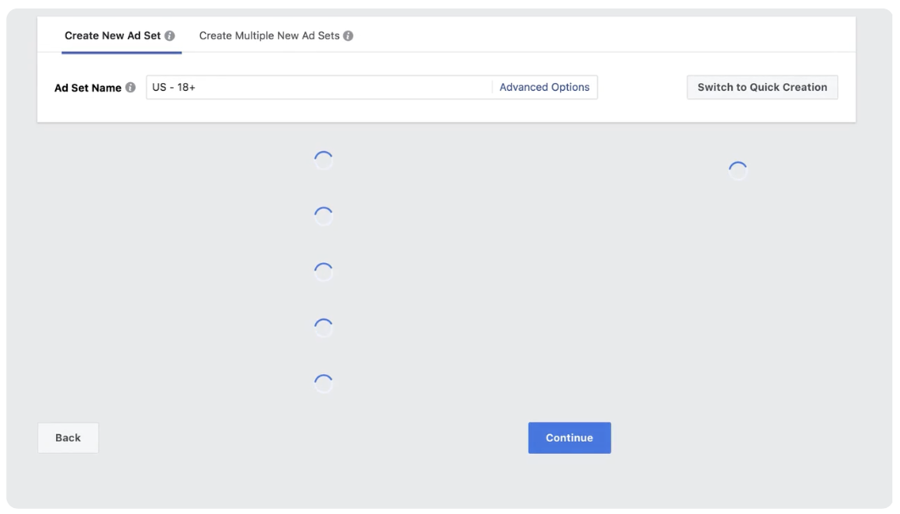
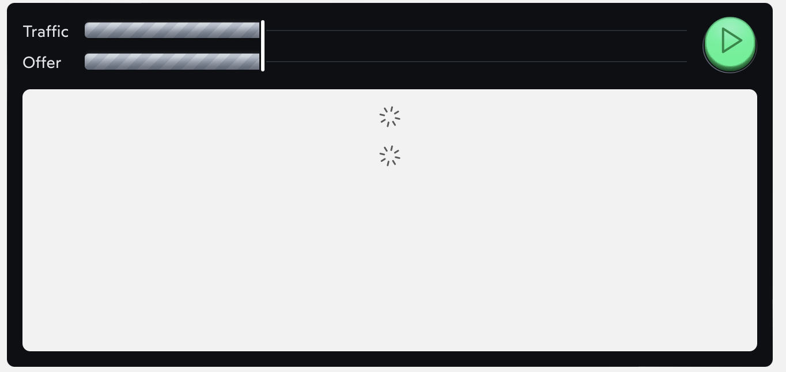
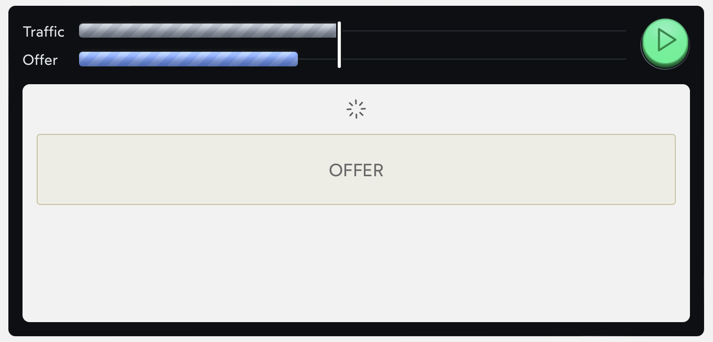
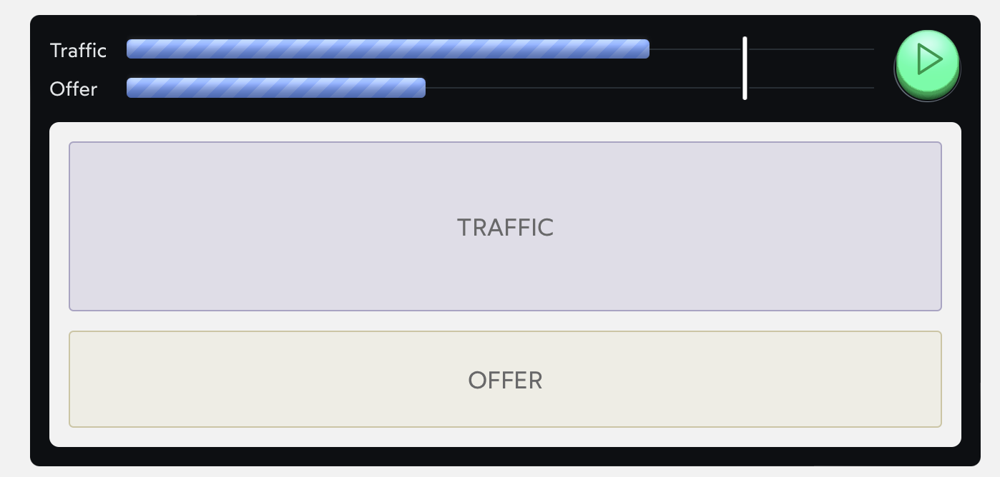
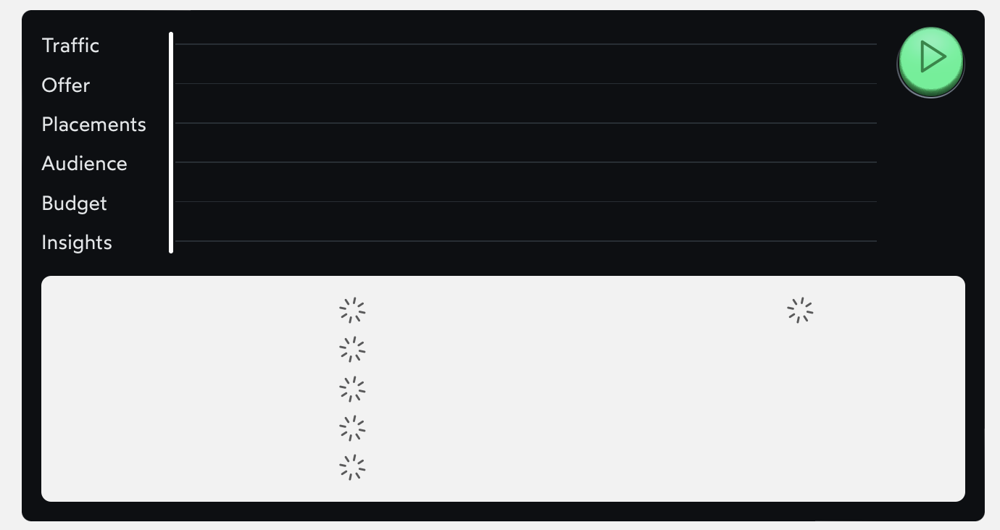
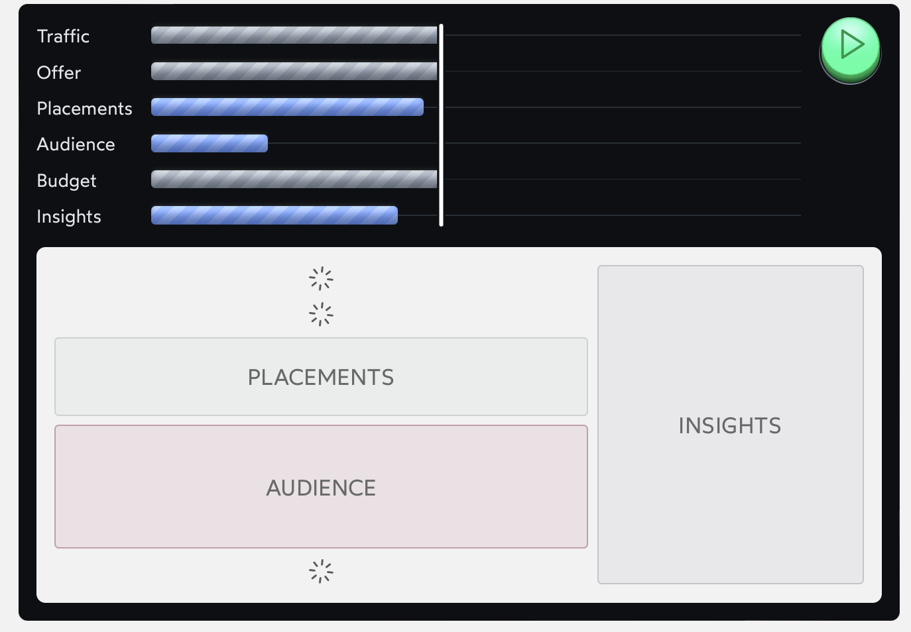
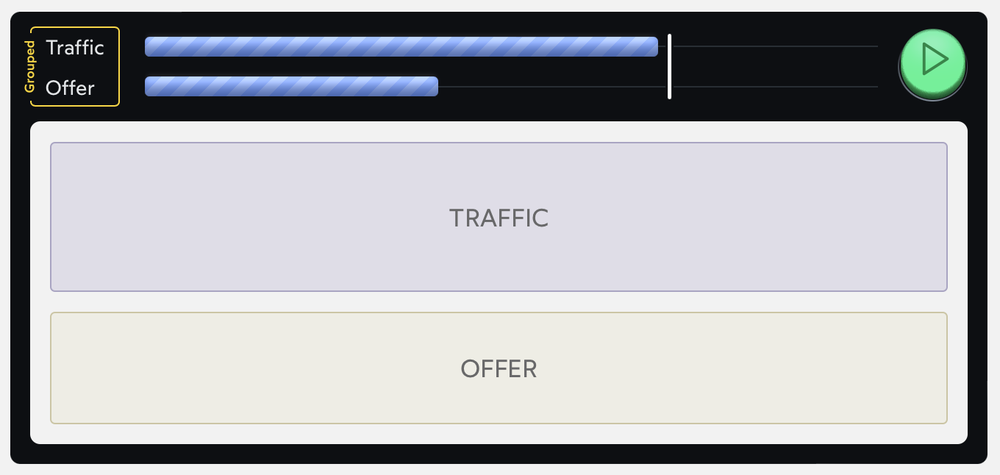

# The Joy of React - Module 6 - Full Stack React

- [Course Outline Notes](../course-notes.md)

## Understanding Suspense

In the previous lessons, we saw how Suspense can offer dramatically improved loading experiences. But what exactly is Suspense?

In order to answer this question, we need to go on a bit of a journey.



As each section loads, it shoves everything around, leading to a poor User Experience. React is built this way, each component is packaging up all the stuff for that particular UI, if each component fetches it own data, we wind up in 'spinner hell'

Look at a code example;

```JAVASCRIPT
function TrafficCard() {
  const { data, isLoading } = useSWR('/api/traffic', fetcher);

  if (isLoading) {
    return <Spinner />;
  }

  return <Card>{/* Stuff using `data` */}</Card>;
}

function OfferCard() {
  const { data, isLoading } = useSWR('/api/offer', fetcher);

  if (isLoading) {
    return <Spinner />;
  }

  return <Card>{/* Stuff using `data` */}</Card>;
}

function Dashboard() {
  return (
    <>
      <TrafficCard />
      <OfferCard />
    </>
  );
}
```

- When we render the `<Dashboard />` component, we start off with two loading spinners. Both `TrafficCard` and `OfferCard` make network request to fetch their data. When that data comes through, the component re-renders the real UI.

- For example, initial load...



- `Offer` component loads...



- Then the `Traffic` component loads...



- The trouble is that each component is operating independently. They both make a request for data, and when received, they re-render immediately.

- The more data-fetching elements we have, the more potential for chaos. The FB Ads Manager has at atleast 6 individual data-fetching components, and looks like this...



- The technical term for when things move around like this; layout shift.



- See this article - [Cumulative Layout Shifts (CLS)](https://web.dev/articles/cls)

**So how do we fix this?**

- We could fix this by lifting the data-fetching requests up to the parent component, so that we can 'group' their loading states. Something like this?

```JAVASCRIPT
function Dashboard() {
  const {
    data: trafficData,
    isLoading: trafficIsLoading,
  } = useSWR('/api/traffic', fetcher);
  const {
    data: offerData,
    isLoading: offerIsLoading,
  } = useSWR('/api/offer', fetcher);

  // If *either* request is still pending, we'll show a spinner:
  if (trafficIsLoading || offerIsLoading) {
    return <Spinner />
  }

  return (
    <>
      <TrafficCard data={trafficData} />
      <OfferCard data={offerData} />
    </>
  )
}
```

- In this new version, we show a spinner until both network request have resolved.



- This is a better user experience. By waiting until both components are ready, we avoid the jarring experience of elements jumping around.

- But it feels like a step backwards in terms of the developer experience. Components should own their own data request, the same way they own their styles, markup, and business logic.

**What if there was a way for us to keep our original modular component structure, but to strategically “group” UI updates to avoid excessive layout shifts?**

🚀 This is the problem Suspense was originally designed to solve.

### Introducing the Suspense Component
