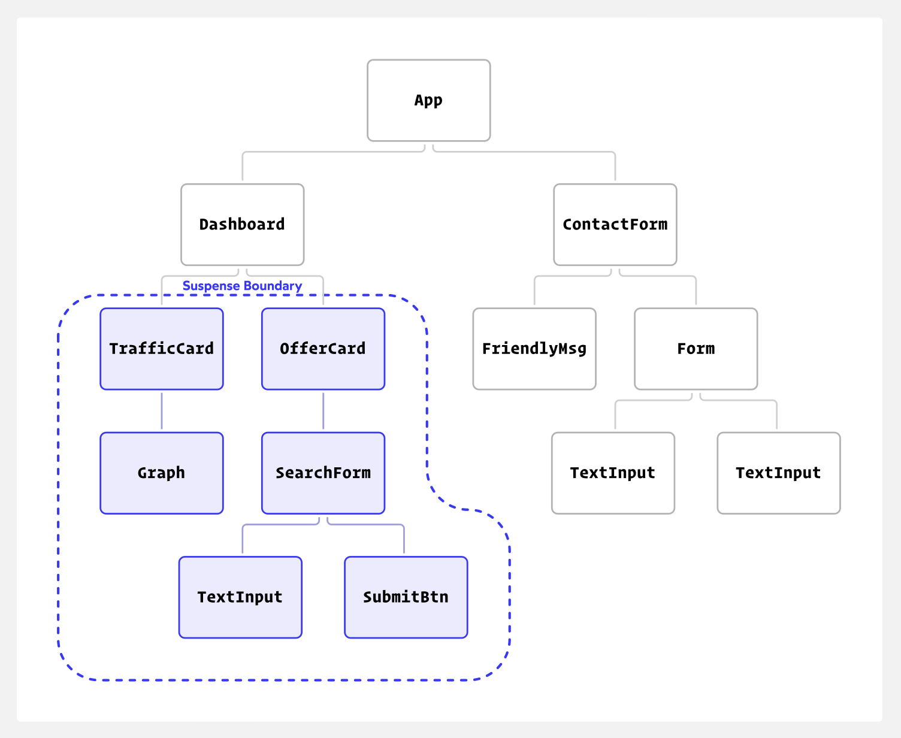
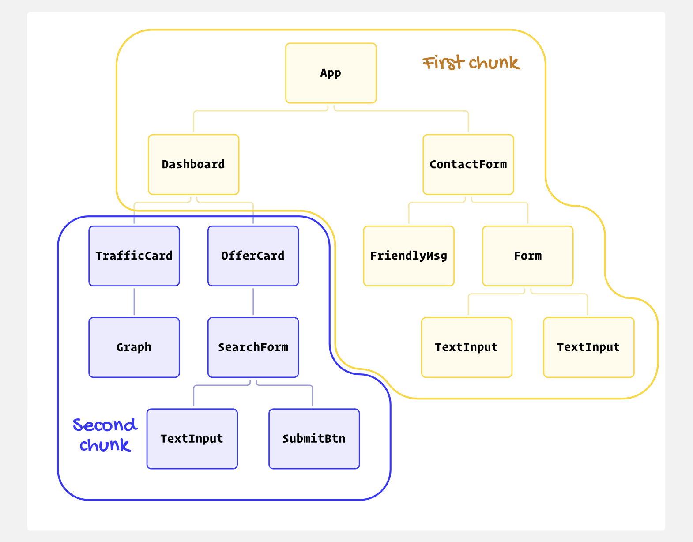
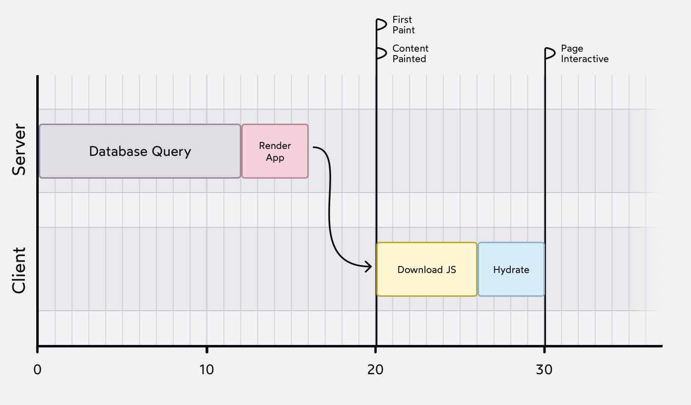
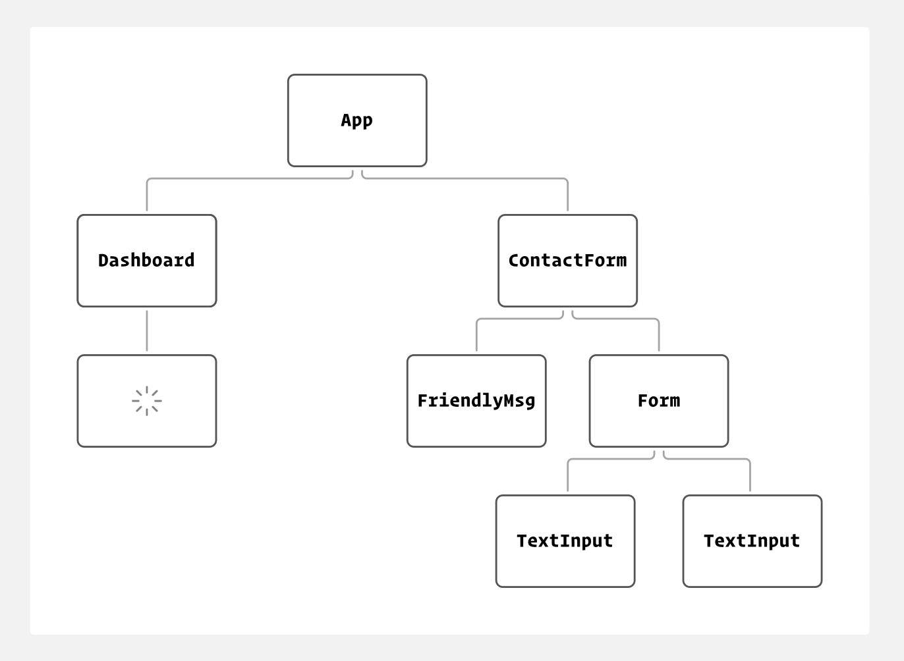
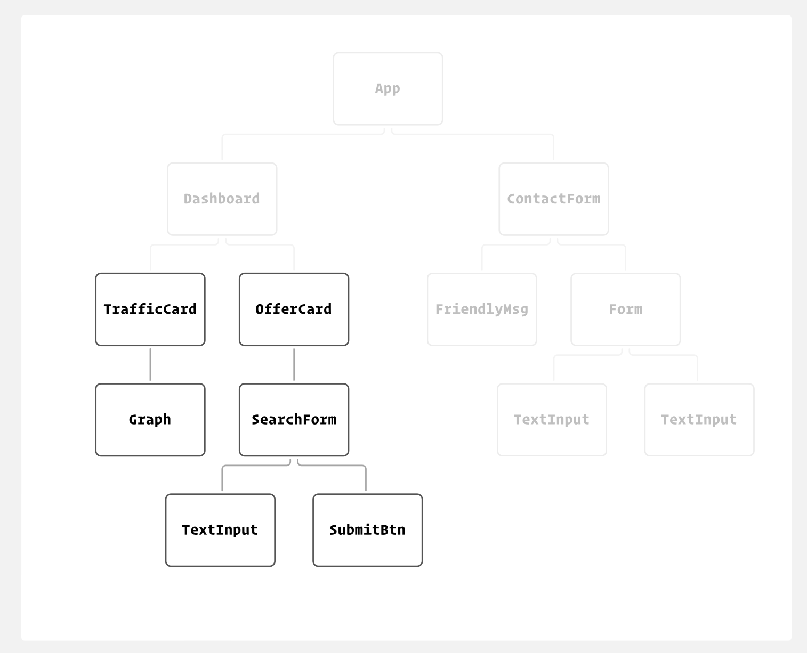
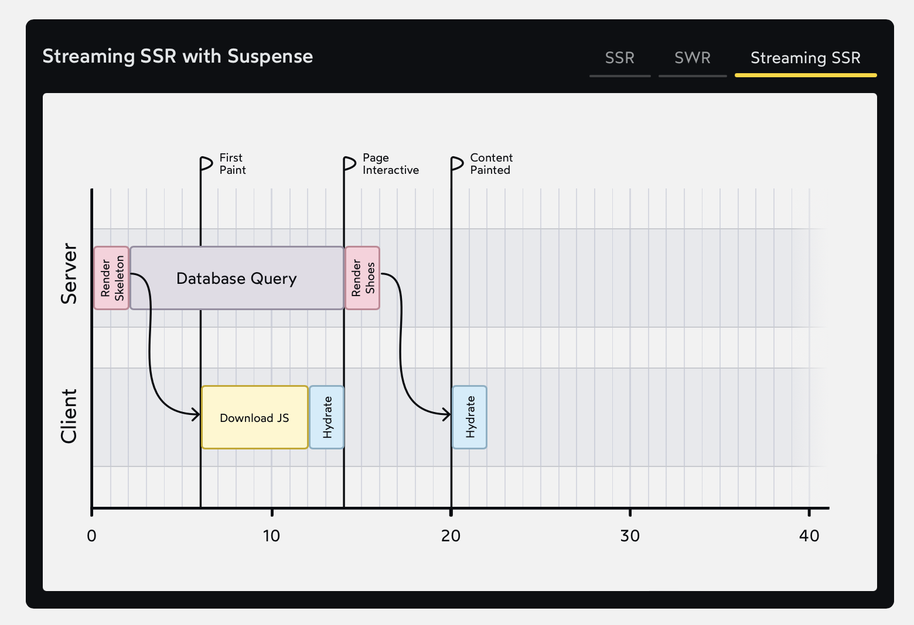

# The Joy of React - Module 6 - Full Stack React

- [Course Outline Notes](../course-notes.md)

## Putting it all Together

In the previous module, we create Suspense boundaries that wrap around slices of our React application, suspending rendering until al the components within have fetched their data. Our goal was to avoid a bunch of janky layout shifts caused by 'lone wolf' components, each operating at their own schedule.

- That was the original vision for Suspense, back when it was exclusively used on the client.
- To get to the true potential of Suspense, we have to talk about how it works in a server side rendering context. So much more useful than avoiding Spinner Hell.

- Let's take another look at the Suspense boundary we drew in the previous lesson:

- We set up a boundary in order to avoid duplicate loading states but what we have actually done is much more powerful. **We have drawn a circle around the slowest part of our app.**

- We have basically split page into two logical 'chunks'.

- Consider the server side rendering context. In a 'classic' SSR setup, without Suspense, everything happens sequentially:

In this setup, everything is blocking:

- We need to retrieve all of the data from the database before we can start rendering.
- We need to generate all of the HTML before we can send anything to the browser.
- IN the browser, we need to download all of the JS before we can start hydrating.
- We need to hydrate all of the components before anything is interactive.

**But with Suspense, our app has been broken into multiple chunks.** We can work on these chunks in parallel.

First, we will generate and send the HTL for the first chunk. This happens quickly, since we don't have to wait on any database queries. This HTML includes the `fallback` loading state for the Suspense boundary:

Then, once teh database query is completed, we generate and send the reset of the HTML:

Streaming SSR with Suspense, you can achieve incredible performance.

- We are able to send the HTML in chunks liek this thanks to a super power that web servers have: the ability to stream the response.
- See this all the time with videos, you don't have to wait for the entire video to downloaded before you can start watching it.

And so, the modern system we have been building has a few parts:

- Server Side Rendering allows us to generate HTML on the server.
- Streaming SSR allows us ot break the response into chunks, for faster performance.
- Suspense let sus define what those chunks are, by drawing boundaries around parts of the React application.

One more part, React Server Components.

## Selective Hydration
