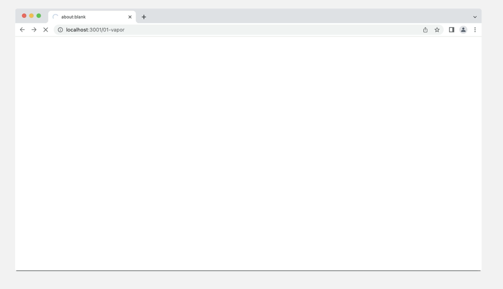
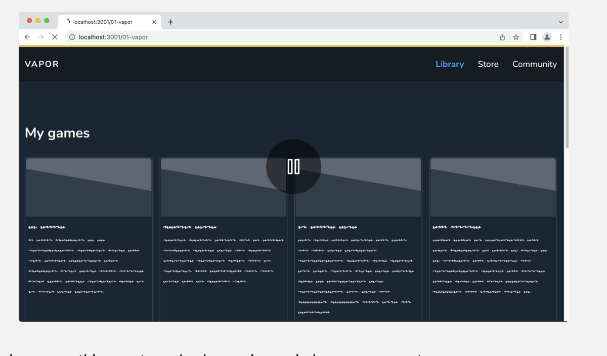

# The Joy of React - Module 6 - Full Stack React

- [Course Outline Notes](../course-notes.md)

## Suspense Exercises

Get some practice with Suspense, you can use the following:

- [Download/Fork from Github](https://github.com/joy-of-react/next-suspense-exercises)

### Vapor Games

Lets suppose we are building a game manager. As is stands, the user faces a blank white screen until the content has loaded:



The mission is to update the code so that a placeholder UI is rendered while the data is being loaded:



- To help you on this journey, given a helper component, `LibraryGameCardSkeleton`. You can use it to create a loading state.

- A `range` function has also been provided in `/src/utils.js`.

ACs:

- WHen the `games` data is loading, 12 `LibraryGageCardSkeleton` elements should be rendered in the place of the current `LibraryGameCard` elements.
- The '15 games in library' paragraph can be omitted from the loading page.

The route for this exercise is `/src/app/01-vapor`.

😉 Hint: You will want to use the Next.js `loading.js` file for this. We saw an example of this in [Sole&Ankle project](https://courses.joshwcomeau.com/joy-of-react/06-full-stack-react/09.01-exciting-new-world).

Solution Note:

- Create a new `loading.js` file, and copy over the structure of the `page.js`.
- Replace the elements, with your new `LibraryGameCardSkeleton`
- Use the `range` utility, to map over the results.

```JAVASCRIPT
import React from 'react';

import { range } from '@/utils';

import { getGamesInLibrary } from '@/helpers/vapor-helpers';
import LibraryGameCardSkeleton from '@/components/LibraryGameCardSkeleton';

export const dynamic = 'force-dynamic';

async function VaporLoading() {
//   const games = await getGamesInLibrary();

  return (
    <section className="max-width-wrapper">
      <header className="library-header">
        <h1>My games</h1>
      </header>
      <div className="game-grid">
        {range(12).map((num) => (
          <LibraryGameCardSkeleton
            key={num}
          />
        ))}
      </div>
    </section>
  );
}

export default VaporLoading;

```

### Artist Interview with Comments
