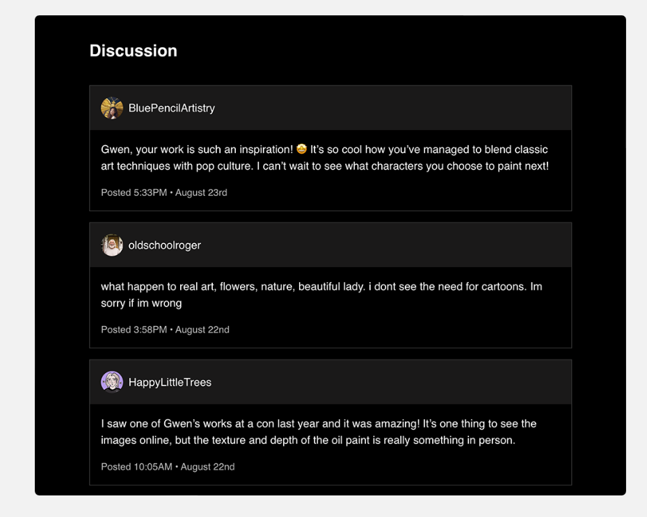
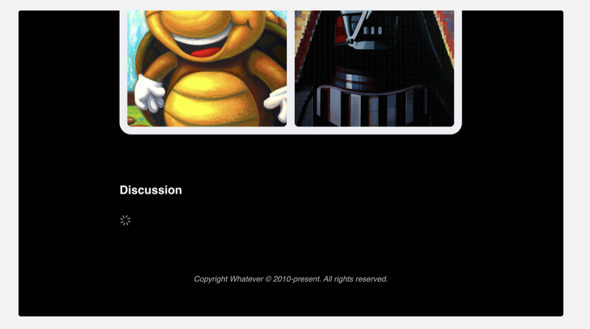

# The Joy of React - Module 6 - Full Stack React

- [Course Outline Notes](../course-notes.md)

## Suspense Exercises

Get some practice with Suspense, you can use the following:

- [Download/Fork from Github](https://github.com/joy-of-react/next-suspense-exercises)

### Vapor Games

Lets suppose we are building a game manager. As is stands, the user faces a blank white screen until the content has loaded:


The mission is to update the code so that a placeholder UI is rendered while the data is being loaded:


- To help you on this journey, given a helper component, `LibraryGameCardSkeleton`. You can use it to create a loading state.

- A `range` function has also been provided in `/src/utils.js`.

ACs:

- WHen the `games` data is loading, 12 `LibraryGageCardSkeleton` elements should be rendered in the place of the current `LibraryGameCard` elements.
- The '15 games in library' paragraph can be omitted from the loading page.

The route for this exercise is `/src/app/01-vapor`.

😉 Hint: You will want to use the Next.js `loading.js` file for this. We saw an example of this in [Sole&Ankle project](https://courses.joshwcomeau.com/joy-of-react/06-full-stack-react/09.01-exciting-new-world).

Solution Note:

- Create a new `loading.js` file, and copy over the structure of the `page.js`.
- Replace the elements, with your new `LibraryGameCardSkeleton`
- Use the `range` utility, to map over the results.

```JAVASCRIPT
import React from 'react';

import { range } from '@/utils';

import { getGamesInLibrary } from '@/helpers/vapor-helpers';
import LibraryGameCardSkeleton from '@/components/LibraryGameCardSkeleton';

export const dynamic = 'force-dynamic';

async function VaporLoading() {
//   const games = await getGamesInLibrary();

  return (
    <section className="max-width-wrapper">
      <header className="library-header">
        <h1>My games</h1>
      </header>
      <div className="game-grid">
        {range(12).map((num) => (
          <LibraryGameCardSkeleton
            key={num}
          />
        ))}
      </div>
    </section>
  );
}

export default VaporLoading;

```

### Artist Interview with Comments

In this exercise, a comments section has been added to our 'Artist Interview' application:



However, it takes a few seconds to load these comments, and right now, the process is blocking the page from loading. Once again, your mission is to use Suspense to improve the loading experience.

You can use the provided `<Spinner>` component as a loading state:



ACs:

- The server shouldn't wait for the comments before sending the first chunk of HTML.
- A spinner should be shown as the fallback for the comments.

The relevant route for this exercise is `/src/app/02-interview`.

HINT: Instead of using Next's `loading.js`, it might make more sense for us to use React Suspense directly. Can we create a Suspense boundary around the comments?

- Solution Notes:
- Create a new async component, `<Comments>`
- Wrap that new component in a `<React.Suspense>`
- Import and add the `<Spinner>` component as a fallback, ``

```JAVASCRIPT
import React from 'react';

import { getComments } from '@/helpers/interview-helpers';
import Comment from '@/components/Comment';
import Spinner from '@/components/Spinner';

function InterviewExercise() {
  return (
    <>
      <article className="main-article">
        {/* Article content unchanged */}
      </article>

      <section className="comments-section">
        <h2>Discussion</h2>
        <React.Suspense fallback={<Spinner />}>
          <Comments />
        </React.Suspense>
      </section>
    </>
  );
}

async function Comments() {
  const comments = await getComments();

  return comments.map((comment) => (
    <Comment key={comment.id} comment={comment} />
  ));
}

export default InterviewExercise;
```

### WebBase CMS Navigation

For this exercise, work on a fictional company landing page, WebBase:


Your mission, if you choose it, is to use Suspense to improve teh page-loading experience. The initial HTML should not include any navigation links, in the header or the footer:

The route for this exercise is: `/src/app/03-web-base`.

ACs:

- The initial HTML should be sent immediately, without waiting fo the `getNavLinks` method to complete.
- In the server terminal, a message is logged twice on eery request, `Requesting navigation links from CMS`. This message should ony be logged once per request.

HINT: The `React.cache()` API can be used to ensure that the `getNavLinks` method only performs the underlying work once, even if it's called from multiple components.

Check out the [React Cache](https://courses.joshwcomeau.com/joy-of-react/06-full-stack-react/08-react-cache) lesson.

Solution Notes:
